# 软件工程

## 第一部分 软件工程导论

## 第二部分 软件过程工作流

对软件过程的定义有多种，这里主要参考 Stephen R. Schach 在《软件工程 面向对象和传统的方法》中描述的“软件生命周期的工作流”，包括以下流程：

+ 需求
+ 分析
+ 设计
+ 实现
+ 测试
+ 交付后维护

以及 Roger S. Pressman 和 Bruce R. Maxim 合著的《软件工程 实践者的研究方法》中描述的“软件过程框架活动”，包括：

+ 沟通
+ 策划
+ 建模
+ 构建
+ 部署

最后将软件过程描述为一系列工作流，包括：

1. 需求
2. 分析
3. 设计
4. 实现
5. 测试
6. 运维

此章主要介绍面向对象方法。

### 2.1 需求

常用的软件过程范型基本上可以分为文档驱动、原型驱动和用例驱动。在面向对象范型中，软件过程主要由用例驱动。在对问题进行定以后，软件工程师就需要根据场景编写用例。

需求流注重软件小组与客户、软件小组内部的沟通交流，并始于交流。在传统软件工程中，一般倾向于在初步交流后生成完备的文档，以文档为基础进行后续沟通；在敏捷过程中，一般只生成必须的书面文档，鼓励软件小组成员结对工作，以频繁的口头沟通代替非必要的文档说明。

需求工作流旨在建立**业务模型**，对软件客户的商业过程进行描述。一般认为需求分为两种：

+ **功能性需求**：软件必须能够执行的行为；
+ **非功能性需求**：产品需要满足的属性，如可靠性、响应时间。

建模是面向对象范型的根本，但使用**快速原型开发**也是可能的，有时不得不依靠原型方法快速生成粗糙的可执行程序。即使原型获得初步成功，也必须在后续迭代中逐渐补充文档，否则原型的维护将是一场灾难。必要时，也可重构原型，而重构成本将随着原型迭代程度增加而增加。

此外，软件的最终用户是人，**用户友好**是所有软件程序尤其是 GUI 程序必须满足的内容。

#### 问题定义

需求工作流始于**问题定义**。对问题的定义需要是清晰、明确、抽象的，软件问题定义的阅读者不只是软件小组成员，还应包括软件用户。问题定义应该较为简洁的描述“**做什么**”，而不涉及“怎么做”。

> 该阶段应产出一份清晰的问题定义说明。

#### 可行性分析

**可行性分析**的**目的**在于“用最小的代价在最短的时间内确定问题是否能够和值得解决”。可行性分析往往需要先确认并询问人员、查阅分析相关资料、改正含糊的概念，确保提出的问题确实是所要解决的问题后，进行四个方面的分析：

1. 策略可行性：问题是否有解决策略，暂时不考虑技术实现问题，如果没有解决问题的策略，则软件不可行；
2. 技术可行性：存在的策略需要在技术上予以实现，如果无法实现，则软件不可行；
3. 操作可行性：软件对于用户需要是可操作的，如果技术实现的接口让用户难以使用，则软件不可行；
4. 经济可行性：通过成本-效益分析法或其他方法，如果软件成本超过软件收益（包括潜在收益），则软件不可行。

> 该阶段应产出各种方面的可行性分析报告。

#### 传统方法：基于数据流

传统的结构化方法重视数据和处理数据的过程（函数），是一种**面向数据**的方法。基于数据流的需求工作要经过以下步骤：

1. 提取和细化需求（<a href="#3-1">规格说明文档</a>）
2. 对系统流程建模（<a href="#3-2">流程图</a>）
3. 对数据流建模（<a href="#3-5">数据流图</a>）
4. 建立<a href="#3-3">数据字典</a>
5. 建立实体关系描述（<a href="#3-4">E - R 图</a>）
6. 建立系统状态转换描述（<a href="#4-6">状态图</a>）

从数据、功能、行为方面描述：

+ **数据建模**：数据字典、E - R 图
+ **功能建模**：数据流图
+ **行为建模**：状态转换图

从静态建模和动态建模方面描述：

+ **静态建模**：数据流图、数据字典、E - R 图
+ **动态建模**：状态转换图

> 如果使用基于数据流的需求工作流，该阶段需要产出规格说明文档、流程图、数据流图、数据字典、E - R 图和状态图。

**结构化系统分析**是由 Gane 和 Saren 提出的一种传统分析方法，包括 9 个步骤：

1. 确定逻辑数据流（<a href="#3-5">数据流图</a>）
2. 确定产品中需要计算机自动化的部分（质量功能部署）
3. 细化数据流（建立<a href="#3-3">数据字典</a>）
4. 定义数据处理逻辑（<a href="#3-2">流程图</a>）
5. 定义数据存储（在数据流中分层细化）
6. 定义物理资源（在流程中引入数据库或报表等）
7. 确定输入输出规格说明（置于<a href="#3-1">规格说明文档</a>）
8. 确定大小（输入量、处理频率、最后期限、文件大小、CPU 要求等，置于规格说明文档）
9. 确定硬件要求（置于规格说明文档）

#### 面向对象方法：基于用例

统一过程和其他面向对象范型下的软件过程几乎都是由**用例（use case）**驱动的。用例即软件的功能使用场景，是一种基于**场景**、**面向对象**的建模方法。基于用例的需求工作流需要经过以下步骤：

1. 提取和细化需求（<a href="#3-1">规格说明文档</a>）
2. 开发用例（<a href="#4-1">UML 用例图</a>）
3. 细化用例（<a href="#3-6">用例规格说明</a>）
4. 必要时进一步细化用例（<a href="#4-4">UML 交互图</a>和<a href="#4-5"> UML 活动图</a>）

一些软件工程方法将与类建模相关的工作划分在分析工作流中，另一些则认为类建模属于需求工程。如果认为类建模属于需求工作流，还有包括有以下步骤（在<a href="#2-2">2.2 节</a>说明）：

5. 抽取实体类（<a href="#4-2">UML 类图</a>）
6. 分析系统状态（<a href="#4-6">UML 状态图</a>）

从数据、功能、行为方面描述：

+ **数据建模**：UML 类图
+ **功能建模**：UML 用例图、用例规格说明
+ **行为建模**：UML 交互图、UML 活动图、UML 状态图

> UML 标准中将数据建模称为结构建模，将功能和行为建模统称为行为建模，此外还有体系结构（架构）建模。

从静态建模和动态建模方面描述：

+ **静态建模**：UML 类图、UML 用例图、用例规格说明
+ **动态建模**：UML 交互图、UML 活动图、UML 状态图

> 如果使用基于用例的需求工作流，该阶段需要产出UML 类图、UML 用例图、用例规格说明、UML 交互图、UML 活动图和UML 状态图，其中交互图和活动图是对用例的补充说明。
>
> 根据实践经验，小型项目在每层用例细化模型中，一般最好使用不超过 20 个用例，保证建模粒度（清晰颗粒）较细以接近实现。

### 2.2 <span id="2-2">分析</span>

在分析流中，需要解决的问题仍是“**做什么**”，而不是“怎么做”，但是对过程的描述将比问题定义更加详细。此节介绍的是面向对象分析方法。

#### 工期规划

大部分软件项目开发都需要多人团队的参与。和工作流模型一样，各个团队成员的工作进程也是并行相交的。为了能够直观的表示各个成员的工作计划安排与当前进度情况，需要使用一种能够描述并行工作流的建模技术。不只是面向对象，在许多方法中<a href="#3-7">**甘特图**</a>都是一种常用于制作工期安排文档的技术。

> 该阶段产出工期安排文档，供所有团队成员参考，管理者和用户也可以根据该文档进行项目评估。

#### 面向对象分析

目前，已有多种**面向对象分析（Object-Oriented Analysis，OOA）**方法：

+ 微开发和宏开发过程：由 Booch 提出，微开发过程定义了一组任务，并在宏开发过程的每一步骤中反复使用它们；
+ 对象模型化技术（OMT）：由 Rumbaugh 等人提出，包括对象模型（描述对象、类、层次和关系），动态模型（描述对象和系统的行为），功能模型（类似于高层的 DFD，描述穿越系统的信息流）三个建模部分；
+  Coad 和 Yourdon 的方法：一种被认为是最容易学习的方法，包括表示潜在对象、定义对象之间的一般/特殊化和整体/部分结构、表示主题（构件级表示）、定义属性与对象之间的联系、定义属性与对象间的消息通信五个过程；
+ 面向对象软件工程（OOSE）：由 Jacobson 提出，用例驱动；
+ Wirfs-Brock 方法：一种始于客户规格说明的方法；
+ 统一的 OOA 方法：即使用 UML 进行分析建模的方法，将 Booch、Rumbaugh 和 Jacobson 等各自独立的 OOA 和 OOD 方法中最优秀的特色组合成一个统一的方法；

这些 OOA 分析方法基本都包括一组任务：

1. 沟通：软件小组成员与客户沟通，软件小组内部沟通；
2. 标识类：找出类，并标识方法和属性（<a href="#4-2">UML 类图</a>）；
3. 定义类之间的关系：继承、实现、关联、依赖、组合、聚合；
4. 模型化对象的行为：对功能和行为建模(<a href="#4-4">UML 交互图</a>、<a href="#4-5"> UML 活动图</a>和<a href="#4-6">UML 状态图</a>)。

面向对象分析法是基于类和对象的，这里不介绍基本的面向对象概念。UML 和其他的一些 OOA 方法常将类分为三种，在 UML 中可以使用<a href="#stereotype">构造型</a>表示它们：

+ **实体类（entity）**：也称**业务**类，可以从用例中直接提取。这些类一般是数据和过程的抽象，如用户类、报表类；
+ **边界类（boundary）**：边界类是软件用户或构件使用的交互**接口**，实体类确实包含很重要的数据信息，但是这些信息必须通过边界类呈现。现代应用中最常见的边界类就是 GUI 控件和微服务接口；
+ **控制类（control）**：控制类将管理实体类的创建、边界类对数据的呈现、对象之间的通信和数据交换。实体类和边界类本身不能无限制的进行交互，因此控制类对于复杂应用而言是必须的。

通常在分析阶段从用例中提取出的大部分潜在类都属于实体类，包含少部分边界类，而控制类一般会在设计阶段才被提出。

> 对三种类类型最直观的实现即是设计工作流中常用的 MVC 模式和其衍生。

##### 标识类

标识包括三个步骤：

1. 建立用例（功能建模）；
2. 进行语法分析，描述类和其属性（实体类建模）；
3. 描述类的操作（动态建模）。

在完成需求工作流中的用例建模任务后，需要对用例进行**语法分析**。语法分析可以包含以下几个步骤：

1. 分析用例图或用例规格说明；
2. 筛选名词和谓词短语，在第一次出现时进行标注，一般名词和名词短语将成为潜在类或其属性，谓词将成为方法，谓词短语将成为事件；
3. 评估潜在类、属性、方法和事件，只有一个成员的类有时更适合作为另一个类的属性，将这些类转化为属性；
4. 将类进行分类，列出分类后的类列表。

下面是一个图书馆系统的用例例子，可以对其进行语法分析，以粗体标注名词，斜体标注谓词：

> 1. **图书管理员**将**读者借书卡** *提供* 给**系统**；
> 2. 系统*验证* **读者** 身份和 **借书条件**；
> 3. 图书管理员将读者所借 **图书** *输入* 系统；
> 4. 系统记录 **借书信息**，并且 *修改* 图书的 **状态** 和此 **种** 书的 **可借数量**；
> 5. 系统 *修改* 读者的 **可用限额**；
> 6. 重复 3 ~ 5，直到图书管理员 *确认全部图书登记完毕*；
> 7. 系统*打印* **借书清单**，交易成功 *完成*。

评估后可以区分出以下类、属性、方法和事件：

| 潜在类     | 属性           | 方法                   | 事件                         |
| ---------- | -------------- | ---------------------- | ---------------------------- |
| 图书管理员 | 读者：借书条件 | 管理员：录入借书卡信息 | 图书管理员：确认图书登记完毕 |
| 读者借书卡 | 读者：借书信息 | 系统：验证读者         | 系统：交易完成               |
| 系统       | 图书：状态     | 管理员：输入图书信息   |                              |
| 图书       | 图书：种类     | 系统：更新图书信息     |                              |
| 借书清单   | 图书：可借数量 | 系统：修改读者信息     |                              |
|            | 读者：可用限额 | 系统：打印借书清单     |                              |

进一步将潜在类分类，可以看出大部分类都属于实体类，而不存在显式的控制类：

| 实体类     | 边界类   | 控制类 |
| ---------- | -------- | ------ |
| 图书管理员 | 借书清单 |        |
| 读者借书卡 |          |        |
| 系统       |          |        |
| 图书       |          |        |

##### 明确关系

在对潜在类进行筛选和分类后，应该明确类与类之间的关系。类之间包含以下五种关系：

1. **泛化（generalization）**：泛化分为**继承（derive）**和**实现（implement）**两种关系；
2. **关联（association）**：表示两个类之间有所关联，但并不互相依赖对方，可以单独存在；
3. **依赖（dependency）**：表示一个类依赖于另一个类的存在，和关联不同，依赖方必须在被依赖方存在时存在；
4. **聚合（aggregate）**：也称**共享聚集**，如果一个类属于另一个类的一部分，但又可以单独存在，就为聚合；
5. **组合（composition）**：也称**组合聚集**，如果一个类属于另一个类且同生命周期、不能单独存在，就为组合。

类之间的关系还可能是一对一，一对多，多对多的上述关系。

UML 中有<a href="#4-2">一组符号</a>表示这些类之间的关键。

##### 概念类建模

**概念类**是在分析工作流中需要明确的类，概念类应该是抽象的、实现无关的，以区分设计工作流中的软件类。利用 <a href="4-2">UML 类图</a>，可以很好地进行概念类建模。对类的建模属于一种静态建模，包括对数据和功能的建模。

##### 行为建模

类还包括一些动态行为，这些行为将涉及类之间的通信与协作，产生同步或异步的消息事件，是静态模型无法描述的。标识类工作中的事件将在行为建模中起作用。UML <a href="#4-4">交互图</a>、<a href="#4-5">活动图</a>和<a href="4-6">状态图</a>是进行类的行为建模的有效工具。

> 该阶段应产出描述类的静态结构和动态行为的抽象概念模型，这些模型应尽可能做到与实现无关。

### 2.3 设计

设计流创建了软件的表示或模型，为实现流提供细节性指导，解决了“**用什么做**”的问题。软件设计包含一些重要的原理和概念，这些内容是进行设计实践前必须了解的。

#### 设计原理

需要设计工作流的**原因**是需求工作流中产生的模型有时过于抽象，缺少细节，无法直接作为实现工作流的指导。设计的**目标**是产生健壮、合适、易于人类阅读和理解的模型或特定表示。

##### 设计的分类

从过程管理的角度来看，设计工作可以分为概要设计和详细设计两部分，前者属于需求工作流的内容，后者属于设计工作流的内容；从技术角度看，将详细设计任务进一步细化，设计流可以分为：

1. **数据/类设计**：将需求流中的概念类模型转换成**设计类（也称软件类）**模型（<a href="#4-2">UML 类图</a>）；
2. **体系结构设计**：细化和扩展需求流中的关系模型，定义软件各元素间的**关系**和约束，在需要时参考惯用体系结构**模式**和其指导，或使用已经经过考验的解决方案**框架**，并生成体系结构模型（<a href="#4-7">UML 部署图</a>）；
3. **接口设计**：接口描述了软件内部的**模块**之间、软件与用户之间如何**交互**，需求流中的动态功能和行为模型将成为接口设计的依据；
4. **构件级设计**：模块提供接口，而**构件**实现模块，需求流中的动态功能和行为模型将成为构件级设计的依据。

##### 好的设计

McGlaughlin 认为，好的设计应该：

1. 不仅实现所有需求模型中包含的**明确需求**，还必须满足利益相关者的所有**隐含需求**；
2. 为实现流、测试流、运维流提供指导的，必须是**可读可理解**的指南；
3. 提供软件的全貌，从**实现角度**对软件数据、功能和行为进行说明。

##### 原理性原则

在设计实践中，考虑以下原理性原则：

1. 体系结构设计应该：
   1. 源自已经验证的体系结构模式；
   2. 由设计良好的构件或已有的可重用构件组成；
   3. 以迭代的方式不断完善。
2. 设计应该模块化；
3. 设计应该包含数据、体系结构、接口和构件的清晰表示；
4. 设计应产出数据结构的设计，这些数据结构将适用于要实现的类，来源于可以识别的数据模式；
5. 设计应产出功能独立的模块；
6. 设计应产生接口以降低构件之间、模块之间的关联复杂性；
7. 设计过程应考虑使用可重用的方法，这些方法是特定于需求模型的，以提高工作效率；
8. 设计的表达方法必须合适且高效，生命周期较短的小型软件可能只需要简单的设计表示，而大型软件必须有完备的设计模型。

##### 评价设计

Hewlett-Packard 提出了一种评价软件设计质量的属性指标，称为 FURPS（首字母缩写），通过参考实现后的系统来评价设计，包括以下属性：

+ 功能性（functionality）：评估程序的特征集和能力（实现的功能集合）、通用性和系统安全性；
+ 易用性（usability）：评估程序的交互友好程度、美观度、内容一致性和文档；
+ 可靠性（reliability）：评估程序发生故障的频率和严重性、程序输出的精确性、平均故障时间（Mean-Time-To-Failure，MTTF）、故障恢复能力和程序的可预测性；
+ 性能（performance）：评估程序的处理速度、响应时间、资源消耗、吞吐量（任务完成速率）和效率；
+ 可支持性（supportability）：也称可维护性（maintainability），评估程序的可扩展性、可适应性和可用性（单位时间内程序正常运行时间占比）。

##### 设计范式的演化

软件工程历史上依次出现过以下具有影响力的软件设计范式：

1. 模块化程序设计（MP）
2. 结构化程序设计（SP）
3. 函数式程序设计（FP）
4. 面向对象程序设计（OOP）
5. 面向切面程序设计（AOP）
6. 领域驱动设计（DDD）
7. 测试驱动设计（TDD）
8. 模型驱动设计（MDD）

#### 设计概念

##### 抽象

**抽象（abstract）**是从事物中抽取出共同的、本质性的特征，而舍弃其非本质的特征的过程。对于软件设计而言，一个简单的解释是“关注接口提供的功能，而不是接口的实现”。从需求流到设计流再到实现流的过程，就是从“干什么”的抽象到“用什么”的抽象最后到“怎么做”的过程，即从抽象到**实现（implementation）**。

软件设计中的抽象可以分为两种：

+ 过程抽象：将过程抽象为接口，而隐藏其实现；
+ 数据抽象：向外暴露类型为一种简单的值，而隐藏类型的实际数据结构。

##### 体系结构

**体系结构（architecture）**也称**架构**，是对软件系统组成的抽象，描述模块和模块间的关系，实现的构件与构件之间应该如何组织，以及构件需要操作的数据结构。体系结构包含三部分：

+ 模块的结构和组织
+ 构件间交互的形式
+ 数据的结构

体系结构图可以表示为带有关系的设计类 <a href="#4-2">UML 类模型</a>。

Shaw 和 Garlan 描述了体系结构具有的一组属性：

+ 结构特性：定义了系统的构件、构件如何被封装、构件间相互作用的方式；
+ 外部功能特性：描述体系结构如何满足外部的性能、能力、可靠性、安全性和适应性需求；
+ 相关系统族：抽象出体系结构中的可复用模式。

**体系结构模式（architecture pattern）**也称体系结构风格，是软件开发过程中面临的一般问题的体系结构设计解决方案，特定的模式可能已经以**框架（framework）**形式实现，并有一组可重用的构件供使用。

一个好的体系结构中的高层模块应该具有较少的**扇入（模块或数据结构被其他模块操作）**和**扇出（模块调用子模块）**，而中间层和底层尽可能多的扇出和扇入。这里的多少不是指绝对数量，而是指与上一层模块相比的相对数量：

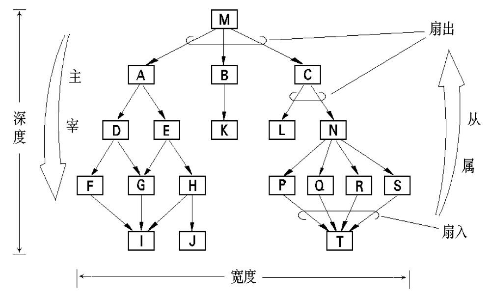

##### 模式

设计**模式（pattern）**是在软件开发过程中面临的一般问题的解决方案。如果需求的实现符合已经考验的模式，就可直接复用这些设计模式。

##### 关注点分离

**关注点分离（separation of concerns）**表明任何复杂的问题如果能被分解成能够独立解决的若干块，就可以更容易的被解决，即“分而治之”策略。

##### 模块化

**模块（module）**化是关注点分离最常见的表现。软件被划分成独立命名的模块并实现为系统中的**构件（component）**，这些构件最终**集成（integration）**为完整的系统。

> 模块（module）是设计中的概念，而构件（component）是已实现系统中实际可用的可更换的部分。即：构件遵照模块接口提供的标准，对模块功能进行实现。

模块化可以带来以下好处：

+ 更简单的开发工作流工期规划；
+ 模块可被定义为软件增量，并以构件形式交付后集成；
+ 更易实现模块变更并减少副作用
+ 利于单元测试
+ 便于维护

需要注意的是，虽然模块相关工作流的成本将随着模块数量增加而下降，但是集成成本却会逐渐上升，最小成本区域随着软件体系结构的变化而变化：

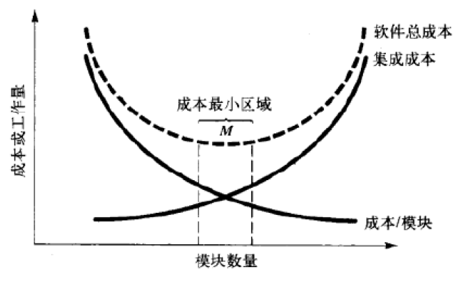

如何寻找最小成本区域仍是一大难题，基本的指导思想是在长期实践中评估各种软件体系结构模式下的合适模块数量区间，该区间可能取决于软件的功能点数量和功能复杂度。

##### 信息隐蔽

**信息隐蔽（information hiding）**原则建议模块对其他模块隐藏自己的内部设计决策，而只通过接口暴露自己的提供的功能（服务），并只提供必要的数据实体。

##### 功能独立

**功能独立（functional independence）**的模块是关注点分离、模块化、抽象和信息隐蔽概念的直接产物。功能独立将产出单一职责的模块，该模块会带来以下好处：

+ 单个模块的功能更加简单和利于实现
+ 模块接口更加简化
+ 减少模块变更带来的副作用
+ 减少错误扩散的影响范围
+ 更高的模块复用能力

模块的功能独立性可以根据模块的内聚性和耦合性进行评估，功能独立的模块是**高内聚低耦合**的。

##### 内聚

**内聚（cohesion）**性是一个模块内部各元素的紧密程度，内聚的模块往往只负责单一职责，尽可能少的与外部直接交互。内聚有以下几种类型：

1. **偶然内聚（coincidence cohesion）**：也称**巧合内聚**，一个模块内部各元素没有任何联系，**最差**的内聚；

   ```cs
   class Coincidence {
       abstract void PrintMyName();
       abstract T Add<T>(T a, T b);
       abstract void CreateChildProcess();
   }
   ```

2. **逻辑内聚（logical cohesion）**：模块内含有一些类似的过程，这些过程的调用由外部模块传递的指令参数决定：

   ```cs
   using System;
   
   static class Logical {
       public static void PrintOneOrTwo(signal) {
           if (signal == 1) Console.WriteLine(1);
           else if (signal == 2) Console.WriteLine(2);
       } 
       public static void PrintOne() => Console.WriteLine(1);
       public static void PrintTwo() => Console.WriteLine(2);
   }
   
   class Consumer {
       void Call() {
           Logical.PrintOneOrTwo(1);
           Logical.PrintOneOrTwo(2);
       }
   }
   ```

3. **时间内聚（classical cohesion）**：也称经典内聚，模块含有一些相关性很低的过程，但这些过程会在同一时间被调用：

   ```cs
   interface ISystemSetUp {
       void CreateProcess();
       void AllocMemory();
       void StartDaemon();
       void RenderGUI();
       void ListenInputs();
   }
   ```

4. **过程内聚（procedural cohesion）**：模块包含一些对应需求中的各个运行步骤的过程，这些过程之间的关联性可能不高：

   ```cs
   interface IHTTPDaemon {
       void Start();
       void Listen(int port);
       void OnRequest(Request request);
       void SendResponse(Response response);
       void ShutDown();
   }
   ```

5. **通信内聚（communication cohesion）**：模块包含一些对应需求中的各个运行步骤的过程，且操作相同的数据：

   ```cs
   interface IDBDriver { // 数据库驱动的所有过程（方法）都操作相同的 db 对象
       void Connect(DB db);
       QueryResult Query(SQLString sql, DB db);
       void Disconnect(DB db);
   }
   ```

6. **信息内聚（informational cohesion）**：模块可以完成多个功能，每个功能都有唯一入口，且操作相同的数据结构（符号表）。模块根据要求确定应该执行哪个功能，通过功能入口执行一组内部过程：

   ```cs
   abstract class StateMachine {
       private States states; // 所有功能均操作状态集合
       
       // 过程
       abstract public State GetState(string key);
       abstract public void SetState<T>(string key, T value);
       
       // 功能    
       public void DebugPrintState(string key) {
           System.Console.WriteLine(GetState(key));
       }
       
       public void FillAllStates<T>(T value) {
           foreach (var state in States) SetState<T>(state.key, value);
       }
   }
   ```

7. **功能内聚（functional cohesion）**：模块执行单一功能，且模块的各部分对于该功能而言均必不可缺，**最好**的内聚：

   ```cs
   abstract class MD5Crypto { // 该类用于计算 MD5
       private string plainText;
       private string cipherText;
       public abstract void SetPlainText(string source);
       public abstract void UpdatePlainText(string increment);
       public abstract string Digest(string format);
   }
   ```

##### 耦合

**耦合（coupling）**性是一个模块内部对外部元素的依赖程度，低耦合的模块往往仅通过接口进行外部交互。耦合有以下几种类型：

1. **内容耦合（content coupling）**：**最坏**的耦合，当模块具有以下特征时，会与外部发生内容耦合：

   + 一个模块直接访问了另一个模块的数据；
   + 一个模块不通过正常入口（函数调用）访问另一模块内部过程（常见于`goto`语句）；
   + 两个或多个模块中的一部分程序代码重合（一般出现在汇编语言中，不会在高级语言中出现）；
   + 一个模块具有多个入口（相当于让外部模块直接访问自己的内部）。

2. **公共耦合（common coupling）**：多个模块访问同个全局或公共数据环境；

3. **外部耦合（external coupling）**：多个模块访问同个全局或公共数据变量；

4. **控制耦合（control coupling）**：一个模块通过一个或多个全局控制信息变量显示控制另一个模块的行为，和外部耦合不同，这些信息变量仅用于控制；

5. **标记耦合（stamp coupling）**：也称印记耦合，模块间通过接口传递的参数进行间接调用通信，但参数是另一个模块中的复杂数据结构：

   ```cs
   class User {
       public string name;
       public string job;
   }
   
   class Order {
       public float CalculateRevenue(User user) => CalculateViaJob(user);
   }
   ```

6. **数据耦合（data coupling）**：**最好**的耦合，模块间通过接口传递的参数进行间接调用通信，并且参数不是另一个模块中的数据结构：

   ```cs
   class User {
       public string name;
       public string job;
   }
   
   class Order {
       public float CalculateRevenue(string userName, string userJob) => CalculateViaJob(userName, userJob);
   }
   ```

##### 求精

**逐步求精（stepwise refinement）**是一种自顶向下的设计策略，从抽象的宏观陈述逐渐**细化**到描述实现的设计模型。

##### 切面

**切面（aspect）**也称**方面**、**问题方面**。假如存在两个需求，需求 A 必须先于需求 B 满足，才可满足需求 B，就称 A **横切** B，A 和 B 是一个**横切关注点**，切面即是横切关注点的表示。**面向切面编程（Aspect-Oriented Programming）**是专注于解决问题方面的编程范式，很多时候会与面向对象范式同时使用，将问题方面抽象为类（模块）。

##### 重构

**重构（refactoring）**是改变系统内部设计和实现，而不改变系统功能或行为的动作，好的重构甚至不需要改变其暴露的接口。重构常见于敏捷过程和各种演化过程模型中。

##### 设计类

**设计类**也称软件类，是对需求工作流中的概念的进一步细化，为实现流提供指导。设计类可以分为以下类型：

+ 用户接口类：定义了软件人机交互中所必要的抽象，常见的有视图组件类；
+ 业务类：业务类定义了特定业务所必需的属性和服务；
+ 过程类：过程类是对业务类中一般业务过程的抽象，使一些业务过程可重用，如使用工具类和帮助类；
+ 持久类：需要持久化的数据的访问和存储驱动，如数据库驱动类；
+ 系统类：系统类是对需求流中控制类的细化，控制其他类的实例化、通信和数据呈现。

Arlow 和 Neustadt 提出良好的设计类需要拥有四个特征：

1. 完整性和充分性：设计类必须完整地封装所有可以预见的应该存在于类中的属性和方法；
2. 原始性：设计类应该关注与实现类的各种服务，且这些服务不应和其他类提供的服务产生冗余；
3. 高内聚性：内聚的设计类应执行单一职责，或至少具有最小的、集中的职责合集；
4. 低耦合性：设计类对其他类应该只有有限的了解，并只向周边相关的类传递消息。

##### 依赖倒置

**依赖倒置（dependency inversion）**指顶层结构调用低层模块的现象。依赖倒置并非不可取，很多时候依赖倒置可以简化模块的设计，但是为了减少副作用和错误扩散的影响，必须遵守**依赖倒置原则**：高层欧快不应当直接依赖于低层模块，而应该依赖于抽象，即通过接口调用底层模块，而不访问其实现。

#### 设计原则

下面是一些可参考的设计原则：

+ 模块的设计面向接口而不是面向实现
+ 为模块安排单一任务以简化模块接口
+ 模块仅暴露外部需要自己提供的服务
+ 模块仅通过接口调用外部服务
+ 使用合适的范式：结构化，函数式，面向对象，面向切面

### 2.4 实现

### 2.5 测试

### 2.6 运维

## 第三部分 常用建模语言

第三部分介绍一些结构化程序设计和之外的常用建模语言，一些语言本身没有标准，但在实践中基本使用相似的符号。符号图片主要来自 [Microsoft Visio](https://www.microsoft.com/en-us/microsoft-365/visio/flowchart-software) 。

### <span id="3-1">3.1 规格说明文档</span>

#### 介绍

在软件工程中，**软件需求规格说明（Software Requirement Specification，SRS）**文档时在项目商业化前必须建立的详细描述软件各个方面的工作产品。规格说明文档可以是非形式化的文字，例如一段场景描述，而形式化的规格说明文档一般必须包括有以下几个部分：

+ 文档概要：主要包括文档目的、问题定义、阅读人员、规范等引述性内容；
+ 软件描述：描述软件本身，包括软件特性、用户文档等部分；
+ 需求分析：详细分析需求，该部分内容将作为之后所有工作流的主要参考，一般包括功能性需求和非功能性需求部分。

> SRS 文档一般需要同时供项目成员和用户参考，如果认为 SRS 的内容性质过于而影响交流效率，也可以生成多份内容侧重和表现形式不同 SRS 文档。

#### 实例

下面是一份源自 Process Impact 公司的 Karl Wiegers 制作的 [SRS 模板](https://www.processimpact.com/process_assets/srs_template.doc)修改版，以供参考：

+ 目录
+ 版本历史
  + 修订人
  + 修订日期
  + 修订内容
+ 正文
  1. 导言
     1. 文档目的：描述文档的作用
     2. 软件目的：即问题定义
     3. 文档规范：文档格式约定等
     4. 适用人群和阅读建议
     5. 项目范围：该部分也可放在问题定义中
     6. 参考文献
  2. 总体描述
     1. 产品愿景：简洁描述软件是什么和能做什么
     2. 产品特性
     3. 用户类型和特征：推荐使用用户画像
     4. 操作环境：用户的使用环境
     5. 设计和实施约束
     6. 用户文档：该部分如果比较复杂也可独立于 SRS，作用类似于说明书手册
     7. 假设和依赖
  3. 系统特性
     1. 软件类型
     2. 软件运行环境
     3. 软件领域需求：如版权、领域规范、行业标准等
  4. 外部接口需求：以接口提供的服务描述功能性需求
     1. 用户接口：用户通过用户接口来使用软件的功能，该部分既要描述应该实现什么功能，也要描述用户如何使用这些功能
     2. 硬件接口
     3. 软件接口
     4. 通信接口
  5. 非功能性需求
     1. 性能需求
     2. 安全需求
     3. 保密需求
     4. 软件质量保证
  6. 其他需求
+ 术语表
+ 分析模型：通常是过程流中产生的各类模型
+ 问题列表：如果有遗留问题在此处记录以查阅和修正

### <span id="3-2">3.2 流程图</span>

#### 介绍

**流程图（flow chart）**是用于描述系统流程的工具，通常包含一组符号和文字说明。流程图类似于 UML 标准中的<a href="#4-5">活动图</a>。

流程图本身没有统一的规范，通常流程图包含以下符号：

| 符号                                                         | 含义                                             |
| ------------------------------------------------------------ | ------------------------------------------------ |
| 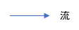 | 链接各个符号。                                   |
|  | 流程的名字，如“用户登录”、“查询订单”等流程活动。 |
|  | 条件分支，成功或失败等。                         |
|  | 流程图的开始和结束，必须成对出现。               |
|  | 数据输入和输出，一般会链接文档或数据库。         |
|  | 表示流程中会产生或读取纸质文档。                 |
|  | 表示流程中涉及的外部数据库。                     |
|  | 表示链接到同一页的另外一块流程图。               |
|  | 表示链接到另一页的另外一块流程图。               |

> 流程图属于静态模型，用于数据建模。

#### 实例

下面是一个用户发票的例子：

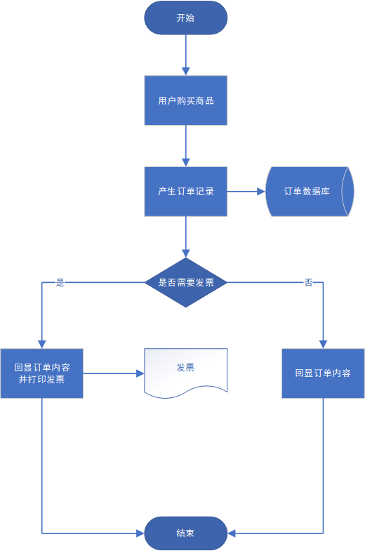

### <span id="3-3">3.3 数据字典</span>

#### 介绍

**数据字典（Data dictionary）**是一种用户可以访问的记录数据库和应用程序元数据的目录。数据字典主要记录关于数据的定义，而不关心数据间的相互关系。一般数据字典必须包括以下项：

+ 字段名
+ 数据类型：数据类型内容根据字典使用场景决定，如果是比较抽象的数据字典，类型只需包含一些元数据类型；如果数据字典就是面向特定系统的，则数据类型应该是系统中的类型；
+ 长度
+ 默认值
+ 可空
+ 备注

> 数据字典属于静态模型，用于数据建模。

#### 实例

下面是一个销售订单的数据字典，数据类型使用抽象类型，但注释中包含一些技术细节：

| 字段名           | 类型    | 长度 | 可空 | 默认值 | 注释                                         |
| ---------------- | ------- | ---- | ---- | ------ | -------------------------------------------- |
| trade_id         | String  | 25   |      |        | 自动生成，日期（8）+ `uuid_short()`（17）    |
| trade_status     | String  |      |      |        | `"已完成" `\|\| `"已取消"` \|\| `"等待处理"` |
| trade_start_time | String  |      |      |        | 交易发起时间，`timestamp`                    |
| trade_paid_time  | String  |      | 是   |        | 交易完成时间，`timestamp`                    |
| trade_price      | Float   |      | 是   |        | 交易价格                                     |
| trade_payment    | String  |      |      |        | 付款方式                                     |
| trade_signed     | Boolean |      |      |        | 产品是否已经签收                             |

### <span id="3-4">3.4 实体关系图</span>

#### 介绍

**实体-联系图(Entity Relationship Diagram，E-R)**，提供了表示实体类型、属性和联系的方法，是用来描述现实世界的概念模型。E-R 图被大量使用在关系型数据库的概念设计阶段中，注重数据间的相互联系。

E-R 图包含以下符号：

| 符号                                                         | 含义                                                         |
| ------------------------------------------------------------ | ------------------------------------------------------------ |
|  | 表示现实中的事物，如“人”、“商品”。                           |
|  | 属性必须连接到实体上。                                       |
|  | 关系描述不同实体间的联系，如“人购买商品”，“购买”就是关系。   |
| 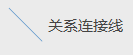 | 连接各个符号，对于实体和实体，可以表示一对一（1 : 1）、一对多（1 : N）和多对多关系（M : N）。 |

> E-R 图属于静态模型，用于数据建模。

#### 实例

下面是一个用户与产品、产品订单的 E-R 图例子：

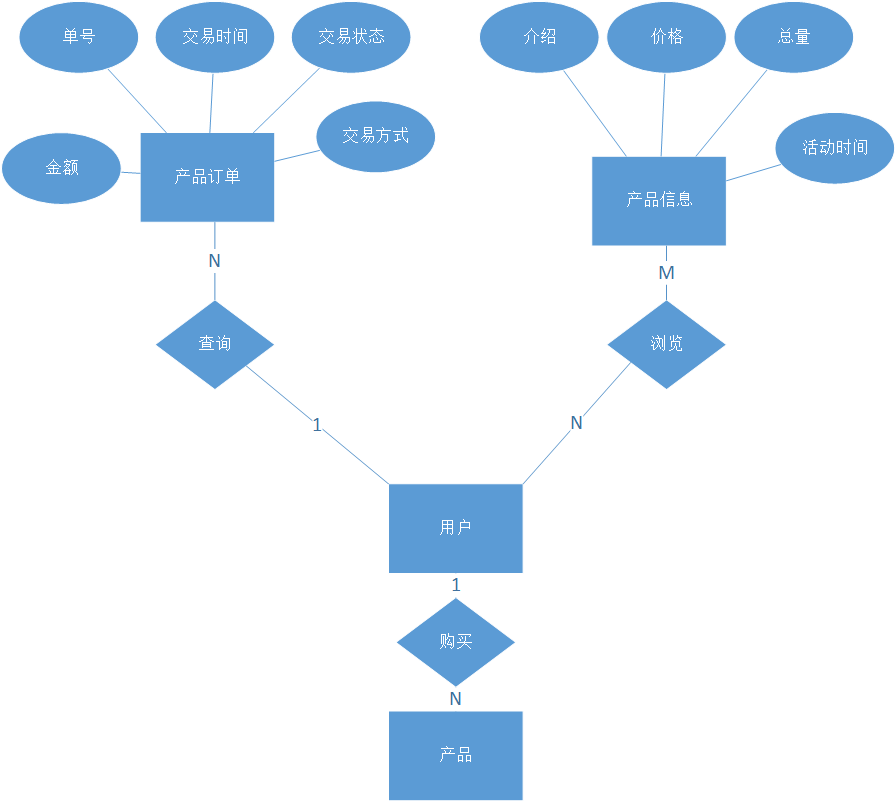

### <span id="3-5">3.5 数据流图</span>

#### 介绍

**数据流图（Data Flow Diagram，DFD）**从数据传递和加工角度，以图形方式来表达系统的逻辑功能、数据在系统内部的逻辑流向和逻辑变换过程，是结构化系统分析方法的主要表达工具及用于表示软件模型的一种图示方法。

> 数据流通常使用分层方式绘制，即先进行总体建模，再进行局部细化。顶层数据流图被称为“0 层数据流图”，在顶层中通常不会描述数据存储过程。
>
> 每条数据流都应该遵循输入输出平衡原则，即输入和输出必须是成对的，否则数据流没有意义。

数据流图包含以下符号：

| 符号                                                         | 含义                                                         |
| ------------------------------------------------------------ | ------------------------------------------------------------ |
|  | 即数据流，数据流应该使用名词描述，表示某项数据。             |
|  | 也称加工过程，表示系统的一个数据处理动作。                   |
|  | 外部交互方一般是数据起点和终点，如“人”、“数据库”。           |
| 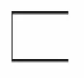或 | 数据存储必须连接到数据流程上，表示从存储中读取或向存储中存入数据。 |

如果单个流程和多条流相关，必须遵循以下原则：

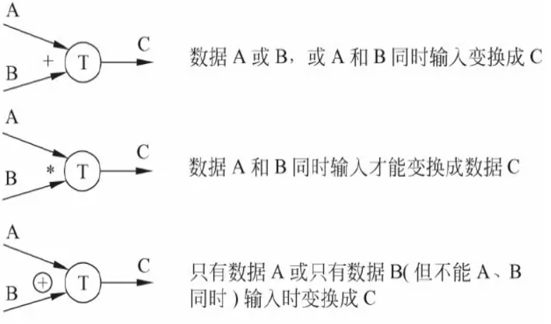

> 数据流图属于静态模型，用于功能建模。

#### 实例

下面是一个餐厅管理系统的 1 层数据流图：

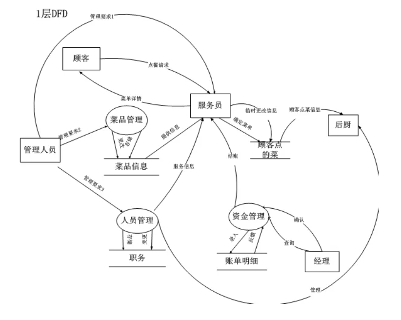

### <span id="3-6">3.6 用例规格说明</span>

#### 介绍

**用例规格说明（Use Case Requirement Specification）**是对用例内容的详细说明，一般会采用表格或列表的形式描述。根据实践经验总结，用例规格说明的内容通常应该包括以下内容：

| 项                 | 含义                                                   |
| ------------------ | ------------------------------------------------------ |
| 用例               | 用例的名字                                             |
| 主要参与者         | 用例的主要参与者，即使用者                             |
| 目标               | 描述用例对应的功能                                     |
| 前提条件           | 激活该用例必须满足的条件                               |
| 后置条件（触发器） | 用例结束后会发生的事情，也可以表述为激活某一个用例     |
| 主事件流（场景）   | 正常情况下会发生的事件流                               |
| 次事件流（异常）   | 用例中可能发生的异常以及其处理事件流                   |
| 优先级             | 描述功能优先级，可以表述为是否必须实现、在什么阶段实现 |
| 何时可用           | 功能再什么时候可用，可以表述为在某个版本中实现         |
| 使用频率           | 用例单位时间被激活的频率                               |
| 使用方式           | 主要参与者使用用例中功能的方式，如接口、软件           |
| 次要参与者         | 用例中的其他参与者                                     |
| 次要参与者使用方式 | 次要参与参与用例功能协作的方式                         |
| 未解决的问题       | 如果用例尚未完成，将问题记录以备查阅                   |

> 用例规格说明属于静态模型，用于需求建模，是对用例的具体描述或补充。

#### 实例

下面是一个市民登录 Web 站点以报告路面坑洼和严重程度的用例规格说明：

| 用例               | 登录 Web 站点                                                |
| ------------------ | ------------------------------------------------------------ |
| 参与者             | 市民                                                         |
| 目的               | 在报告前进行身份验证，防止恶意报告行为影响正常功能           |
| 前置条件           | 市民拥有能够访问 Web 的设备                                  |
| 后置条件           | 市民获得提交报告的权限                                       |
| 主事件流           | 1. 市民：打开客户端输入网址<br>2. 客户端：显示登录页面<br>3. 市民：输入账号密码<br>4. 客户端：发出请求<br>5. 服务器：响应验证<br>6. 客户端：允许用户进入 |
| 次事件流           | 1. 服务器错误：服务器无法处理页面请求<br>2. 客户端错误：客户端没有解析页面的能力，提示用户<br>3. 市民密码输入错误：必须重新输入直到正确 |
| 优先级             | 必须实现                                                     |
| 何时可用           | 首个版本                                                     |
| 使用频率           | 预计为较低的月频                                             |
| 使用方式           | 通过客户端浏览器                                             |
| 次要参与者         | 客户端，服务器                                               |
| 次要参与者使用方式 | 客户端和服务器：HTTP                                         |

### <span id="3-7">3.7 甘特图</span>

#### 介绍

**甘特图（Gantt chart）**也称横道图或条状图（Bar chart），由亨利·劳伦斯·甘特（Henry Laurence Gantt）提出。甘特图通过条状图来显示项目、进度和其他时间相关的系统进展的内在关系随着时间进展的情况。

甘特图一般必须包括以下信息：

+ 任务
+ 时间
+ 任务预期安排
+ 当前任务进度

复杂的甘特图还可以添加其他辅助信息，如：

+ 任务简介
+ 参与人员
+ 统计信息
+ 注释
+ ......

#### 实例

下方是一个最简单的甘特图实例：

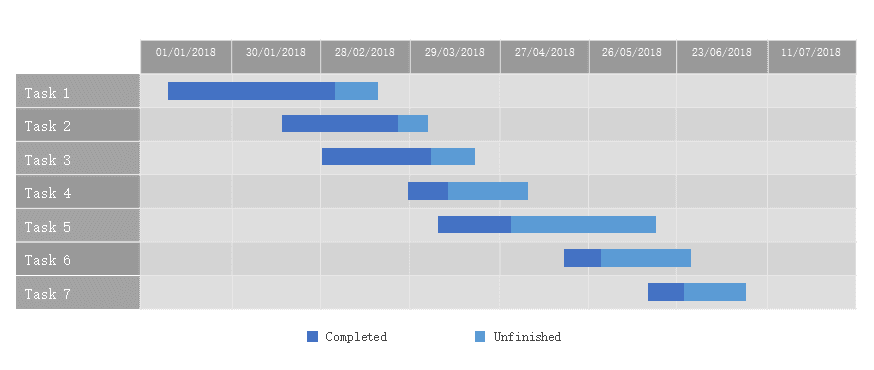

## 第四部分 统一建模语言

> 第四部分参考 *The Unified Modeling Language User Guide*（《UML 用户指南》），Grady Booch，James Rumbaugh，Ivar Jacobson 著，邵维忠 等译。
>
> [UML 官方网站](http://uml.org)
>
> 据 [Wikipedia](https://en.wikipedia.org/wiki/Unified_Modeling_Language)：**统一建模语言**（英语：Unified Modeling Language，缩写 **UML**）是非专利的第三代建模和规约语言。UML 是一种开放的方法，用于说明、可视化、构建和编写一个正在开发的、面向对象的、软件密集系统的制品的开放方法。UML 展现了一系列最佳工程实践，这些最佳实践在对大规模，复杂系统进行建模方面，特别是在软件架构层次已经被验证有效。
>
> 这个语言由葛来迪·布区（Grady Booch），伊瓦尔·雅各布森（Ivar Jacobson）与詹姆士·兰宝（James Rumbaugh）于 1994 年至 1995 年间，在 Rational Software 公司中开发，于 1996年 又进一步发展。UML 集成了 Booch ，对象建模技术和面向对象程序设计的概念，将这些方法融合为单一的，通用的，并且可以广泛使用的建模语言。UML 打算成为可以对并发和分布式系统的标准建模语言。
>
> 1997 年，UML 被对象管理组织（ISO）接纳为标准，并在此之后受该组织管理。2005 年，UML 被国际标准化组织接纳为一种标准，自此，该标准被定期修订以涵盖 UML 的最新版本。然而，在软件工程中，大多数从业者不使用 UML ，而是产生非正式的手绘图；不过，这些图例中仍往往包括 UML 的元素。

UML 利用图形化机制描述系统的分析和设计模型，定义了四类视图：

1. 用例图：描述系统参与者与功能；
2. 静态图：描述系统的静态结构，包括类图、对象图、包图等；
3. 行为图：描述系统的动态行为，包括交互图、活动图、状态图等；
4. 实现图：描述系统的实际实现，包括构件图和部署图等。

共 13 种图形：

1. 类图：一种结构图，展示类、接口、协作以及它们的关系；
2. 对象图：一种结构图，展示一组对象以及它们的关系；
3. 构件图：一种结构图，展示构建的外部接口和内部组成；
4. 组合结构图：一种结构图，展示结构化类的外部接口和内部组成；
5. 用例图：一种行为图，展示一组用例、参与者以及它们的关系；
6. 顺序图：一种行为图，展示一组交互，强调消息的时间顺序；
7. 通信图：一种行为图，展示一组交互，强调收发消息的对象的组织结构；
8. 状态图：一种行为图，展示一个状态机，强调对象由事件定义的行为；
9. 活动图：一种行为图，展示一个计算过程，强调从活动到活动的流；
10. 部署图：一种结构图，展示一组节点、制品以及包含的类和构件之间的关系；
11. 包图：一种结构图，展示把模型组织成包；
12. 定时图：一种行为图，展示在特定时间具有消息的交互；
13. 交互概念图：一种行为图，结合了活动图和顺序图的内容。

UML 是抽象的、独立于特定程序语言、为适用于任何软件开发过程而设计的，当 UML 提供的符号仍然无法满足表达需求时，还可使用<span id="stereotype">**构造型（stereotype）**</span>`<<steretype>>`进行额外描述，只需在双尖括号内填充描述语句即可。第四部分主要介绍一些软件工程中常用 UML 技术，符号图片主要来自 [Microsoft Visio](https://www.microsoft.com/en-us/microsoft-365/visio/flowchart-software) 。UML 将建模分为静态和动态建模。

### 4.1 <span id="4-1">用例图</span>

#### 介绍

**用例（use case）**也称用况，是对一组动作序列的描述，也可以理解为每个用例表述一种使用场景。**UML 用例图**是对用例进行建模的一种技术，包括一些概念以及相对应的符号表示。

> UML 用例图属于动态模型，用于对基本行为（功能）进行建模。

#### 规范

UML 标准规定了一组概念术语和其符号：

| 术语   | 符号                                                         | 含义                                                         |
| :----- | ------------------------------------------------------------ | :----------------------------------------------------------- |
| 参与者 |  | 用例的参与者，只用于表示人。                                 |
| 参与者 |  | 用方框表示非人参与者。                                       |
| 用例   |  | 椭圆形表示用例。                                             |
| 子系统 |  | 使用方框包围多个用例表示一个子系统。                         |
| 关联   |  | 无箭头实线，连接参与者和用例，表示参与者将参与用例。         |
| 依赖   | 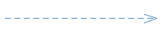 | 箭头虚线，表示某个用例依赖于前一个用例的发生，箭头指向被依赖的用例。 |
| 泛化   | 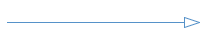 | 空心箭头，表示一个用例/参与者与另一个用例/参与者为继承关系，箭头指向基类，如“管理员”泛化自用户，“管理员注册”泛化自“用户注册”。 |
| 扩展   |  | 虚线箭头附加构造型`<<extend>>`，表示一个用例可能在另一个用例后发生，箭头指向前一个用例，如“打印订单”是“产生订单”的扩展。 |
| 包含   |  | 虚线箭头附加构造型`<<include>>`，表示一个用例是另一个用例的一部分，箭头指向父用例，如“验证”包含“登录”和“注册”。 |
| 实现   |  | 虚线空心箭头，表示一个或多个（通常是多个）用例实现了另一个更加抽象的用例，箭头指向接口用例，如“餐厅”被“服务”、“厨房”、“收银“等用例实现。该符号使用较少，因为一般不会在用例图中描述实现。 |

#### 实例

下面是一个简单图书馆系统的用例图，包含基本的用户认证、查阅书籍、借阅、图书管理员功能：

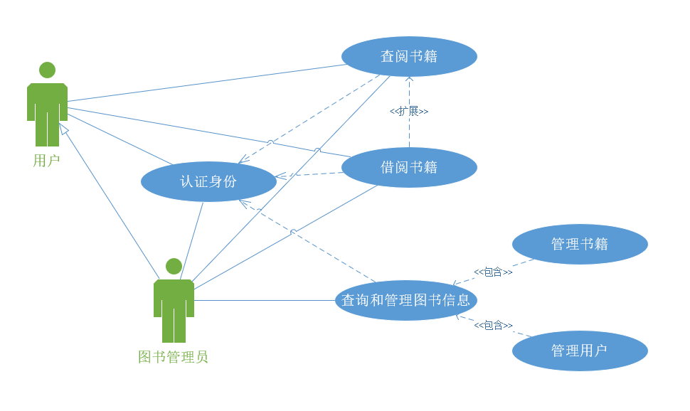

### 4.2 <span id="4-2">类图</span>

#### 介绍

**UML 类图（class diagram）**是显示一组类、接口、协作以及它们之间的关系的图形符号。类图不仅能用于描述概念模型，还可用于描述具体设计。

> UML 类图属于静态模型，用于对基本结构（数据）建模。

#### 规范

UML 类图标准的内容比其他图表更加复杂，首先是最基本的类结构部分：

| 术语     | 符号                                                         | 含义                                                         |
| -------- | ------------------------------------------------------------ | ------------------------------------------------------------ |
| 类       | 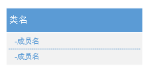 | 表示类，第一行为类的名字，第二行为类的属性，第三行为类的方法。 |
| 特殊的类 | 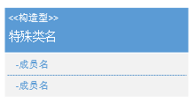 | 在软件类设计中，普通的类无法满足表述需求，往往还包括特殊结构如枚举、接口、mixin 等，要表示这些特殊的类，需要在其名称上方使用构造型进行描述，如`<<interface>>`表示一个接口。 |
| 模板类   | 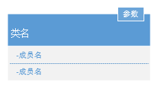 | 对于模板/泛型类，模板参数位于类符号的右上角，如果模板类在继承或实现时有模板特化情况，还需使用`<<bind>>`构造型描述参数限定条件。 |
| 包       |  | 包用于把一组模型组织成一定的层次结构，如文件夹、程序集、类库。 |

类的成员规定：

| 术语        | 符号                                               |
| ----------- | -------------------------------------------------- |
| 公有成员    | `+`开头                                            |
| 私有成员    | `-`开头                                            |
| 保护成员    | `#`开头                                            |
| 包内成员    | `~`开头                                            |
| 抽象类/成员 | 斜体标注名称                                       |
| 静态类/成员 | 下划线标注名称                                     |
| 属性        | `<属性名>[:类型]`                                  |
| 方法        | `<方法名>([参数1类型, 参数2类型, ...])[:返回类型]` |

类的关系：

| 术语     | 符号                                                         | 含义                                                         |
| -------- | ------------------------------------------------------------ | ------------------------------------------------------------ |
| 继承     | 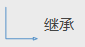 | 空心箭头，箭头指向基类。                                     |
| 实现     | 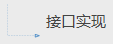 | 空心虚线箭头，箭头指向被实现的接口或抽象类。                 |
| 双向关联 |  | 实线，连接两个互相知道彼此的类。                             |
| 单向关联 | 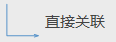 | 实线非闭合箭头，两个类的联系是单向的，一个类知道另一个类，另一个类却不知道这个类，箭头指向被知道的类。 |
| 聚合     | 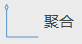 | 空心菱形箭头，也称公共聚集，箭头指向“容器”类。               |
| 组合     | 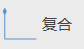 | 实心菱形箭头，也称组合聚集或符合，箭头指向“容器”类。         |
| 依赖     |  | 虚线非闭合箭头，表示一个类依赖于另一个类的存在，箭头指向依赖者。 |

> 对于概念模型，表述结构和关系就足够了，而设计模型一般还要表示更加具体的内容，如模板和成员访问性。

#### 实例

一个学生类的例子：

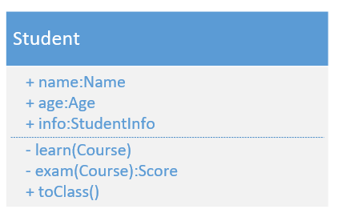

一个可迭代接口的例子：

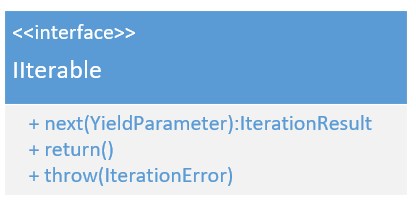

一个 HTTP 状态枚举的例子：

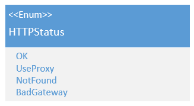

一个泛型数组和字符串继承的例子：

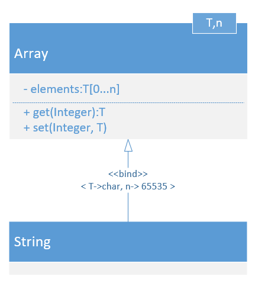

一个游戏场景内各类关系的例子：

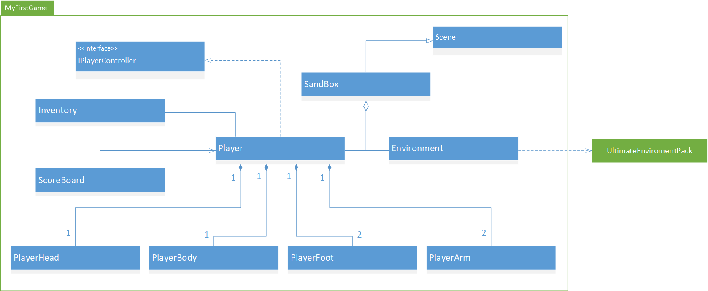

### <span id="4-3">4.3 对象图</span>

#### 介绍

**UML 对象图（object diagram）**是表示某一时间点上一组对象内部以及它们之间关系的符号图，当需要对系统特殊情况进行描述时，应该使用对象图而不是类图。

> UML 对象图属于静态模型，用于对基本结构（数据）建模。

#### 规范

对象图是对类图的补充，其标准内容比较简单：

| 术语     | 符号                | 含义                                               |
| -------- | ------------------- | -------------------------------------------------- |
| 对象     | `对象名:类名`       | 将类图中的类名细化为对象名即可表示一个特定的对象。 |
| 泛指对象 | `:类名`             | 表示所有该类的对象实例。                           |
| 状态     | `对象名:类名[状态]` | 状态名称包裹在对象名后的方括号内。                 |
| 属性值   | `属性=属性值`       | 表示属性具体的值。                                 |

#### 实例

下面是一个人类对象的例子：

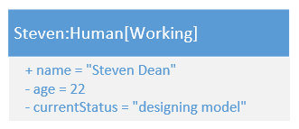

### 4.4 <span id="4-4">交互图</span>

#### 介绍

**UML 交互图（interactive diagram）**显示一个交互过程，包括一组对象和它们间的关系，以及对象间传递的消息。交互图主要包括**顺序图**和**通信图**，顺序图强调交互和时间的关系，通信图则没有反应时间信息。

> UML 交互图属于动态模型，用于对基本行为进行建模。

#### 规范

UML 标准规定了一组概念术语和其符号：

| 术语         | 符号                                                         | 含义                                                         |
| ------------ | ------------------------------------------------------------ | ------------------------------------------------------------ |
| 对象和生命线 | 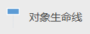 | 矩形方框表示对象，垂直虚线表示生命线，生命线代表对象的执行时间范围。对象也可添加类说明。 |
| 执行规约     |  | 也称激活，执行规约将置于对象生命线上，表示在一定时间段上对象将进行一种交互。 |
| 参与者       | 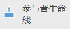 | 当参与交互的对象是人时，可以附加人型符号。                   |
| 同步消息     |  | 也称同步事件，同步消息箭头从一条对象生命线上的执行规约指向另一个对象生命线上的执行规约，消息箭头必须是平行的，附加文字说明消息的名称和参数`消息([参数1, 参数2, ...])`。消息一般为动词，参数为名词。 |
| 返回消息     | 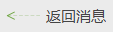 | 返回消息从执行规约底部返回到另一个执行规约，可以带返回参数`([参数1, 参数2, ...])`。 |
| 异步消息     | 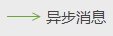 | 非封闭箭头，表示消息的返回是异步的，附加文字说明消息名称和参数。 |
| 对象撤销     |  | 也称破坏对象，在生命线终点标记一个叉号表示对象生命周期结束。 |
| 片段         |  | 片段用于包裹一段交互过程，并说明片段中的结构化控制流程，总共有四种控制流程，其名称位于片段左上角标签中。片段也可以包裹一组交互并命名。 |

四种控制流程：

+ 可选执行：标签`opt`，表示片段内的交互过程是可选的，内部过程的执行需要满足一个布尔条件，该条件书写在标签下方，相当于流程控制语句`if`；
+ 条件执行：标签`alt`，表示片段内的过程根据条件分支执行，会有一个满足条件参数的执行区域和一个分支`else`区域，相当于流程控制语句`if else`；
+ 并行执行：标签`par`，并行片段会用虚线来分割几个并行的部分，经常用于表示进程和线程的并发；
+ 循环执行：标签`loop(m, n)`，表示循环 m 至 n 次，一般表示为 1 至 n 次，每次循环需要满足特定条件，不满足条件或循环次数达到最高时跳出，相当于流程控制语句`while`。

#### 实例

下面是一个客户端通过消息队列向数据库输入数据的例子，消息队列同步接收客户端消息，数据库空闲时传输消息至数据库，在所有消息处理完毕后异步提示客户端处理完成：

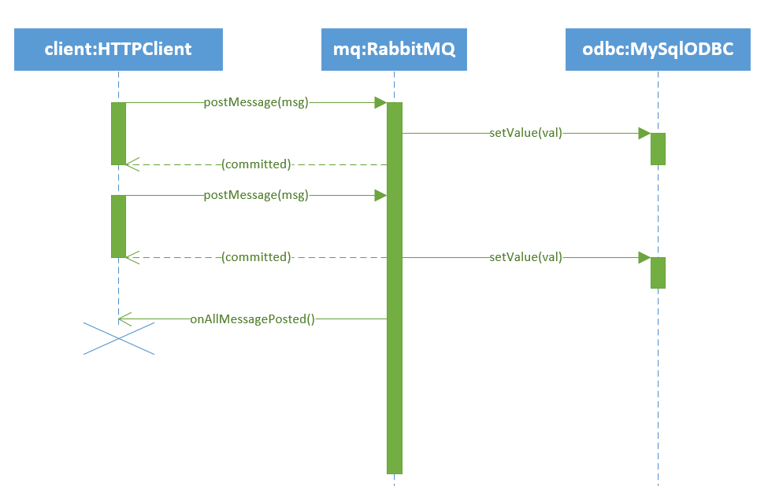

下面是一个订单录入的例子：

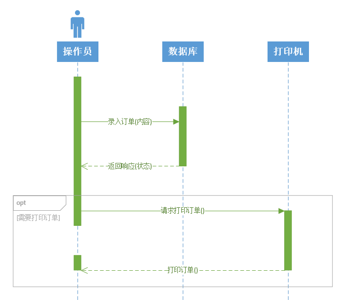

下面是一个判断权限的例子：

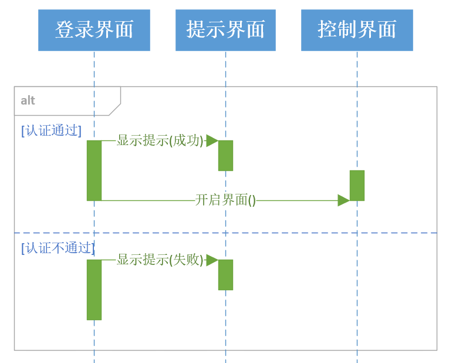

下面是一个语言编译服务并行处理多个代码片段的例子：

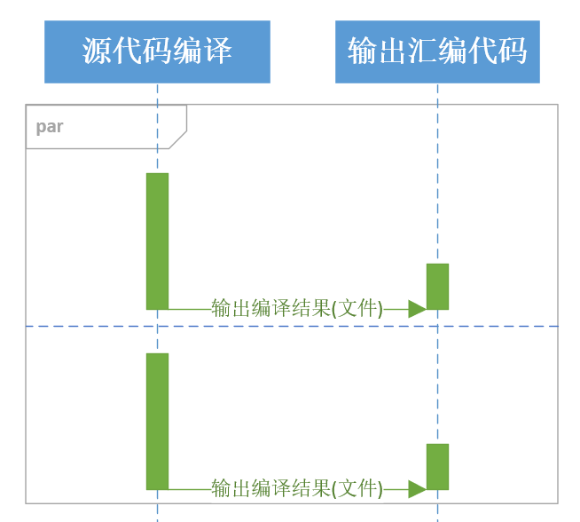

下面是一个计算机从键盘鼠标等设备读取用户输入，并在屏幕上返回输出的例子：

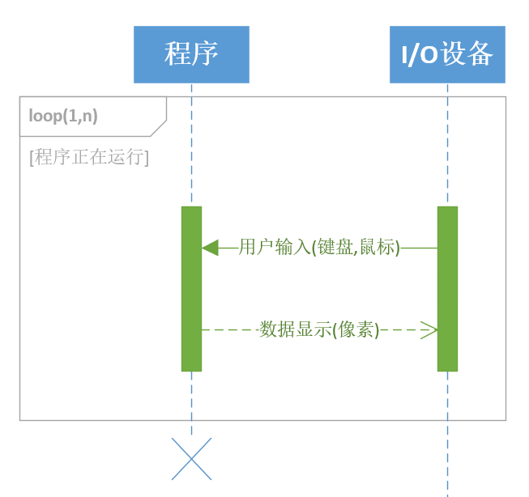

### 4.5 <span id="4-5">活动图</span>

#### 介绍

**UML 活动图（activity diagram）**显示从活动到活动的流。**活动（activity）**表示独立执行的动作，这些动作将改变系统自身的状态。互动图类似常用建模语言中的<a href="#3-2">流程图</a>。

> UML 用例图属于动态模型，用于对基本行为进行建模。

#### 规范

UML 标准规定了一组概念术语和其符号：

| 术语 | 符号                                                         | 含义                                                       |
| :--- | ------------------------------------------------------------ | :--------------------------------------------------------- |
| 活动 |  | 圆角方形，表示一个动作。                                   |
| 流   |  | 表示活动的进行方向。                                       |
| 判断 |  | 菱形，表示判断分支，如是或否。                             |
| 合并 |  | 菱形，和判断一致，用于合并多个因判断而分支流至同一个活动。 |
| 开始 |  | 活动图的开始。                                             |
| 结束 |  | 活动图的结束。                                             |
| 分岔 |  | 长方框，表示接下来多个活动将并行，必须和汇合成对出现。     |
| 汇合 |  | 长方框，表示多个并行活动汇合，必须和分岔成对出现。         |
| 泳道 |  | 泳道用于表示一组并行任务。                                 |

#### 实例

下面是一个市民报告路面坑洼和严重程度活动的活动图：

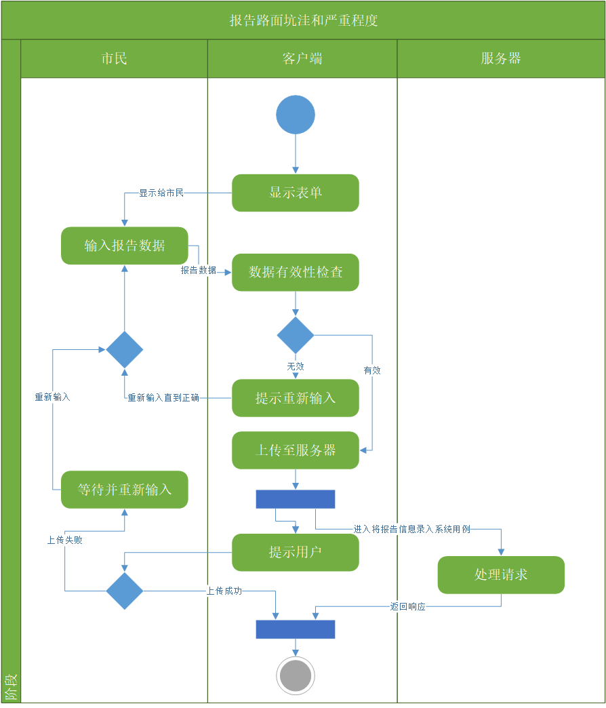

### 4.6 <span id="4-6">状态图</span>

#### 介绍

**UML 状态图（state diagram）**是描述状态机的一种工具。**有限状态机（FSM）**是一种描述动态系统的方法，一个 FSM 由五个部分组成：

+ 状态集 J
+ 输入集 K
+ 转换函数 T
+ 初始状态 S
+ 最终状态集 F

每个**当前状态（current state）**都在特点特定**事件（event）**发生后，发生一个**转移（transition）**，经过包含一组**动作（action，原子操作）**的**活动（activity，组合操作）**处理，转换至**下一个状态**，或转换为**最终状态**不再变化。

##### 状态

**状态（state）**是对象生命周期中的一个条件或状况，在生命周期中对象将在满足一些条件后执行一些动作，或等待事件到来。状态包含以下几个部分：

+ 名称：状态可以匿名
+ 进入/退出效应（entry/exit effect）：进入退出状态时执行的一组动作；
+ 内部转移（internal transition）：不包括状态改变，但会执行动作或活动的转移；
+ 子状态（substate）：状态的嵌套结构，包含非正交（顺序活动）或正交（并发活动）子状态；
+ 延迟事件（deferred event）：在该状态下不处理，推迟到该对象另一个状态下处理的一组事件。

 ##### 转移

**转移（transition）**表示对象在特定事件发生后，在满足特定条件的情况下，在前一个状态中执行一些动作（退出效应），并进入下一个状态的过程。对象发生状态改变称转移被**激活**。转移包含五个部分：

+ 源状态（source state）：处于源状态的对象在接收到触发事件并满足守卫条件时将激活一个转移；
+ 事件触发器（event trigger）：即事件，当对象满足条件时会因事件而激活转移；
+ 守卫条件（guard condition）：一个布尔表达式，当转移监听的事件发生时检测表达式，为真时激活转移；
+ 效应（effect）：一个可执行的行为，比如动作，作用于该对象或其他对象；
+ 目标状态（target state）：转移完成后的状态。

##### 事件触发器

复杂的事件触发器可以包括以下部分：

+ 信号：向其他对象发送一个信号，`send 对象.信号名`；
+ 事件：对象接收的事件，事件可以有参数，参数将用在其他事件触发器部分中，`事件名(参数)`。
+ 调用：调用其他对象的方法，`对象名.方法名(参数)`；
+ 时间推移：在指定时间后激活转移，`after(时间)`；
+ 状态改变：即非内部转移；
+ 守卫条件：激活转移的前提，是对事件传入参数的判断，`[布尔表达式]`；

事件触发器表示为一个字符串，以斜杠分隔各个部分。

##### 效应

**效应（effect）**是对象在激活转移时执行的行为，转移只发生在上一个转移结束后。一个转移只允许在上一个转移的所有效应结束后才可激活，有以下几种效应：

+ entry：进入效应，对象进入状态时的活动，`entry/动作1(参数);动作2(参数);...`；
+ exit：退出效应，对象离开状态时的活动，`exit/动作(参数);动作2(参数);...`；
+ do：其他效应，动作或活动，`do/动作(参数);动作2(参数);...`；
+ defer： do 中的特殊动作或活动，需要有一个事件队列管理延迟事件，`do/defer 延迟动作(参数)`

> UML 状态图属于动态模型，用于对高级行为进行建模。

##### 子状态

如果一个状态内部还有比较复杂的**子状态（substate）**，就需要进行嵌套表示，子状态将包含自己的初态和末态。子状态分为两种：

+ 非正交子状态：同步顺序执行的一组状态，就是一组内部状态图；
+ 正交子状态：异步并发的多组状态，就是多组内部状态图。

#### 规范

UML 标准规定了一组概念术语和其符号：

| 术语           | 符号                                                         | 含义                                           |
| -------------- | ------------------------------------------------------------ | ---------------------------------------------- |
| 转移           | 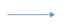 | 箭头指向下一个状态。                           |
| 事件触发器     |  | 事件触发器写在转移上方，斜杠分隔各个部分。     |
| 简单状态       |  | 仅表示状态的名字，而不包含动作和活动。         |
| 状态           |  | 包括状态名、动作和活动。                       |
| 初始状态       |  | 初始状态一般是匿名的。                         |
| 最终状态       |  | 最终状态一般是匿名的。                         |
| 复合状态       |  | 含有子状态的状态，正交状态使用平行虚线隔开。   |
| 折叠的复合状态 |  | 复合状态，但是内部细节不可见。                 |
| 分支           |  | 一个状态在不同条件下有不同转移，使用分支表示。 |

#### 实例

下面是一个简单的 HTTP 接口服务状态机：

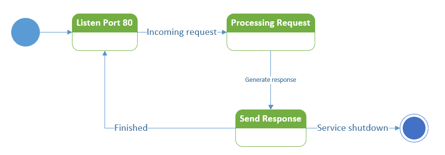

下面是一个雷达系统状态机：

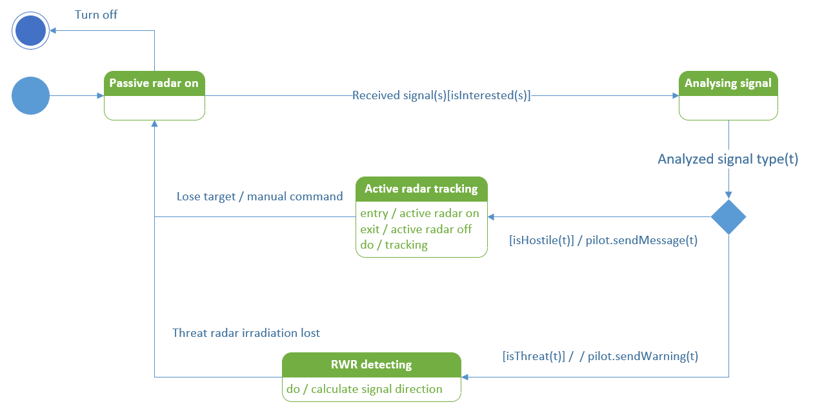

下面是一个包含子状态的 ATM 状态机：

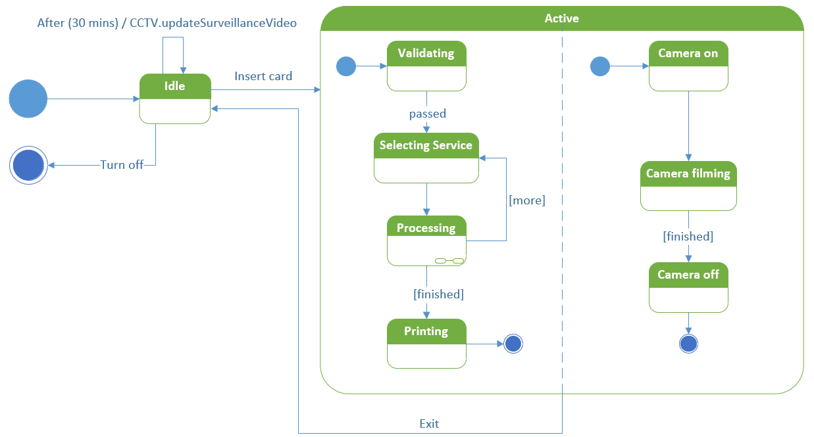

### 4.7 <span id="4-7">部署图</span>

