# 软件工程

## 第一部分 软件工程导论

## 第二部分 软件过程工作流

对软件过程的定义有多种，这里主要参考 Stephen R. Schach 在《软件工程 面向对象和传统的方法》中描述的“软件生命周期的工作流”，包括以下流程：

+ 需求
+ 分析
+ 设计
+ 实现
+ 测试
+ 交付后维护

以及 Roger S. Pressman 和 Bruce R. Maxim 合著的《软件工程 实践者的研究方法》中描述的“软件过程框架活动”，包括：

+ 沟通
+ 策划
+ 建模
+ 构建
+ 部署

最后将软件过程描述为一系列工作流，包括：

1. 需求
2. 分析
3. 设计
4. 实现
5. 测试
6. 部署和维护

此章主要介绍面向对象方法。

### 2.1 需求

常用的软件过程范型基本上可以分为文档驱动、原型驱动和用例驱动。在面向对象范型中，软件过程主要由用例驱动。在对问题进行定以后，软件工程师就需要根据场景编写用例。

需求流注重软件小组与客户、软件小组内部的沟通交流，并始于交流。在传统软件工程中，一般倾向于在初步交流后生成完备的文档，以文档为基础进行后续沟通；在敏捷过程中，一般只生成必须的书面文档，鼓励软件小组成员结对工作，以频繁的口头沟通代替非必要的文档说明。

需求工作流旨在建立**业务模型**，对软件客户的商业过程进行描述。一般认为需求分为两种：

+ **功能性需求**：软件必须能够执行的行为；
+ **非功能性需求**：产品需要满足的属性，如可靠性、响应时间。

建模是面向对象范型的根本，但使用**快速原型开发**也是可能的，有时不得不依靠原型方法快速生成粗糙的可执行程序。即使原型获得初步成功，也必须在后续迭代中逐渐补充文档，否则原型的维护将是一场灾难。必要时，也可重构原型，而重构成本将随着原型迭代程度增加而增加。

此外，软件的最终用户是人，**用户友好**是所有软件程序尤其是 GUI 程序必须满足的内容。

#### 问题定义

需求工作流始于**问题定义**。对问题的定义需要是清晰、明确、抽象的，软件问题定义的阅读者不只是软件小组成员，还应包括软件用户。问题定义应该较为简洁的描述“**做什么**”，而不涉及“怎么做”。

> 该阶段应产出一份清晰的问题定义说明。

#### 可行性分析

**可行性分析**的**目的**在于“用最小的代价在最短的时间内确定问题是否能够和值得解决”。可行性分析往往需要先确认并询问人员、查阅分析相关资料、改正含糊的概念，确保提出的问题确实是所要解决的问题后，进行四个方面的分析：

1. 策略可行性：问题是否有解决策略，暂时不考虑技术实现问题，如果没有解决问题的策略，则软件不可行；
2. 技术可行性：存在的策略需要在技术上予以实现，如果无法实现，则软件不可行；
3. 操作可行性：软件对于用户需要是可操作的，如果技术实现的接口让用户难以使用，则软件不可行；
4. 经济可行性：通过成本-效益分析法或其他方法，如果软件成本超过软件收益（包括潜在收益），则软件不可行。

> 该阶段应产出各种方面的可行性分析报告。

#### 传统方法：基于数据流

传统的结构化方法重视数据和处理数据的过程（函数），是一种**面向数据**的方法。基于数据流的需求工作要经过以下步骤：

1. 提取和细化需求（<a href="#3-1">规格说明文档</a>）
2. 对系统流程建模（<a href="#3-2">流程图</a>）
3. 对数据流建模（<a href="#3-5">数据流图</a>）
4. 建立<a href="#3-3">数据字典</a>
5. 建立实体关系描述（<a href="#3-4">E - R 图</a>）
6. 建立系统状态转换描述（<a href="#4-6">状态图</a>）

从数据、功能、行为方面描述：

+ **数据建模**：数据字典、E - R 图
+ **功能建模**：数据流图
+ **行为建模**：状态转换图

从静态建模和动态建模方面描述：

+ **静态建模**：数据流图、数据字典、E - R 图
+ **动态建模**：状态转换图

> 如果使用基于数据流的需求工作流，该阶段需要产出规格说明文档、流程图、数据流图、数据字典、E - R 图和状态图。

**结构化系统分析**是由 Gane 和 Saren 提出的一种传统分析方法，包括 9 个步骤：

1. 确定逻辑数据流（<a href="#3-5">数据流图</a>）
2. 确定产品中需要计算机自动化的部分（质量功能部署）
3. 细化数据流（建立<a href="#3-3">数据字典</a>）
4. 定义数据处理逻辑（<a href="#3-2">流程图</a>）
5. 定义数据存储（在数据流中分层细化）
6. 定义物理资源（在流程中引入数据库或报表等）
7. 确定输入输出规格说明（置于<a href="#3-1">规格说明文档</a>）
8. 确定大小（输入量、处理频率、最后期限、文件大小、CPU 要求等，置于规格说明文档）
9. 确定硬件要求（置于规格说明文档）

#### 面向对象方法：基于用例

统一过程和其他面向对象范型下的软件过程几乎都是由**用例（use case）**驱动的。用例即软件的功能使用场景，是一种基于**场景**、**面向对象**的建模方法。基于用例的需求工作流需要经过以下步骤：

1. 提取和细化需求（<a href="#3-1">规格说明文档</a>）
2. 开发用例（<a href="#4-1">UML 用例图</a>）
3. 细化用例（<a href="#3-6">用例规格说明</a>）
4. 必要时进一步细化用例（<a href="#4-4">UML 交互图</a>和<a href="#4-5"> UML 活动图</a>）

一些软件工程方法将与类建模相关的工作划分在分析工作流中，另一些则认为类建模属于需求工程。如果认为类建模属于需求工作流，还有包括有以下步骤（在<a href="#2-2">2.2 节</a>说明）：

5. 抽取实体类（<a href="#4-2">UML 类图</a>）
6. 分析系统状态（<a href="#4-6">UML 状态图</a>）

从数据、功能、行为方面描述：

+ **数据建模**：UML 类图
+ **功能建模**：UML 用例图、用例规格说明
+ **行为建模**：UML 交互图、UML 活动图、UML 状态图

> UML 标准中将数据建模称为结构建模，将功能和行为建模统称为行为建模，此外还有体系结构（架构）建模。

从静态建模和动态建模方面描述：

+ **静态建模**：UML 类图、UML 用例图、用例规格说明
+ **动态建模**：UML 交互图、UML 活动图、UML 状态图

> 如果使用基于用例的需求工作流，该阶段需要产出UML 类图、UML 用例图、用例规格说明、UML 交互图、UML 活动图和UML 状态图，其中交互图和活动图是对用例的补充说明。
>
> 根据实践经验，小型项目在每层用例细化模型中，一般最好使用不超过 20 个用例，保证建模粒度（清晰颗粒）较细以接近实现。

### 2.2 <span id="2-2">分析</span>

在分析流中，需要解决的问题仍是“**做什么**”，而不是“怎么做”，但是对过程的描述将比问题定义更加详细。此节介绍的是面向对象分析方法。

#### 工期规划

大部分软件项目开发都需要多人团队的参与。和工作流模型一样，各个团队成员的工作进程也是并行相交的。为了能够直观的表示各个成员的工作计划安排与当前进度情况，需要使用一种能够描述并行工作流的建模技术。不只是面向对象，在许多方法中<a href="#3-7">**甘特图**</a>都是一种常用于制作工期安排文档的技术。

> 该阶段产出工期安排文档，供所有团队成员参考，管理者和用户也可以根据该文档进行项目评估。

#### 面向对象分析

目前，已有多种**面向对象分析（Object-Oriented Analysis，OOA）**方法：

+ 微开发和宏开发过程：由 Booch 提出，微开发过程定义了一组任务，并在宏开发过程的每一步骤中反复使用它们；
+ 对象模型化技术（OMT）：由 Rumbaugh 等人提出，包括对象模型（描述对象、类、层次和关系），动态模型（描述对象和系统的行为），功能模型（类似于高层的 DFD，描述穿越系统的信息流）三个建模部分；
+  Coad 和 Yourdon 的方法：一种被认为是最容易学习的方法，包括表示潜在对象、定义对象之间的一般/特殊化和整体/部分结构、表示主题（构件级表示）、定义属性与对象之间的联系、定义属性与对象间的消息通信五个过程；
+ 面向对象软件工程（OOSE）：由 Jacobson 提出，用例驱动；
+ Wirfs-Brock 方法：一种始于客户规格说明的方法；
+ 统一的 OOA 方法：即使用 UML 进行分析建模的方法，将 Booch、Rumbaugh 和 Jacobson 等各自独立的 OOA 和 OOD 方法中最优秀的特色组合成一个统一的方法；

这些 OOA 分析方法基本都包括一组任务：

1. 沟通：软件小组成员与客户沟通，软件小组内部沟通；
2. 标识类：找出类，并标识方法和属性（<a href="#4-2">UML 类图</a>）；
3. 定义类之间的关系：继承、实现、关联、依赖、组合、聚合；
4. 模型化对象的行为：对功能和行为建模(<a href="#4-4">UML 交互图</a>、<a href="#4-5"> UML 活动图</a>和<a href="#4-6">UML 状态图</a>)。

面向对象分析法基于类和对象，UML 和其他的一些 OOA 方法常将类分为三种，在 UML 中可以使用<a href="#stereotype">构造型</a>表示它们：

+ **实体类（entity）**：也称**业务**类，可以从用例中直接提取。这些类一般是数据和过程的抽象，如用户类、报表类；
+ **边界类（boundary）**：边界类是软件用户或构件使用的交互**接口**，实体类确实包含很重要的数据信息，但是这些信息必须通过边界类呈现。现代应用中最常见的边界类就是 GUI 控件和微服务接口；
+ **控制类（control）**：控制类将管理实体类的创建、边界类对数据的呈现、对象之间的通信和数据交换。实体类和边界类本身不能无限制的进行交互，因此控制类对于复杂应用而言是必须的。

通常在分析阶段从用例中提取出的大部分潜在类都属于实体类，包含少部分边界类，而控制类一般会在设计阶段才被提出。

> 对三种类类型最直观的实现即是设计工作流中常用的 MVC 模式和其衍生。

##### 标识类

标识包括三个步骤：

1. 建立用例（功能建模）；
2. 进行语法分析，描述类和其属性（实体类建模）；
3. 描述类的操作（动态建模）。

在完成需求工作流中的用例建模任务后，需要对用例进行**语法分析**。语法分析可以包含以下几个步骤：

1. 分析用例图或用例规格说明；
2. 筛选名词和谓词短语，在第一次出现时进行标注，一般名词和名词短语将成为潜在类或其属性，谓词将成为方法，谓词短语将成为事件；
3. 评估潜在类、属性、方法和事件，只有一个成员的类有时更适合作为另一个类的属性，将这些类转化为属性；
4. 将类进行分类，列出分类后的类列表。

下面是一个图书馆系统的用例例子，可以对其进行语法分析，以粗体标注名词，斜体标注谓词：

> 1. **图书管理员**将**读者借书卡** *提供* 给**系统**；
> 2. 系统*验证* **读者** 身份和 **借书条件**；
> 3. 图书管理员将读者所借 **图书** *输入* 系统；
> 4. 系统记录 **借书信息**，并且 *修改* 图书的 **状态** 和此 **种** 书的 **可借数量**；
> 5. 系统 *修改* 读者的 **可用限额**；
> 6. 重复 3 ~ 5，直到图书管理员 *确认全部图书登记完毕*；
> 7. 系统*打印* **借书清单**，交易成功 *完成*。

评估后可以区分出以下类、属性、方法和事件：

| 潜在类     | 属性           | 方法                   | 事件                         |
| ---------- | -------------- | ---------------------- | ---------------------------- |
| 图书管理员 | 读者：借书条件 | 管理员：录入借书卡信息 | 图书管理员：确认图书登记完毕 |
| 读者借书卡 | 读者：借书信息 | 系统：验证读者         | 系统：交易完成               |
| 系统       | 图书：状态     | 管理员：输入图书信息   |                              |
| 图书       | 图书：种类     | 系统：更新图书信息     |                              |
| 借书清单   | 图书：可借数量 | 系统：修改读者信息     |                              |
|            | 读者：可用限额 | 系统：打印借书清单     |                              |

进一步将潜在类分类，可以看出大部分类都属于实体类，而不存在显式的控制类：

| 实体类     | 边界类   | 控制类 |
| ---------- | -------- | ------ |
| 图书管理员 | 借书清单 |        |
| 读者借书卡 |          |        |
| 系统       |          |        |
| 图书       |          |        |

##### 明确关系

在对潜在类进行筛选和分类后，应该明确类与类之间的关系。类之间包含以下五种关系：

1. **泛化（generalization）**：泛化分为**继承（derive）**和**实现（implement）**两种关系；
2. **关联（association）**：表示两个类之间有所关联，但并不互相依赖对方，可以单独存在；
3. **依赖（dependency）**：表示一个类依赖于另一个类的存在，和关联不同，依赖方必须在被依赖方存在时存在；
4. **聚合（aggregate）**：也称**共享聚集**，如果一个类属于另一个类的一部分，但又可以单独存在，就为聚合；
5. **组合（composition）**：也称**组合聚集**，如果一个类属于另一个类且同生命周期、不能单独存在，就为组合。

类之间的关系还可能是一对一，一对多，多对多的上述关系。

UML 中有<a href="#4-2">一组符号</a>表示这些类之间的关键，<a href="#3-10">CRC 模型</a>提供了另一种建模方案。

##### 概念类建模

**概念类**是在分析工作流中需要明确的类，概念类应该是抽象的、实现无关的，以区分设计工作流中的软件类。利用 <a href="4-2">UML 类图</a>，可以很好地进行概念类建模。对类的建模属于一种静态建模，包括对数据和功能的建模。

##### 行为建模

类还包括一些动态行为，这些行为将涉及类之间的通信与协作，产生同步或异步的消息事件，是静态模型无法描述的。标识类工作中的事件将在行为建模中起作用。UML <a href="#4-4">交互图</a>、<a href="#4-5">活动图</a>和<a href="4-6">状态图</a>是进行类的行为建模的有效工具。

> 该阶段应产出描述类的静态结构和动态行为的抽象概念模型，这些模型应尽可能做到与实现无关。

### 2.3 设计

设计流创建了软件的表示或模型，为实现流提供细节性指导，解决了“**用什么做**”的问题。软件设计包含一些重要的原理和概念，这些内容是进行设计实践前必须了解的。

#### 设计原理

需要设计工作流的**原因**是需求工作流中产生的模型有时过于抽象，缺少细节，无法直接作为实现工作流的指导。设计的**目标**是产生健壮、合适、易于人类阅读和理解的模型或特定表示。设计和实现的区别在于，设计关注软件结构高层各部分间的相互关系，以及底层包含的逻辑性操作；而实现将以特定的方式（如编程语言）描述这些关系和操作所对应的计算机能够理解的过程。

简而言之，设计的目的是让参与实现的人类理解需求细节，而实现的目的是让计算机理解人类描述的作业过程。

##### 设计的分类

从过程管理的角度来看，设计工作可以分为概要设计和详细设计两部分，前者属于需求工作流的内容，后者属于设计工作流的内容；从技术角度看，将详细设计任务进一步细化，设计流可以分为：

1. **数据/类设计**：将需求流中的概念类模型转换成**设计类（也称软件类）**模型（<a href="#4-2">UML 类图</a>）；
2. **体系结构设计**：细化和扩展需求流中的关系模型，定义软件各元素间的**关系**和约束，在需要时参考惯用体系结构**模式**和其指导，或使用已经经过考验的解决方案**框架**，并生成体系结构模型（<a href="#4-8">UML 部署图</a>）；
3. **接口设计**：接口描述了软件内部的**模块**之间、软件与用户之间如何**交互**，需求流中的动态功能和行为模型将成为接口设计的依据；
4. **构件级设计**：模块提供接口，而**构件**实现模块，需求流中的动态功能和行为模型将成为构件级设计的依据。

##### 好的设计

McGlaughlin 认为，好的设计应该：

1. 不仅实现所有需求模型中包含的**明确需求**，还必须满足利益相关者的所有**隐含需求**；
2. 为实现流、测试流、运维流提供指导的，必须是**可读可理解**的指南；
3. 提供软件的全貌，从**实现角度**对软件数据、功能和行为进行说明。

##### 原理性原则

在设计实践中，考虑以下原理性原则：

1. 体系结构设计应该：
   1. 源自已经验证的体系结构模式；
   2. 由设计良好的构件或已有的可重用构件组成；
   3. 以迭代的方式不断完善。
2. 设计应该模块化；
3. 设计应该包含数据、体系结构、接口和构件的清晰表示；
4. 设计应产出数据结构的设计，这些数据结构将适用于要实现的类，来源于可以识别的数据模式；
5. 设计应产出功能独立的模块；
6. 设计应产生接口以降低构件之间、模块之间的关联复杂性；
7. 设计过程应考虑使用可重用的方法，这些方法是特定于需求模型的，以提高工作效率；
8. 设计的表达方法必须合适且高效，生命周期较短的小型软件可能只需要简单的设计表示，而大型软件必须有完备的设计模型。

##### 评价设计

Hewlett-Packard 提出了一种评价软件设计质量的属性指标，称为 FURPS（首字母缩写），通过参考实现后的系统来评价设计，包括以下属性：

+ 功能性（functionality）：评估程序的特征集和能力（实现的功能集合）、通用性和系统安全性；
+ 易用性（usability）：评估程序的交互友好程度、美观度、内容一致性和文档；
+ 可靠性（reliability）：评估程序发生故障的频率和严重性、程序输出的精确性、平均故障时间（Mean-Time-To-Failure，MTTF）、故障恢复能力和程序的可预测性；
+ 性能（performance）：评估程序的处理速度、响应时间、资源消耗、吞吐量（任务完成速率）和效率；
+ 可支持性（supportability）：也称可维护性（maintainability），评估程序的可扩展性、可适应性和可用性（单位时间内程序正常运行时间占比）。

##### 设计范式的演化

软件工程历史上依次出现过以下具有影响力的软件设计范式：

1. 模块化程序设计（MP）
2. 结构化程序设计（SP）
3. 函数式程序设计（FP）
4. 面向对象程序设计（OOP）
5. 面向切面程序设计（AOP）
6. 领域驱动设计（DDD）
7. 测试驱动设计（TDD）
8. 模型驱动设计（MDD）

#### 设计概念

##### 抽象

**抽象（abstract）**是从事物中抽取出共同的、本质性的特征，而舍弃其非本质的特征的过程。对于软件设计而言，一个简单的解释是“关注接口提供的功能，而不是接口的实现”。从需求流到设计流再到实现流的过程，就是从“干什么”的抽象到“用什么”的抽象最后到“怎么做”的过程，即从抽象到**实现（implementation）**。

软件设计中的抽象可以分为两种：

+ 过程抽象：将过程抽象为接口，而隐藏其实现；
+ 数据抽象：向外暴露类型为一种简单的值，而隐藏类型的实际数据结构。

##### 体系结构

**体系结构（architecture）**也称**架构**，是对软件系统组成的抽象，描述模块和模块间的关系，实现的构件与构件之间应该如何组织，以及构件需要的操作和数据结构。体系结构包含三部分：

+ **构件**：软件中具有某种功能的可复用、可替代、已实现模块，表示系统中的计算过程或数据结构，如程序和工具库；
+ **连接件**：建立构件关联和信息传递的途径，如通信机制（API、管道、进程调用）和通信协议（网络、数据库）；
+ **约束**：构件交互和关联时必须满足的限定条件，如体系结构模式和体系结构风格的要求。

体系结构图可以表示为带有关系的设计类 <a href="#4-2">UML 类模型</a>，<a href="#4-7">UML 构件图</a>和 <a href="#4-8">UML 部署图</a>。

Shaw 和 Garlan 描述了体系结构具有的一组属性：

+ 结构特性：定义了系统的构件、构件如何被封装、构件间相互作用的方式；
+ 外部功能特性：描述体系结构如何满足外部的性能、能力、可靠性、安全性和适应性需求；
+ 相关系统族：抽象出体系结构中的可复用模式。

**体系结构模式（architecture pattern）**也称体系结构风格，是软件开发过程中面临的一般问题的体系结构设计解决方案，特定的模式可能已经以**框架（framework）**形式实现，并有一组可重用的构件供使用。

一个好的体系结构中的高层模块应该具有较少的**扇入（模块或数据结构被其他模块操作）**和**扇出（模块调用子模块）**，而中间层和底层尽可能多的扇出和扇入。这里的多少不是指绝对数量，而是指与上一层模块相比的相对数量：


##### 构件

**构件（artifact）**也称制品、组件，是软件系统中已经被实现的、可更换、可重用的功能模块，表示一组计算过程和数据结构。软件构件可以分为三类：

+ 部署构件：可执行软件系统的充分必要组成部分，通常部署于计算机外存中，系统脱离部署构件无法正常运作，部署构件无法脱离系统单独运行，典型的例子有动态链接库（DLL）、可执行程序（EXE）、Web 页面的 HTML 文件、数据库表等；
+ 工作产品构件：开发过程中的产物，不直接参与到可执行系统中，而是用于产生可执行系统，典型的有源代码文件、数据文件、文档等；
+ 可执行构件：一个真正正在被执行的构件，通常位于计算机内存中，如可执行程序产生的操作系统进程实例、DLL 实例化后的对象或函数、渲染后的 Web 页面等。

##### 部署节点

软件系统在执行前必须从开发工作流中的环境迁移到部署和运维工作流中，**部署节点（deployment node）**表示软件系统在运行时拥有计算资源、内存资源和处理能力的处理器或设备，是软件构件的物理载体。即：部署节点执行构件，构件是部署节点的执行对象。常见的部署节点有个人计算机、移动终端、Web 服务器、网络路由器、物联网设备等。

##### 模式

设计**模式（pattern）**也称**机制（mechanism）**，是在软件开发过程中面临的一般问题的解决方案。如果需求的实现符合已经考验的模式，就可直接复用这些设计模式。

##### 关注点分离

**关注点分离（separation of concerns）**表明任何复杂的问题如果能被分解成能够独立解决的若干块，就可以更容易的被解决，即“分而治之”策略。

##### 模块化

**模块（module）**化是关注点分离最常见的表现。软件被划分成独立命名的模块并实现为系统中的一组可更换的**构件（component）**，这些构件最终**集成（integration）**为完整的系统。

> 模块（module）是设计中的概念，而构件（component）是已实现系统中实际可用的可更换的部分。即：构件遵照模块接口提供的标准，对模块功能进行实现。

模块化可以带来以下好处：

+ 更简单的开发工作流工期规划；
+ 模块可被定义为软件增量，并以构件形式交付后集成；
+ 更易实现模块变更并减少副作用
+ 利于单元测试
+ 便于维护

需要注意的是，虽然模块相关工作流的成本将随着模块数量增加而下降，但是集成成本却会逐渐上升，最小成本区域随着软件体系结构的变化而变化：


如何寻找最小成本区域仍是一大难题，基本的指导思想是在长期实践中评估各种软件体系结构模式下的合适模块数量区间，该区间可能取决于软件的功能点数量和功能复杂度。

##### 信息隐蔽

**信息隐蔽（information hiding）**原则建议模块对其他模块隐藏自己的内部设计决策，而只通过接口暴露自己的提供的功能（服务），并只提供必要的数据实体。

##### 功能独立

**功能独立（functional independence）**的模块是关注点分离、模块化、抽象和信息隐蔽概念的直接产物。功能独立将产出单一职责的模块，该模块会带来以下好处：

+ 单个模块的功能更加简单和利于实现
+ 模块接口更加简化
+ 减少模块变更带来的副作用
+ 减少错误扩散的影响范围
+ 更高的模块复用能力

模块的功能独立性可以根据模块的内聚性和耦合性进行评估，功能独立的模块是**高内聚低耦合**的。

##### 内聚

**内聚（cohesion）**性是一个模块内部各元素的紧密程度，内聚的模块往往只负责单一职责，尽可能少的与外部直接交互。内聚有以下几种类型：

1. **偶然内聚（coincidence cohesion）**：也称**巧合内聚**，一个模块内部各元素没有任何联系，**最差**的内聚；

2. **逻辑内聚（logical cohesion）**：模块内含有一些类似的过程，这些过程的调用由外部模块传递的指令参数决定：

   ```cs
   using System;
   
   static class Logical {
       public static void PrintOneOrTwo(signal) {
           if (signal == 1) Console.WriteLine(1);
           else if (signal == 2) Console.WriteLine(2);
       } 
       public static void PrintOne() => Console.WriteLine(1);
       public static void PrintTwo() => Console.WriteLine(2);
   }
   
   class Consumer {
       void Call() {
           Logical.PrintOneOrTwo(1);
           Logical.PrintOneOrTwo(2);
       }
   }
   ```

3. **时间内聚（classical cohesion）**：也称经典内聚，模块含有一些相关性很低的过程，但这些过程会在同一时间被调用：

   ```cs
   interface ISystemSetUp {
       void CreateProcess();
       void AllocMemory();
       void StartDaemon();
       void RenderGUI();
       void ListenInputs();
   }
   ```

4. **过程内聚（procedural cohesion）**：模块包含一些对应需求中的各个运行步骤的过程，这些过程之间的关联性可能不高：

   ```cs
   interface IHTTPDaemon {
       void Start();
       void Listen(int port);
       void OnRequest(Request request);
       void SendResponse(Response response);
       void ShutDown();
   }
   ```

5. **通信内聚（communication cohesion）**：模块包含一些对应需求中的各个运行步骤的过程，且操作相同的数据：

   ```cs
   interface IDBDriver { // 数据库驱动的所有过程（方法）都操作相同的 db 对象
       void Connect(DB db);
       QueryResult Query(SQLString sql, DB db);
       void Disconnect(DB db);
   }
   ```

6. **信息内聚（informational cohesion）**：模块可以完成多个功能，每个功能都有唯一入口且完成单一职责，且操作相同的数据结构（符号表）。模块根据要求确定应该执行哪个功能，通过功能入口执行一组内部过程：

   ```cs
   abstract class StateMachine {
       private States states; // 所有功能均操作状态集合
       
       // 过程
       abstract public State GetState(string key);
       abstract public void SetState<T>(string key, T value);
       
       // 功能    
       public void DebugPrintState(string key) {
           System.Console.WriteLine(GetState(key));
       }
       
       public void FillAllStates<T>(T value) {
           foreach (var state in States) SetState<T>(state.key, value);
       }
   }
   ```

7. **功能内聚（functional cohesion）**：模块执行单一功能，且模块的各部分对于该功能而言均必不可缺，即只要模块被引用，就不会存在无用部分，**最好**的内聚：

   ```cs
   abstract class MD5Crypto { // 该类用于计算 MD5
       private string plainText;
       private string cipherText;
       public abstract void SetPlainText(string source);
       public abstract void UpdatePlainText(string increment);
       public abstract string Digest(string format);
   }
   ```

##### 耦合

**耦合（coupling）**性是一个模块内部对外部元素的依赖程度，低耦合的模块往往仅通过接口进行外部交互。耦合有以下几种类型：

1. **内容耦合（content coupling）**：**最坏**的耦合，当模块具有以下特征时，会与外部发生内容耦合：

   + 一个模块直接访问了另一个模块的数据；
   + 一个模块不通过正常入口（函数调用）访问另一模块内部过程（常见于`goto`语句）；
   + 两个或多个模块中的一部分程序代码重合（一般出现在汇编语言中，不会在高级语言中出现）；
   + 一个模块具有多个入口（相当于让外部模块直接访问自己的内部）。

2. **公共耦合（common coupling）**：多个模块访问同个全局或公共数据环境；

3. **外部耦合（external coupling）**：多个模块访问同个全局或公共数据变量；

4. **控制耦合（control coupling）**：一个模块通过一个或多个全局控制信息变量显示控制另一个模块的行为，和外部耦合不同，这些信息变量仅用于控制；

5. **标记耦合（stamp coupling）**：也称印记耦合，模块间通过接口传递的参数进行间接调用通信，但参数是另一个模块中的复杂数据结构：

   ```cs
   class User {
       public string name;
       public string job;
   }
   
   class Order {
       public float CalculateRevenue(User user) => CalculateViaJob(user);
   }
   ```

6. **数据耦合（data coupling）**：**最好**的耦合，模块间通过接口传递的参数进行间接调用通信，并且参数不是另一个模块中的数据结构：

   ```cs
   class User {
       public string name;
       public string job;
   }
   
   class Order {
       public float CalculateRevenue(string userName, string userJob) => CalculateViaJob(userName, userJob);
   }
   ```

##### 求精

**逐步求精（stepwise refinement）**是一种自顶向下的设计策略，从抽象的宏观陈述逐渐**细化**到描述实现的设计模型。

##### 切面

**切面（aspect）**也称**方面**、**问题方面**。假如存在两个需求，需求 A 必须先于需求 B 满足，才可满足需求 B，就称 A **横切** B，A 和 B 是一个**横切关注点**，切面即是横切关注点的表示。**面向切面编程（Aspect-Oriented Programming）**是专注于解决问题方面的编程范式，很多时候会与面向对象范式同时使用，将问题方面抽象为类（模块）。

##### 重构

**重构（refactoring）**是改变系统内部设计和实现，而不改变系统功能或行为的动作，好的重构甚至不需要改变其暴露的接口。重构常见于敏捷过程和各种演化过程模型中。

##### 设计类

**设计类**也称软件类，是对需求工作流中的概念的进一步细化，为实现流提供指导。设计类可以分为以下类型：

+ 用户接口类：定义了软件人机交互中所必要的抽象，常见的有视图组件类；
+ 业务类：业务类定义了特定业务所必需的属性和服务；
+ 过程类：过程类是对业务类中一般业务过程的抽象，使一些业务过程可重用，如使用工具类和帮助类；
+ 持久类：需要持久化的数据的访问和存储驱动，如数据库驱动类；
+ 系统类：系统类是对需求流中控制类的细化，控制其他类的实例化、通信和数据呈现。

Arlow 和 Neustadt 提出良好的设计类需要拥有四个特征：

1. 完整性和充分性：设计类必须完整地封装所有可以预见的应该存在于类中的属性和方法；
2. 原始性：设计类应该关注与实现类的各种服务，且这些服务不应和其他类提供的服务产生冗余；
3. 高内聚性：内聚的设计类应执行单一职责，或至少具有最小的、集中的职责合集；
4. 低耦合性：设计类对其他类应该只有有限的了解，并只向周边相关的类传递消息。

##### 依赖倒置

**依赖倒置（dependency inversion）**指顶层结构调用低层模块的现象。依赖倒置并非不可取，很多时候依赖倒置可以简化模块的设计，但是为了减少副作用和错误扩散的影响，必须遵守**依赖倒置原则**：高层模块不应当直接依赖于低层模块，而应该依赖于抽象，即通过接口调用底层模块，而不访问其实现。

#### 设计原则

下面是一些可参考的设计原则：

+ 原型有时是最好的设计
+ 模块的设计面向接口而不是面向实现
+ 为模块安排单一任务以简化模块接口
+ 模块仅暴露外部需要自己提供的服务
+ 模块仅通过接口调用外部服务
+ 使用合适的范式：结构化，函数式，面向对象，面向切面

#### 设计模型

**设计模型**是设计工作流的一组产出。可以从过程维度和抽象维度描述设计工作流中设计模型的迭代变换。**过程维度**描述了设计模型如何从顶层抽象迭代为基础具体，包含以下几个从抽象到具体的等级：

1. 数据模型；
2. 体系结构模型；
3. 接口模型；
4. 构件模型；
5. 部署模型；

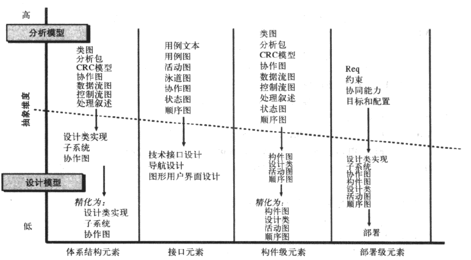

**抽象维度**描述需求模型如何转换为一个等价的设计模型，有时需求模型和设计模型间存在较大差异，有时可能只需要细微修改就可成为设计模型。

在设计时应该首先考虑可否使用经过验证的**设计模式**，如果这些模式有已经实现的构件或框架，可以极大地减少开发工作流的成本。

根据过程维度，设计工作流分为数据模型设计、体系结构设计、接口设计、构件设计和部署设计五个子工作流，这些流并不总是按固定先后顺序进行。

##### 数据设计

**数据设计**也称数据体系结构设计，创建高抽象级（一般是用户需求中的数据观点、需求模型中的数据字典）表示的软件级数据模型和信息模型。需求工作流中诞生的数据字典将被细化为计算机能够识别的表示。

在程序构建级中，数据模型对于处理数据的算法的输入、输出和处理过程至关重要，将直接影响算法的实现效率；在应用级中，数据模型将完成到数据库详细字段的转变；在业务级中，本身结构化的数据将被按照之间的联系重新组织为新的数据结构，以满足数据分析和信息挖掘的需要。

在数据设计工作流中，一般会将需求阶段的数据字典细化为软件级别的数据字典，将字段类型和描述更加技术化，以适应计算机程序和数据库系统的要求。

> 该阶段产出适用于特定程序设计语言或运行时和数据库的数据字典，将 UML 需求概念类转化为 UML 软件设计类。

##### 体系结构设计

**体系结构设计**创建软件总体布局的表示，包含软件各部分的**协作**关系与**接口**描述，即一组相互关联的子系统。体系结构设计受以下方面的影响：

+ 应用域信息：应用领域的特点将将决定软件采用何种架构。如云、桌面、Web 软件都会采用不同的体系结构模式；
+ 软件过程范式：软件遵守的软件过程范式直接决定了各个工作流中使用的方法和产出。参照特定范式下的需求工作流模型指导，将使用不同的设计方法，并产生不同的模型表示。如结构化程序设计和面向对象程序设计将产出不一样的体系结构模型表示；
+ 已经验证的体系结构模式：已验证的体系结构模式可以被重用，或为目前的设计提供指导。

> 该阶段确定需要采用的体系结构风格和体系结构模式，产出初步的 UML 构件图和部署图，细化 UML 设计类图。

##### 接口设计

**接口设计**创建软件各部分暴露给外部和其他内部部分的交互的表示，描述事件和信息如何输入和输出各个模块。**接口**表示模块外部可见的公共操作说明，而没有内部结构具体说明。接口设计大致可以分为以下几类：

+ 用户界面设计：UI 设计有时也称可用性设计，重点建立软件和用户的交互接口模型，包括可视化接口和非可视化接口设计；
+ 外部接口设计：建立软件和外部元素，如其他系统、网络、设备等交互的接口模型；
+ 内部接口设计：内部接口设计和构件设计密切相关，描述软件各个模块需要的操作和消息传递方式，以保证模块间的通信和协作。

> 该阶段细化 UML 构件和设计类图，为设计类添加接口的描述，具有图形界面的软件还需创建 UI 设计模型。

##### 构件级设计

**构件级设计**完整的描述了每个软件构件的内部细节，如数据结构、算法细节、操作接口等。构件级设计可以根据需求在不同的抽象层进行表示，如使用 UML 模型描述交互过程，使用伪代码描述算法过程，甚至直接使用程序设计语言描述数据结构和操作接口。

需要注意的是，构件级设计始终是设计的一部分，细节应该按需描述，而不是为了描述而描述，不要做无意义的设计工作。只有在细节仍然比较模糊的情况下才将构件模型往实现细化，否则直接开始实现工作流才是更合适的选项。

> 该阶段细化 UML 设计类图，主要添加接口的实现关系。

##### 部署级设计

**部署级设计**描述软件和其子模块如何在具体的物理计算环境中分布。如桌面软件需要使用部署模型描述其本地部分和网络部分在各个平台中的分布，Web 软件则会重点描述服务器方面的部署结构。

> 该阶段细化和修正 UML 部署图。

#### 软件架构设计

> 现在更多地使用架构设计来指代软件体系结构设计。

最早的计算机软件没有**架构**。当计算机程序开始变得复杂后，软件开始被划分成多个模块，程序员开始负责这些模块间的交互和装配，便开始出现软件架构，并同时出现了程序员间的合作和分工。

然而，早期的软件架构是不成熟的，软件开发人员以非正式的方式描述和使用这些系统，而不是像现在使用多种技术清晰的表述它们。这些架构可能包含了一组隐藏的特性或副作用，这些特性会在遇到一些没有考虑到的偶然事件是发生，并作为历史遗留产物的一部分延续下去。

因此，我们需要**软件架构设计**技术，将软件架构描述为以下部分的组成：

+ 软件系统内部的一个或多个**模块**；
+ 软件系统内部模块的**接口**；
+ 软件系统内部模块的外部可见**属性**（数据和数据结构）；
+ 模块之间的**相互关系**或**约束**（依赖和协作）。

以满足以下需求：

+ 在设计阶段对需求的实现进行**有效性分析**；
+ 在软件实现仍处于易于变更的阶段，考虑更多的解决方案；
+ 降低软件过程的**风险**。

##### 架构

如上所述，软件架构指软件系统中的一个或多个模块，包含模块的接口和外部可见数据和数据结构，以及模块间的依赖于协作关系。这些**模块**可能就是一个简单的面向对象的类，也可能会是服务器软件中的中间件，甚至是一个完整的解决方案。模块间的**关系**可能是一个模块对另一个模块的接口调用，也可能是一个复杂的网络或数据库访问协议。

如今的软件架构师必须明白一点：现在的软件设计大多基于已有的体系结构的**实现之上**，我们所谓的架构设计，是在更高的抽象架构下的软件设计。即：架构是多层的，现代软件设计已经成为特定软件架构下的一个实例，进行架构设计前必须能够明确设计的**边界**。

+ 硬件级架构实现：x86，ARM；
+ 操作系统级架构实现：Windows API，POSIX；
+ 运行时级架构实现：.NET，Java，WASM；
+ 设计模式/框架级架构实现：Spring MVC，.NET WPF，React.js；
+ 程序设计范式级实现：OOP，OOA，Functional；
+ 程序设计语言级实现：C/C++，Java，C#，F#；
+ ……

这些架构的实现为所有利益相关者提供了交流社区，并简化了软件工作流中的各个流程，但也因此对整个软件行业产生了深远的影响，已实现的软件架构也逐渐从企业内部闭源走向开源和商业构件化。为了确保这些架构以及架构之上的其他架构能够始终有效，必须关注架构设计。

软件架构发展历史：

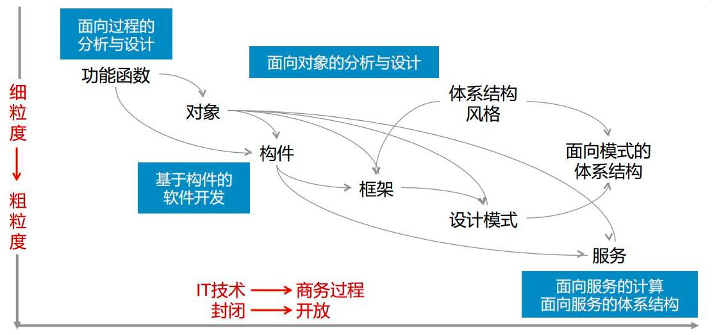

##### 架构描述

软件架构可以从不同方面描述，这些方面适用于不同的利益相关者的不同关注点，并有对应的描述形式和实用的技术：

| 描述方面 | 适合人群         | 描述形式 | 实用技术                                       | 作用                                       |
| -------- | ---------------- | -------- | ---------------------------------------------- | ------------------------------------------ |
| 实现     | 程序员，架构师   | 构件模型 | UML，IDL（接口定义语言），伪代码，程序设计语言 | 传递实现中的相关信息                       |
| 功能     | 客户             | 自然语言 | 规格说明文档                                   | 对需求的实现进行评估                       |
| 外在表现 | 所有             | 原型     | 原型设计软件，软件快速开发工具                 | 对软件的设计进行评估和理解                 |
| 模块组成 | 项目经理，架构师 | 架构模型 | UML，功能性架构图，技术性架构图                | 分配项目资源和人员分工，考虑构件和架构重用 |
| 使用方式 | 客户，运维人员   | 文档     | 用户手册，接口文档，日志文档                   | 了解如何使用软件，如何部署软件和维护软件   |

总之，架构描述的目的是要从不同的角度让不同的人群有一个最好的理解。

##### 架构决策

架构决策是选择解决设计问题的方法和模式的活动。由于设计过程是一个反复迭代的过程，架构师无法在一开始就对项目有一个全面的暴恐，将架构决策的过程书面化并记录下来有助于架构人员在多次决策中逐渐理清逻辑，并作出更优的选择。Grady Booch 提供了一种描述架构决策的模板，包含以下部分：

+ 设计问题：描述将要解决的架构设计问题；
+ 解决方案：描述选择的解决设计问题的方法；
+ 分类：指定问题和解决方案所属的设计分类，如数据设计、内容结构设计、构件结构设计、集成、架构简要说明等；
+ 假设：指出有利于设计开展的前提假设；
+ 约束：指出有利于设计开展的环境约束；
+ 候选方案：描述其他可以考虑的架构设计方案，以及摒弃的原因；
+ 争论：描述为什么选择该方案而不是其他方案；
+ 意义：指出解决方案对设计过程本身的影响，如是否会影响其他的架构设计问题，是否会对其他架构设计问题产生约束；
+ 相关决策：该决策和其他被记录的决策间有没有相关性；
+ 相关关注点：其他需求和该决策有没有相关性；
+ 工作产品：指出在架构描述中，该决策会在哪里体现出来；
+ 注释：其他参考文字或文档引用。

##### 架构类型

软件架构类型（genre）是特定于某一生产领域的。Grady Booch 在《软件体系结构手册》一书中描述了一组常见软件类型：

+ 人工智能
+ 通信
+ 设备
+ 金融
+ 游戏
+ 工业
+ 法律
+ 医疗
+ 军事
+ 操作系统
+ 运输
+ 使用程序/工具库
+ ……

某一类型的软件架构往往包含一组已经验证的可重用的方法和实现供参考。

##### 架构风格

业界对于**架构风格（style）**和架构模式（pattern）的定义和区分并不是十分统一，现在一般认为架构风格是一组对架构中各模块协作关系的**约束**，并在这些约束下形成的一种**解决方案**。[微软的 Azure 云文档](https://docs.microsoft.com/zh-cn/azure/architecture/guide/architecture-styles/)对架构风格有一个比较详细的描述。这些约束是必要的，以避免软件模块在协作和集成时再次出现某些已知的问题。即：架构风格是在**特定约束下的解决方案**。

常见的软件风格可以被分为以下几个类型：

+ 以数据为中心的架构：该架构风格下有一个数据存储模块（文件或数据库），其他边缘构件需要经常访问该模块，数据存储模块就像一块“黑板”。这种约束提高了架构的可集成性，边缘构件的修改和添加不会影响其他边缘构件和存储模块，存储模块也可在不变更接口的情况下更改内部实现。典型的实现有剪贴板程序、数据库驱动程序等；

  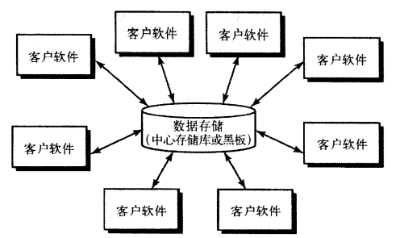

+ 数据流架构：该架构下包含一组相对独立的过程，约束则是这些过程必须按特定顺序执行，且一个或一组过程的输出将成为下一个或下一组过程的输入，任意环节出错将导致整个架构停止。这些过程构件被称为“过滤器”，通过“管道”连接。典型的实现有 Shell 批处理作业脚本、编译器、媒体播放器等；

  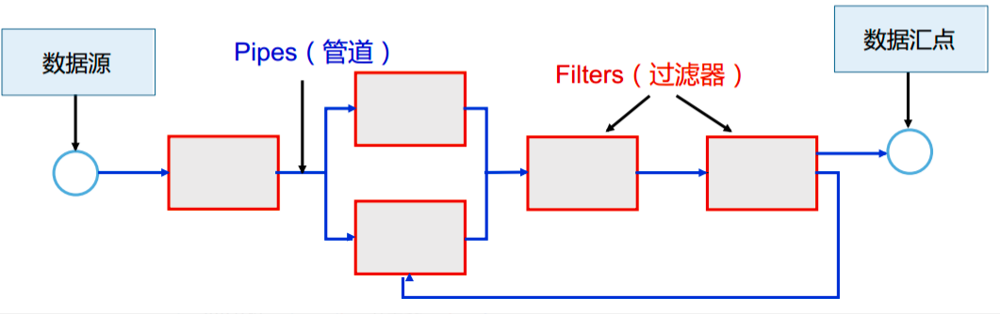

  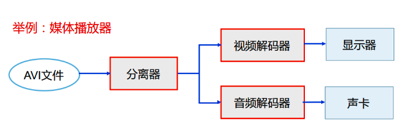

  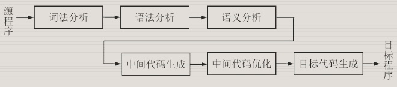

+ 调用和返回架构：这类架构在各级抽象中都特别常见，包含主程序构件和其他子程序构件，这些构件组成一种树状调用关系，这种约束同样可以防止错误扩散，并让程序结构变得比较清晰。根据各个构件间的调用方式还可分为本地过程调用和远程过程调用，典型的实现有类 C 程序设计语言结构；

  

+ 面向对象架构：各构件封装内部数据和操作，暴露一组必要的对外操作，各个对象通过消息传递进行协作。面向对象约束已经被证明是可靠的；

+ 层次架构：层次架构定义了一系列抽象程度不同的构件，在该约束下，越顶层的构件拥有越高的抽象度和复用性，越底层的构件越接近于机器的指令描述。使用该风格需要遵守依赖倒置原则，并注意各层构件的职能边界。典型的实现有 OSI 7 层网络模型、TCP/IP 协议模型、现在计算机系统的 5 层结构等；

+ 客户机-服务器架构：该架构将构件分为客户机和服务器两种类型，客户机只负责处理简单逻辑，复杂运算交由服务器提供的服务过程处理，该约束下两类构件各司其职，拥有较高的可集成性。典型的实现有操作系统服务、Web 应用等；

+ 面向服务架构：SOA 架构实现的系统由一组分布式的松耦合、粗粒度的网络应用组成，每个网络应用节点为调用者提供明确服务，调用者无需了解任何服务实现细节，由 SOA 提供系统集成，具有高重用、可组合的特性；

+ 微服务架构：微服务架构是对 SOA 的一种扩展，强调将 SOA 的服务彻底地组件化和服务化，即 SOA 集成对象的完全分离。微服务实现的软件由一组小而自治的应用组成，这些应用提供单一服务，具有规模小、松耦合、高独立的特点，所有服务由单一入口：API 网关调用。微服务架构具有高敏捷、小团队、混合技术、错误隔离、数据隔离和可伸缩性优势。

  > 微服务架构 = 80% 的 SOA 服务架构思想 + 100% 的组件化架构思想 + 80% 的领域建模思想


要确定软件应该采用的架构风格，可以参考其他类似的项目采取的解决方案，通过进行需求问题分类和概括，使用适合的风格对症下药。

##### 架构模式

**架构模式**也称**框架（framework）**模式（被实现的架构模式称作框架），是相比架构风格更加细化的构件关系描述，用于解决在特定上下文和约束下的常见应用问题。“四人帮”在《设计模式》一书中是这么描述面向对象范式中的模式的：

> The design patterns in this book are descriptions of communicating objects and classes that are customized to solve a general design problem in a particular context.
>
> 设计模式描述了一组类和对象的关系，用以解决特定上下文内的某个常见的设计问题。

即：架构模式可以是架构风格的一部分，以架构风格作为上下文存在，也可脱离架构风格的约束，在其他问题需求上下文中使用。

##### 架构评估

架构设计的目标和其评价标准可以包含以下**质量属性**：

+ 可重用性：架构设计是否可靠，并足够抽象可重用；
+ 可扩展性：架构设计是否易于增加新的功能；
+ 可改变性：架构设计是否易于更变；
+ 简单性：架构设计是否成功地将复杂问题分解为可以解决的简单问题；
+ 有效性：架构设计是否能体现早期的设计决策，反映出解决需求问题的能力；
+ 性能：架构设计的实现是否足够迅速与有效；
+ 可测试性：架构设计与其实现是否易于测试；
+ 可移植性：架构设计是否易于转化为不同平台中的实现；
+ ......

变更时对架构影响最大的组成部分称为**敏感点**。例如，服务器数量可能是客户机-服务器架构性能的一个敏感点，在一定区间内，服务器数量的增加可以显著改善系统性能。

##### 架构设计过程

1. 建立架构环境：架构环境定义了软件架构的外部实体（其他系统、设备、人等）与系统自身的接口交互的特性。可以使用文字描述简单的上下文环境，或用<a href="#3-9">架构环境图</a>图形化地描述架构环境。
2. 复盘需求：重新阅读需求和分析流文档，确保架构环境描述能够满足用户的所有需求；
3. 引用架构风格和模式：评估已经验证的架构风格和模式，选择适用于目标系统的风格与模式以及对应的框架实现。评估候选的架构风格和模式时可以关注系统的敏感点；
4. 将架构细化为构件：在风格和模式的指导与约束下，进行构件设计，依据一般来自分析流中的概念类模型，这些模型最终会被细化为构件模型和设计类模型，常用的建模技术有 <a href="#4-7">UML 构件图</a>和 <a href="#4-2">UML 类图</a>，每个构件包含一组类，构件间通过各自的接口相互调用；
5. 描述系统实例：之前的步骤描述了系统的环境和模块抽象，现在需要将抽象转化为实际运行的系统实例，常用的建模技术有<a href="#4-7">UML 构件图</a>、<a href="#4-3">UML 对象图</a>和<a href="#4-8">UML 部署图</a>。

#### 软件构件设计

**构件**是系统中模块化的、可配置的和可替换的部件，该部件封装了实现并暴露了一组**接口**。在面向对象范式中表示为一个类或一组协作的类。构件设计将需求流中的概念类细化为实现流中可用的设计类，完善构件接口和类的成员描述：

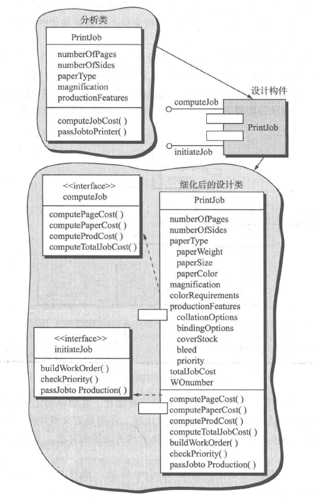

##### 构件类型

软件构件可以分为三种类型：

1. **控制构件**：上层构件，协调当前问题域中其他构件的调用，常见的有微服务架构中的 API 网关、MVC 模式中的控制器；
2. **问题域构件**：中层构件，通常包含用户希望的一组或一项功能，调用底层构件，常体现为业务相关类；
3. **基础设施构件**：底层构件，包含功能过程的具体实现，常见的有 Web 三层架构中的数据库系统、可复用的 GUI 组件、状态管理系统和操作系统和运行平台 API 等。

##### 构件设计原则

不良好的面向对象设计将带来一系列灾难，设计不佳的基类、随意的外部引用、微妙的继承和混入等行为将会让复用机制称为耦合性发源地。下面是四项被广泛认可的设计基本原则，用于减少错误设计带来的在构件变更时产生的副作用和高成本。

###### 开闭原则

**开闭原则（The Open-Closed Principle，OCP）**：模块（构件）应该对外延具有开放性，对修改具有封闭性。即只需最小的变更就能让构件适应新需求，最佳实践是尽可能使用接口和抽象类型操作对象实例，减少对具体实现（派生类和对象）的直接引用。下面是一个例子，说明了使用抽象方法实现和使用抽象类型指针操作对象在发生变更时带来的好处：

```cs
	// 违反开闭原则的例子
	class GraphicEditor
    {
    	// 如果要添加新图形的绘制功能，必须在基类和派生类中同时做修改
        public void drawShape(Shape s)
        {
            if (s.m_type == 1) drawRectangle(s);
            else if (s.m_type == 2) drawCircle(s);
        }

        public void drawCircle(Circle r) { /* .... */ }

        public void drawRectangle(Rectangle r) { /* .... */ }
    }

    class Shape
    {
        int m_type;
    }

    class Rectangle : Shape {
        public void Rectangle()
        {
            super.m_type = 1;
        }
    }

    class Circle : Shape {
        public void Circle()
        {
            super.m_type = 2;
        }
    }
```

```cs
	// 符合开闭原则的例子
	class GraphicEditor
    {
        // 使用抽象类指针，具体实现由派生类决定，添加新功能时只需操作派生类
        public void drawShape(Shape s)
        {
            s.draw();
        }
    }

	// 定义抽象类，只需让派生类实现该方法
    abstract class Shape
    {
        abstract void draw();
    }

    class Rectangle : Shape
    {
        public void draw() { /* draw the rectangle */ }
    }

    class Circle : Shape 
    {
        public void draw() { /* draw the Circle */ }
    }
```

###### 里氏替换原则

**里氏替换原则（Liskov Substitution Principle）**：派生类在特定条件下可以替换其基类。即派生类在满足如下原则时，可以在不改变变量指针类型（此前为基类）的情况下直接改变操作的对象类型为派生类型，而不会产生在基类上的变动，减少变更产生的副作用：

+ 派生类完全实现基类所有抽象方法：使得基类指针可以进行所有操作；
+ 操作派生类对象时使用接口或基类型变量：使得对象类型变更时无需改变指针类型；
+ 派生类可以扩展基类功能，但不能丢弃基类功能：派生类只覆写基类虚方法，并一定在其虚方法体中调用基类虚方法，让基类指针操作的派生类对象行为可预测；

下面是一个例子，说明符合里氏替换原则的派生类和对象操作代码带来的好处：

```cs
class Animal
{
    private string name;

    void Animal(string name)
    {
        this.name = name;
    }

    public void Description()
    {
        Console.WriteLine("This is a(an) " + name);
    }
}

// Cat 和 Dog 派生类都采取扩展一个自己的操作增加功能

class Cat : Animal
{
    public void Cat(string name) { /* ... */ }

    public void Mew()
    {
        Console.WriteLine("The cat is saying like 'mew'");
    }
}

class Dog : Animal { /* ... */ }

class Demo
{
    	// 此处直接使用派生类指针操作对象，每增加一种派生类，就必须同时变更该方法和新派生类的代码
        public void DescriptionTheAnimal(Animal animal)
        {
            if (typeof(animal) is Cat)
            {
                Cat cat = (Cat)animal;
                Cat.Description();
                Cat.Mew();
            }
            else if (typeof(animal) is Dog)
            {
                Dog dog = (Dog)animal;
                Dog.Description();
                Dog.Bark();
            }
        }
}
```

```cs
class Animal
{
    private string name;

    void Animal(string name)
    {
        this.name = name;
    }

    public void Description()
    {
        Console.WriteLine("This is a(an) " + name);
    }

    abstract void doAction(); // 此处使用抽象方法策略
}

class Cat : Animal
{
    void Cat(string name) { /* ... */ }

    // 派生类实现了基类抽象方法，因此该方法可以被基类指针调用
    // 如果基类是一个虚方法，还需添加 override 关键字并一定要调用基类虚方法：base.doAction();
    public void doAction()
    {
        Console.WriteLine("The cat is saying like 'mew'");
    }
}

class Demo
{
    	// 因为使用基类指针，之后该方法接收任何一个新的派生类对象时，都无需变动代码
        public void DescriptionTheAnimal(Animal animal)
        {
            animal.Description();
            animal.doAction();
        }
}
```

###### 依赖倒置原则

**依赖倒置原则（Dependency Inversion Principle，DIP）**：依赖抽象，而不是实现。最佳实践是尽可能使用接口或抽象类型变量操作派生类对象，减少对底层构件的直接依赖，发生变更时只需统一修改高层的控制构件；

###### 接口分离原则

**接口分离原则（Interface Segregation Principle，ISP）**：多个专用接口将比一个通用接口好。如果一个接口有多个客户，但每个客户都不会使用接口上的所有操作，实现该接口的模块就可能不是功能内聚的。最佳实践是使用多个客户专用接口，不要让这些接口包含客户无需的操作，可以采取接口间的继承来减少冗余的操作声明；

###### 发布复用等价性原则

**发布复用等价性原则（Release Reuse Equivalent Principle，REP）**：复用的粒度就是发布的粒度。即应该将可复用的一组类打包成一个软件包，作为版本控制的最小单位，因此在更新时只需更新包，而不是零散的更新单个类；

###### 共同封装原则

**共同封装原则（Common Closure Principle，CCP）**：一起变更的类应该合并。即软件包中的类需要根据内聚性打包，此时单个软件包的修改将不会引发其他软件包的必要更新；

###### 共同复用原则

**共同复用原则（Common Ruse Principle，CRP）**：不能一起复用的类不应该分为一组。即软件包中的类需要根据内聚性打包，如果一个模块包中包含两组提供不同服务的功能组，在修改其中一个组时，使用另一个无需变更的组的外部模块也不得不进行一次不必要的更新。

##### 构件设计过程

1. 标注与需求相对应的问题域构件：根据需求和分析流文档，可以标注出构件对应的概念类模型；

2. 确定控制构件与基础设施构件：分析流中可能缺少软件实现所必须的边缘类和控制类，这些类对应控制构件和基础设施构件；

3. 细化非可复用构件对应的类：一些构件可能已有工具库或框架实现，剩下的不可复用类即是需要实现的类，详细描述这些类的接口、属性和方法：

   1. 在类或构件协作时说明**消息**的细节：详细说明类之间如何调用公有方法，可以采用如下语法说明：

      ```
      [守卫条件] 传递顺序表达式 (返回值) := 消息名(参数列表)
      
      守卫条件：消息发出前应该满足的条件
      传递顺序表达式：表示消息发送的顺序，可以是简单的整数，也可以是其他表示
      返回值：发送消息时调用的方法的返回值
      消息名：发送消息时调用的方法名
      参数列表：方法参数
      ```

   2. 为每个类和构件确定**接口**：接口应该是内聚的，专注于单一功能的处理；

      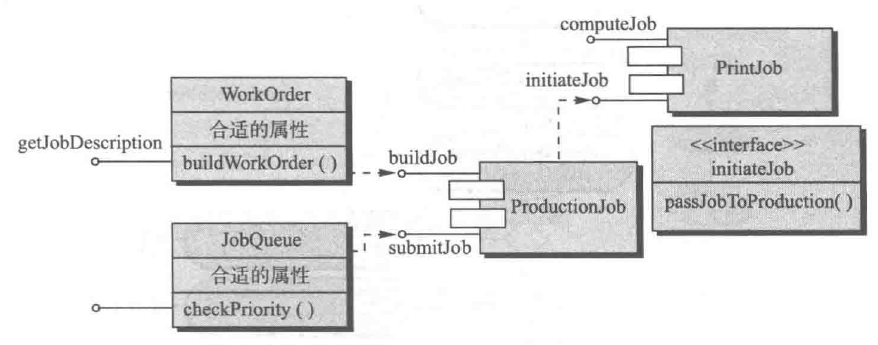

   3. 细化**属性**：确定属性的类型，并定义属性需要的额外数据类型的结构；

   4. 详细描述每个**方法**的处理过程：方法应该是内聚的，完成单一功能。对于简单的方法，只需要简单的接口表示，而复杂的算法还需描述内部过程，常用伪代码或 <a href="#4-5">UML 活动图</a>进行建模，如下：

      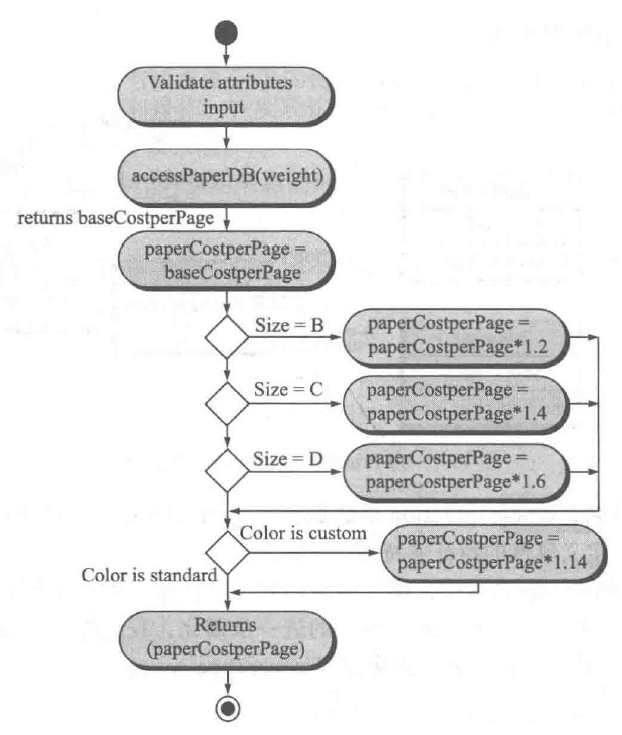

4. 说明**持久数据源**（数据库、文件等）和其对应的类：描述数据库和文件，以及它们的数据驱动类和<a href="#3-3">数据字典</a>；

5. 细化类或构件的**行为**：一些类或构件可能包含复杂的生命周期，考虑这些类涉及的用例，描述生命周期各阶段间包含的状态转换，常用 <a href="#4-6">UML 状态图</a>表示类的状态转换，如下：

   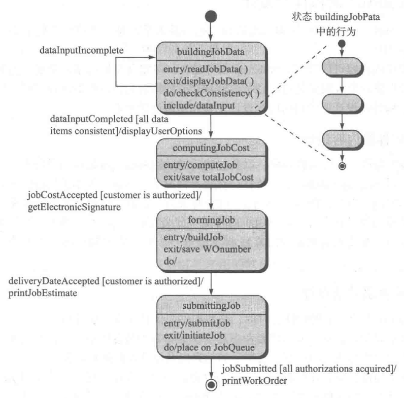

6. 建立和细化**部署**图以明确额外细节：需要使用<a href="#4-8">UML 部署图</a>或其他图示指示构件的物理位置，并说明所处的环境的细节，如操作系统和硬件；

7. 时刻考虑其他可选方案：软件设计流是一个迭代的过程，应该时刻评估和考虑更好的设计，在适当时机进行重构。

> 心理学上认为，一般人可以同时关注 5 ~ 7 个事物，对于熟悉的旧信息则为 12 ~ 13 个。在构件细化的过程中可以利用该法则确定构件内部复杂度和集成复杂度的范围。

### 2.4 实现

### 2.5 测试

**软件测试（Software Testing）**是一组事先计划并可以系统性进行的一系列活动，其**目的**是为了发现软件设计和实现中因疏忽造成的错误。软件测试的根本**动机**是使用经济且有效的方法来确认软件质量。

从用户的角度出发，希望通过软件测试暴露软件中隐藏的错误和缺陷，以考虑是否可接受该产品。从软件开发者的角度出发，希望测试成为表明软件产品中不存在错误的过程，验证该软件已正确地实现了用户的要求，确立人们对软件质量的信心。

**软件测试策略**则提供了软件测试的一般指导性步骤，**成功的策略**需要满足以下要求：

+ 以量化的形式规定产品需求；
+ 明确的描述测试目标；
+ 为每类用户建立用户描述（用户画像）；
+ 制定快速有效的测试计划；
+ 尽早和不断地进行软件测试；
+ 从小规模测试过渡到大规模测试；
+ 建立支撑测试用例运行的软件或工具体系；
+ 在测试之前使用有效的正式技术评审评价和修正测试计划；
+ 持续改进测试活动各过程。

软件测试策略有两个极端：无论系统何时建成，软件工程师每天都进行测试；在系统全部构建完成后进行测试。现实中大多数团队会选择折中方案：以个别单元测试为起点，渐进地转向便于单元集成的测试，最终实施对整个系统的测试。另一种方案是遵循流模型，从需求流开始就在每个工作流中持续测试，而不是等待实现流开始后。

#### 好的程序与好的测试

James Batch 认为，一个易于测试的程序应该包含以下特征：

1. 可操作性：在设计和实现工作流中，程序员应该时刻具有质量意识，这样才不会为测试流带来太多的错误；
2. 可观察性：程序应该为提供的输入产出清楚的输出，执行期间的系统状态和变量应该是可见的和可查询的；
3. 可控制性：程序的输入与输出应该是可预见的，并且拥有一致且结构化的格式；
4. 可分解性：程序应该由可分解可测试的独立模块组成；
5. 简单性：程序模块的功能（单一职责）、结构（模块化）和代码（格式标准）应该简单；
6. 稳定性：程序不应经常发生变更；
7. 易理解性：程序的内部逻辑和外部依赖关系应该易于理解。

Kaner，Falk 和 Nguyen 认为，好的测试应该具有以下属性：

1. 好的测试具有较高发现测试的可能；
2. 好的测试不应冗余；
3. 好的测试应该是最佳种类（最有可能发现错误的测试）；
4. 好的测试不应过于简单和复杂，复杂的需要连接的测试可能具有潜在副作用，这些副作用有可能隐藏错误，应该尽可能单独运行测试。

#### 软件测试一般过程

1. 软件配置：产出软件需求规格说明、软件设计规格说明、源代码等；
2. 测试配置：产出测试计划、测试用例、测试程序等；
3. 使用测试工具：测试数据自动生成程序、静态分析程序、动态分析程序、测试结果分析程序、以及驱动测试的测试数据库等；
4. 分析测试结果：比较实测结果与预期结果，评价错误是否发生；
5. 调试：对已经发现的错误进行错误定位和确定出错性质，改正这些错误，同时修改相关的文档；
6. 回归测试：直到通过测试为止。

#### 软件测试概念

##### 验证和确认

软件测试是**验证（verification）**和**确认（validation）**活动中的一部分。验证是确保软件**正确地实现**特定功能的活动，而确认是确保软件**满足**客户特定需求的活动。验证和确认的依据为需求流中的<a href="#3-1">软件规格说明文档</a>。

##### 软件测试组织

软件测试可以由开发人员负责，也可交由**独立测试组（Independent Test Group，ITG）**负责。实践中一般由开发人员完成简单的单元测试，之后与 ITG 人员密切合作，完成后续的一系列高级测试活动。

##### 软件测试类型

软件测试活动根据其测试对象的抽象程度可以分为以下类型：

+ **单元测试（unit testing）**：侧重于对编码实现单元的测试；
+ **集成测试（integration testing）**：也称联合测试或组装测试，侧重于对软件架构与抽象设计的测试，关注编码单元调用时的输入和输出；
+ **确认测试（confirmation test）**：侧重于对需求模型的测试，验证软件是否实现用户需求；
+ **系统测试（system testing）**：将软件与其他计算机系统租场部分作为一个整体进行测试，包括一些超出软件工程范围（计算机系统工程）的活动。

> 有时将子系统测试、确认测试、系统测试统称为集成测试，此时的子系统测试相当于上述的集成测试。

按测试关注点分类：

+ **白盒测试（white box testing）**：也称玻璃盒测试或结构化测试，关注模块内部逻辑和数据结构，采用逐一验证的方式测试程序的功能；
  + 基本路径法
  + 路径覆盖法
  + 控制结构测试法
  + ……

+ **黑盒测试（black box testing）**：也称行为测试或功能测试，关注模块接口提供的功能，对程序各个功能模块进行至少一次的测试。
  + 等价类划分法
  + 边界值分析法
  + 错误猜测法
  + 因果图法
  + ……


##### 单元测试

**单元测试**侧重于软件设计的最小单元（构件或模块）的验证工作，关注构件内部的处理逻辑与数据结构，是可并行的测试活动。

单元测试会关注以下问题点：

+ 接口：确保被测单元的信息能够正常输入与输出；
+ 数据结构：确保在处理逻辑运行过程中，数据结构能保持完整性并始终有效；
+ 独立路径：确保单元中的所有语句都至少被执行一次；
+ 边界条件：确保单元在边界情况下仍能正常工作；
+ 错误处理路径：确保异常能被正常捕获和处理，而不发送扩散。

**边界测试**是最重要的单元测试任务之一，在单元测试中，边界错误是最常发现的错误类型。

**异常处理**路径同样需要测试，以便在异常产生时重新确认执行路径或彻底中断。异常处理容易出现以下错误：

+ 错误描述难以理解；
+ 记录的错误并不是真正的错误；
+ 进行异常处理前，异常以及引发了操作系统干预；
+ 异常处理过程错误；
+ 错误描述提供的信息不足或根本无效。

**驱动程序（driver）**和**桩程序（stub）**是软件测试过程中需要开发的非业务单元。驱动程序作为一个临时主程序，负责调用被测单元并提供所需输入，接收单元输出；桩程序也称存根或假程序，用于替换非测试目标单元，提供被测单元需要的数据。

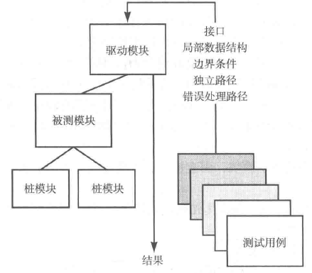

##### 集成测试

**集成测试**是一种正确建立设计中所描述程序结构的技术，旨在发现模块集成中和接口以及接口调用相关的错误：

+ 有效数据在穿越接口时丢失；
+ 一个模块对另一个模块产生了负面影响；
+ 子模块集成后无法提供预期的功能；
+ 单个模块中可接受的精度问题在集成后被扩大到无法接受的范围；
+ 全局数据结构问题；
+ ……

**增量集成**也称**渐进式集成**，是模块集成中最常使用的方法，以较小增量的形式逐渐构建和测试软件。

**自顶向下集成**是一种增量集成方法，从主程序模块开始，以深度优先（可以优先展示软件某个功能点）或广度优先的方式集成其他从属模块。**自顶向下集成测试**包括以下步骤：

1. 将通过单元测试的主模块作为驱动程序，从属模块作为桩程序；
2. 根据深度优先或广度优先方法，每次选择一个从属模块替代桩程序；
3. 测试集成后结果；
4. 使用从属模块替代剩余桩程序并测试；
5. 如果模块发生变更，可以考虑进行回归测试。

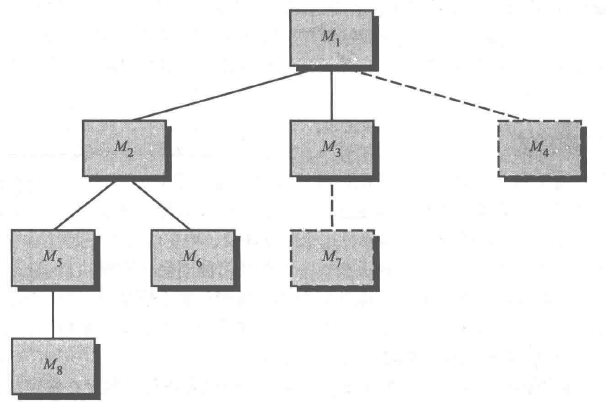

自顶向下方法可以尽早发现主控模块的问题，但无法保证桩程序能够完全模拟从属模块的行为。

**自底向上集成**从原子模块开始构建程序，而无需编写桩程序。**自底向上集成测试**包括以下步骤：

1. 连接协作并完成特定功能的一组子模块，这些连接的模块集合被称为簇；
2. 编写驱动程序，协调输入与输出；
3. 测试簇；
4. 集成其他子模块以代替驱动程序，逐步向上连接簇。

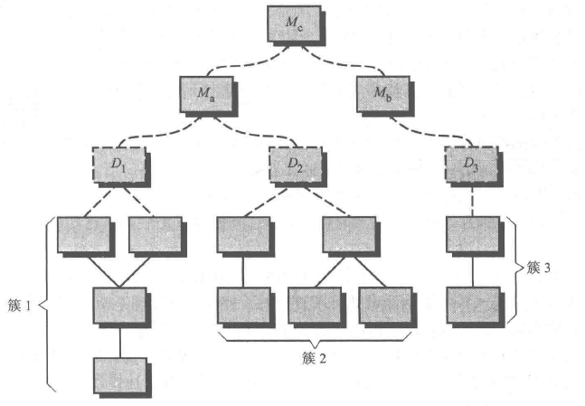

自底向上方法可以尽早发现从属模块的问题，但无法在一开始找到主模块中的问题。

两种集成方法常结合使用。如果程序结构的上层部分使用自顶向下集成方法，底层部分使用自底向上集成方法，可以明显减少驱动程序和桩程序的数量。此外，关键模块和与 I/O 相关的模块应该尽早测试。

**回归测试（regression testing）**在模块发生变更后，重新运行部分测试用例，以检查和修正变更带来的副作用。回归测试一般需要下面三种用例：

+ 已有用例中最具代表性的用例；
+ 侧重于变更可能影响的功能的用例；
+ 侧重于变更的模块的用例。

**冒烟测试（smoke testing）**最早源于硬件测试领域。在软件领域中，冒烟测试描述一种频繁测试方法：在较短的时间周期内临时构建已有的代码，并对每个构建版本进行测试。冒烟测试适用于复杂并且时间敏感的项目，能够降低集成风险，简化错误的检测和修正过程，并最终提高软件质量。

> 集成测试活动应产出测试用的规格说明文档，包含一系列测试用例，测试计划和测试规程，并在每次测试和修正结束后进行回归测试，并建立已经构建的模块集。

##### 确认测试

**确认测试**以软件需求规格说明文档为依据，验证需求模型或软件构件是否满足用户需求。确认测试可以在需求工作流中就开始进行，也可以在实现流进入尾声，软件已经组装完毕后开始进行。在确认测试开始前，一般需要对三种文档化产出进行**配置评审**，确保文档内容准确无误。这些产出可能来自集成测试活动：

+ 需求规格说明：包含用户需求的详细说明；
+ 测试计划：列出要被执行测试的类或类的组合；
+ 测试规程：定义了所有测试用例。

##### α 和 β 测试

**验收测试**是一种面向用户而不是软件组织成员的测试技术，其周期可能远长于其他测试方法。根据测试环境和软件实现程度，可以将验收测试分为两类：

+ **α 测试**：在开发环境下进行，用户使用仍处于开发阶段的软件原型，或在开发现场观看开发和测试过程，分析并记录所有发现的错误。α 测试始终处于受限的环境中；
+ **β 测试**：在生产环境下进行，用户使用已经正式部署的软件版本，在实际工作场景中进行测试，并将错误报告提交给开发团队。整个过程中开发人员一般不在场，也不对过程进行控制。

β 测试的一种变体是**客户验收测试**。客户在正式使用软件前先试用，以规避正式生产中可能的风险，其周期一般较长。

##### 系统测试

软件只是整个计算机系统中的一部分，因此**系统测试**会将软件与其他计算机系统租场部分作为一个整体进行测试。软件工程师在参与系统测试时，需要完成以下任务：

1. 设计异常处理路径，以处理其他系统组成的信息，并避免错误扩散；
2. 在软件接口模拟不良数据，进行潜在错误测试；
3. 记录测试结果，作为合作时的工作依据；
4. 参与系统测试的计划和设计。

**恢复测试（recovery testing）**通过各种方式强制让系统发生故障，以此验证系统的恢复能力。如果系统的恢复需要人工干预，还应记录平均修复时间（Mean-Time-To-Repair，MTTR）。

**安全测试（security testing）**使用各种手段测试系统内的安全机制是否能够保证系统不受非法入侵。

**压力测试（pressure testing）**以一种非正常的使用频率或信息负载测试系统，以验证系统的处理能力极限，该方法同样可以用于其他情形。一种变体是**敏感性测试**，也称为弱点测试，使用一小部分特殊数据以测试系统是否会因可能的弱点发生错误。

**性能测试（performance testing）**验证软件在集成环境中的运行性能，适用于实时和嵌入式系统，以及其他高性能环境。

**部署测试（deployment testing）**也称配置测试，在每一种软件将要运行的环境进行测试。

##### 调试

**调试（debugging）**是检查和修正错误的过程，总是发生在测试之后。调试大致可以分为三种方法：

1. 蛮干法：程序员最常用但也是最低效的方法，在其他方法失效时也会回归到该方法上。蛮干法让程序员在大量信息中寻找线索，使用临时变量和输出语句等方式寻找错误原因，或是通过调试工具查看内存细节；
2. 回溯法：从错误点向后追踪源代码问题，分析各种可能路径，而不只是分析状态，难度随着程序复杂度的增加上升；
3. 原因排除法：通过归纳、演绎、二分法，组织与错误相关的信息，假设、排除和寻找错误原因并加以验证。

在纠正错误时，考虑以下问题：

1. 错误的原因是否在程序的另一部分也出现过：如果是，可能存在一些错误的逻辑模式，考虑这些模式并寻找它们的映射；
2. 进行的修改是否会导致出现另一个错误：检查当前错误的引用耦合部分，考虑修改后的副作用；
3. 怎么做可以避免同样的错误：适当的约束往往可以减少错误的发生。

#### 基本路径测试

**基本路径测试（basic path testing）**是由 Tom McCabe 最早提出的一种白盒测试方法，也是白盒测试中最常使用的测试方法。该方法旨在通过用最少的测试，保证程序中所有**语句**至少执行一次。基本路径测试包含以下步骤：

1. 对路径建模
2. 确定测试数量上界
3. 使用路径覆盖法导出用例
4. 执行测试并修正问题
5. 必要时执行回归测试

##### 对路径建模

对路径建模可以使用<a href="3-2">程序流程图</a>或简化版的流图（不使用形状区分节点种类）。模型中表示流的箭头被称为**边**或连接，处理节点统称为**流图节点**，表示一个或一组过程语句。表示路径的流图模型要能反应所有可能的执行路径，在此之前应该先行确认节点包含的语句列表，下面是一个 PDL （过程定义语言）描述的节点确认例子：

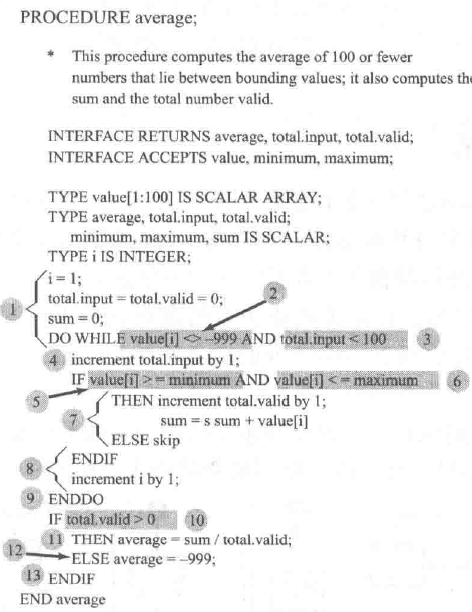

根据所选节点，建立流程图或简单流图模型：

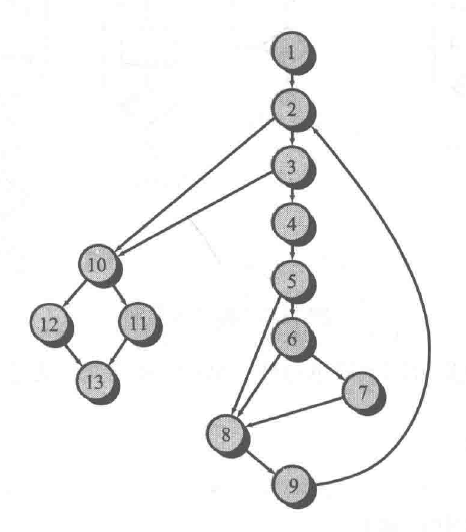

> 最佳实践：
>
> 1. 使用代码行序号描述节点的内容，并在流图中先使用一组序号填充节点内容，待建模完毕后再为节点添加编号；
> 2. 优先对最短路径进行建模，并将这些路径统一放置到模型的一侧，避免交织；
> 3. 当分支节点出现多个判断条件时（如上方 PDL 的第一个 WHILE 和 IF），考虑：
>    + 如果判断的条件语句可能导致错误，将每个条件判断语句作为单独的节点，并根据从左到右的顺序在流图中从上至下排列（如上方流图中的 [ 2, 3 ] 和 [ 5, 6 ] 节点对，对数组和对象成员的引用可能导致越界错误）；
>    + 如果判断语句不会引发潜在错误，将整个判断语句作为一个单独的节点。

##### 环复杂度

**独立路径**是从开始节点到结束节点的，贯穿程序始终的程序运行路径。在导出独立路径之前，应该先确认测试数量的复杂度上界。

**环复杂度**是测试复杂度度量的量化表示，根据图论，有向图的环复杂度$V(G)$定义为：
$$
V(G)=E-N+2
$$
其中 $E$ 为流图的边数，$N$ 为流图节点数，$V(G)$ 的值表示所有可能的独立路径组合中独立路径的总数，即路径数量的上界。对于上方例子，可以确认环复杂度为 $17-13+2=6$ 。

##### 导出独立路径

独立路径的导出过程以流图和环复杂度为指导。一般使用深度优先遍历的方法确定所有路径，对于上方例子，可以导出六条独立路径：

1. `1-2-10-11-13`
2. `1-2-10-12-13`
3. `1-2-3-10-11-13`
4. `1-2-3-4-5-8-9-2-...`
5. `1-2-3-4-5-6-8-9-2-...`
6. `1-2-3-4-5-6-7-8-9-2-...`

可以发现，每条新的独立路径**必然**会引入一条新的边，否则该路径就是冗余的。根据换复杂度可以验证导出路径的正确性。

##### 路径覆盖法

**路径覆盖法**有时和基本路径测试统称为**基本路径覆盖测试（basic path coverage testing）**。**覆盖强度**反映了实际导出的测试用例的数量和测试的有效性，从弱至强分为五种覆盖类型：

1. 语句覆盖：用例数量等于环复杂度，每个用例测试单一**独立路径**以保证覆盖；
2. 判定覆盖：用例使得所有**判定节点**都获得一次真值和假值；
3. 条件覆盖：用例使得所有判定节点中的**每个判定条件**都获得一次真值和假值；
4. 判定/条件覆盖：用例使得判定节点中的**每个判定条件**取得所有**可能值**；
5. 条件组合覆盖：用例使得判定节点中的各种**判定条件结果组合**都出现一次。

```c
int fn(int A, int B, int X)
{
    if (A > 1 && B == 0) X = X / A ;
    else if (A == 2 || X > 1) X += 1 ;
    return X;
}
```

以上方 C 程序为例，每种类型的覆盖强度体现为：

1. 语句覆盖：覆盖所有路径，但可能不涉及`X > 1`的判断语句，如果该语句是一个函数调用或其他包含出错可能的语句（如 0 为商的除法），就可能出现异常；
2. 判定覆盖：在本例中同上；
3. 条件覆盖：覆盖所有路径，但不考虑两个 IF 判断中`A`，`B`，`X`的所有可能值，对于静态类型的简单值可能并不会有什么问题，但如果三者是复杂数据结构，或是动态类型的变量，就可能出现潜在错误；
4. 判定/条件覆盖：覆盖所有路径，取遍`A`，`B`，`X` 的所有值，但不考虑两个 IF 中各种可能的排列组合；
5. 条件组合覆盖：覆盖所有路径，并且用例包含了所有可能的`A`，`B`，`X`排列组合。

#### 等价类划分

**等价类划分（Equivalence Class Partitioning，ECP）**测试法是一种常用黑盒测试法，将所有可能的输入按一定特征进行类别划分，以减少测试用例数量，达到单个或一小组用例发现一类错误的目的。

等价类可以分为两种类型：

+ **有效等价类**：根据软件规格说明，对软件是合理有效的一组输入集合；
+ **无效等价类**：根据软件规格说明，对软件是无效且可能产生错误的一组输入集合。

等价类划分测试一般包括以下步骤：

1. 建立规格说明，描述期望输入和输出；
2. 根据输入条件划分等价类；
3. 设计测试用例；
4. 执行测试；
5. 修正错误后回归测试。

##### 划分等价类

根据规格说明中的输入条件，可以为单个条件划分一个有效等价类和多个无效等价类。对于一些常见的输入类型，通常有以下划分：

+ 输入条件规定了输入值的范围：可划分一个有效等价类和两个无效等价类。如对于范围`[1, 100]`，有超过范围的两个无效集合`[-∞, 1)`和`(100, +∞]`作为无效等价类；
+ 输入条件规定了输入值的个数：可划分为一个有效等价类和两个无效等价类。如对于 5 个输入值，大于 5 个输入和小于 5 个输入是两个无效等价类；
+ 输入条件规定了一组限定的输入：可划分为一个有效等价类和一个无效等价类。如输入必须是特定枚举类型，有效等价类的一个实例为该类型枚举值，无效等价类的一个实例是该类型外任何值；
+ 输入条件规定了输入必须遵守的规则：可划分为一个有效等价类和若干个无效等价类。

一般会用表格描述等价类，并为类编号，在用例中引用。以一个判断`${YEAR}${MONTH}${DATE}`格式的字符串有效性的程序为例：

| 输入条件     | 有效等价类              | 无效等价类                                              |
| ------------ | ----------------------- | ------------------------------------------------------- |
| 字符串格式   | 1. 6 位仅含数字的字符串 | 2. 含非数字字符<br>3. 多于 8 个字符<br>4. 少于 8 个字符 |
| 月份字符范围 | 5. 1 ~ 12               | 6. 大于 12<br>7. 小于 1                                 |
| 日期字符范围 | 8. 符合公历约定         | （一组无效等价类）                                      |
| ……           | ……                      | ……                                                      |

##### 设计测试用例

等价划分测试中的用例应满足以下原则：

+ 单个测试用例尽可能覆盖**多个**有效等价类；
+ 单个测试用例只能覆盖**单个**无效等价类。

以上方规格说明为例，可以设计一些典型的用例：

| 用例输入      | 期望输出 | 覆盖用例    |
| ------------- | -------- | ----------- |
| `20221226`    | 有效     | 1，5，8，…… |
| `MAY,25,2022` | 无效     | 2           |
| `202251`      | 无效     | 4           |
| `2022-05-01`  | 无效     | 3           |
| ……            | ……       | ……          |

#### 边界值分析

“程序常在边界出错。” **边界值分析（Boundary Value  Analysis，BVA）**是一种常用的黑盒测试法，可以基于等价类划分的结果进行，专注于等价类的边界情况。一般包含以下步骤：

1. 等价类划分；
2. 分析边界情况，设计用例；
3. 执行用例，修正程序并回归测试。

##### 边界分析原则

1. 输入条件规定了输入值的范围：边界情况为上界、下界、略大于上界和略小于下界；
2. 输入条件规定了输入值的个数：边界情况为个数的上界、下界、略大于上界和略小于下界；
3. 输入条件规定了一组限定的输入：边界情况为输入集合中的最大值、最小值、略大于最大值的值、略小于最大值的值；
4. 输入条件规定了一组有序对象集合：边界情况为第一个和最后一个对象，以及可能的邻接外部对象。

#### 测试面向对象软件

##### 面向对象模型测试

对面向对象模型测试的目的在于检查模型的正确性和模型之间的一致性。需求模型反映了真实世界中的问题域，分析和设计模型则描述解决问题的具体实现的基本结构和相互关系。

对于使用 <a href="#3-10">CRC</a> 和 <a href="#4-2">UML</a> 建模技术的模型，可以考虑使用以下步骤进行测试：

1. 检查已有的 CRC 和 UML 类模型：确保需求所含的所有对象和协作关系已经在模型中体现；
2. 检查 CRC 中的协作者部分或 UML 的外部引用部分：确保协作者提供了当前类需要的服务；
3. 检查协作时的通信消息内容：确保当前类能够提供协作者服务所需的所有参数，且协作者可以返回服务所需的所有结果；
4. 检查协作和类设计的合理性：考虑合并一些不需要的小类型。

对于 UML 行为模型（<a href="#4-4">交互图</a>、<a href="#4-5">活动图</a>、<a href="#4-6">状态图</a>），可以考虑使用以下方法：

##### 面向对象单元测试

在面向对象范式中，单元的概念发生了变化：**最小的可测试单元**是封装后的类。单独测试类的某个方法是困难的，方法可能引用了类中的其他属性或协作类的方法，必须将这些依赖视为单元进行测试；在子类中，方法的运行环境可能和基类有所不同，需要根据环境使用额外的测试用例。

一种可行的方法是对类内部的执行路径进行建模，提取单个类中的属性和方法到同一测试空间中，使用桩程序替代外部协作者的服务，像传统测试那样执行单元测试，需要小心路径上可能产生的潜在副作用。

##### 面向对象集成测试

大部分面向对象软件没有明显的层次结构，自顶向下集成和自底向上集成不是特别有意义。常使用三种方法进行集成测试。

+ **基于线程的测试（thread-based testing）**：线程即是面向对象系统的功能问题方面。基于线程的测试类似放大的类单元测试，将响应系统功能的一组协作类集成在一起进行测试；
+ **基于使用的测试（use-based testing）**：优先测试很少使用外部服务的类（独立类），然后根据依赖关系，测试使用独立类服务的其他类（依赖类）；
+ **簇测试（cluster testing）**：簇测试是其他测试法中的一个可选步骤，通过设计试图发现系统服务错误的用例对一组协作类（簇）进行测试。

##### 单类的随机测试

**类的随机测试**基于用例，测试对象是特定用例的整个生命周期中，单个类实例对象的一组方法调用的排列组合。

对于下方的`Account`类：

```cs
class Account {
    open() { /* 开启账户 */ }
    deposit() { /* 存款 */ }
    withdraw() { /* 退款 */ }
    balance() { /* 查询存款 */ }
    summarize() { /* 查询账户信息 */ }
    creditLimit() { /* 查询账户限额 */ }
    close() { /* 关闭账户 */ }
}
```

可以导出多组生命周期中的方法调用序列。对于“用户存款”这一用例，可能序列的完整描述为`open · setup · deposit · [ deposit | withdraw | balance | summarize | creditLimit ] ^ n · close`。从中选取一些随机序列以测试对应的用例生命周期正确性。

1. `open · setup · deposit · deposit · balance · summarize · close`
2. `open · setup · deposit · withdraw · deposit · balance · creditLimit · close`
3. ……

##### 单类的划分测试

**类的划分测试**类似等价类划分方法，可以分为：

1. 基于状态的划分：将改变实例状态和不改变实例状态的方法调用序列分开并设计测试用例。对于上方的`Account`类，可以有：
   + 改变状态的一组操作：`open · setup · deposit · close`；
   + 不改变状态的一组操作：`open · setup · balance · close`；
2. 基于属性的划分：根据调用序列操作的属性组合进行分类；
3. 基于类别的划分：根据调用序列完成的服务进行分类。

##### 类间协作测试

对类间协作的测试依赖于面向对象的类静态模型和行为模型。从模型中导出多类协作的方法调用序列，然后利用上述方法对序列进行测试。可以利用的工具有 UML 行为模型等。

#### 实例：银行客户留言功能

##### 规格说明

某银行官网提供客户“我要留言”功能，若客户选择留言方式为“短信回复”，则下方回显“手机号码”输入框，要求手机号码为必输、且为11 位数字：

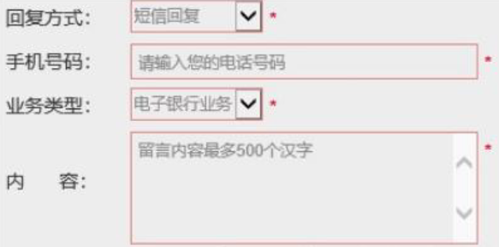

请设计短信回复方式下的测试用例。

##### 实例分析

由银行提供的留言功能的内部实现对于测试人员属于一个黑盒，因此可以采取常用的黑盒测试策略：

+ 等价类划分测试
+ 边界值分析测试

##### 等价类划分

| 输入条件 | 条件类型             | 有效等价类                                   | 无效等价类                                                   |
| -------- | -------------------- | -------------------------------------------- | ------------------------------------------------------------ |
| 手机号   | 特定格式的输入       | 1. 11 位手机号，仅含数字                     | 2. 少于 11 位的字符串<br>3. 多于 11 位的字符串<br>4. 包含非数字字符的字符串<br>5. 不符合手机号国标的 11 位数字字符串 |
| 业务类型 | 一组限定范围的输入   | 6. `电子银行业务`及其他值                    | 7. 其他非法值                                                |
| 内容     | 特定格式和数量的输入 | 8. 编码后的存储空间限定为 0 ~ 500 个汉字字符 | 9. 编码后的存储空间大于 500 个汉字字符                       |

##### 一般用例

| 用例输入              | 期望输出 | 覆盖用例 |
| --------------------- | -------- | -------- |
| `13820819311`         | 有效     | 1        |
| `88800010`            | 无效     | 2        |
| `8613820819311`       | 无效     | 3        |
| `+8688800010`         | 无效     | 4        |
| `19972963015`         | 无效     | 5        |
| `电子银行业务`        | 有效     | 6        |
| *非限定的业务类型选项 | 无效     | 7        |
| * 400 个汉字          | 有效     | 8        |
| * 600 个汉字          | 无效     | 9        |

##### 边界用例

| 用例输入       | 期望输出 | 覆盖用例 |
| -------------- | -------- | -------- |
| `140000000000` | 无效     | 1，5     |
| `13999999999`  | 有效     | 1，5     |
| `13800000000`  | 有效     | 1，5     |
| `13799999999`  | 无效     | 1，5     |
| `138048817111` | 无效     | 3        |
| `1380488171`   | 无效     | 2        |
| *500 个汉字    | 有效     | 8，9     |
| *501 个汉字    | 无效     | 8，9     |

### 2.6 部署和维护

## 第三部分 常用建模语言

第三部分介绍一些结构化程序设计和之外的常用建模语言，一些语言本身没有标准，但在实践中基本使用相似的符号。符号图片主要来自 [Microsoft Visio](https://www.microsoft.com/en-us/microsoft-365/visio/flowchart-software) 。

### <span id="3-1">3.1 规格说明文档</span>

#### 介绍

在软件工程中，**软件需求规格说明（Software Requirement Specification，SRS）**文档时在项目商业化前必须建立的详细描述软件各个方面的工作产品。规格说明文档可以是非形式化的文字，例如一段场景描述，而形式化的规格说明文档一般必须包括有以下几个部分：

+ 文档概要：主要包括文档目的、问题定义、阅读人员、规范等引述性内容；
+ 软件描述：描述软件本身，包括软件特性、用户文档等部分；
+ 需求分析：详细分析需求，该部分内容将作为之后所有工作流的主要参考，一般包括功能性需求和非功能性需求部分。

> SRS 文档一般需要同时供项目成员和用户参考，如果认为 SRS 的内容性质过于而影响交流效率，也可以生成多份内容侧重和表现形式不同 SRS 文档。

#### 实例

下面是一份源自 Process Impact 公司的 Karl Wiegers 制作的 [SRS 模板](https://www.processimpact.com/process_assets/srs_template.doc)修改版，以供参考：

+ 目录
+ 版本历史
  + 修订人
  + 修订日期
  + 修订内容
+ 正文
  1. 导言
     1. 文档目的：描述文档的作用
     2. 软件目的：即问题定义
     3. 文档规范：文档格式约定等
     4. 适用人群和阅读建议
     5. 项目范围：该部分也可放在问题定义中
     6. 参考文献
  2. 总体描述
     1. 产品愿景：简洁描述软件是什么和能做什么
     2. 产品特性
     3. 用户类型和特征：推荐使用用户画像
     4. 操作环境：用户的使用环境
     5. 设计和实施约束
     6. 用户文档：该部分如果比较复杂也可独立于 SRS，作用类似于说明书手册
     7. 假设和依赖
  3. 系统特性
     1. 软件类型
     2. 软件运行环境
     3. 软件领域需求：如版权、领域规范、行业标准等
  4. 外部接口需求：以接口提供的服务描述功能性需求
     1. 用户接口：用户通过用户接口来使用软件的功能，该部分既要描述应该实现什么功能，也要描述用户如何使用这些功能
     2. 硬件接口
     3. 软件接口
     4. 通信接口
  5. 非功能性需求
     1. 性能需求
     2. 安全需求
     3. 保密需求
     4. 软件质量保证
  6. 其他需求
+ 术语表
+ 问题列表：如果有遗留问题在此处记录以查阅和修正

### <span id="3-2">3.2 流程图</span>

#### 介绍

**流程图（flow chart）**是用于描述系统流程的工具，通常包含一组符号和文字说明。流程图类似于 UML 标准中的<a href="#4-5">活动图</a>。

流程图本身没有统一的规范，通常流程图包含以下符号：

| 符号                                                         | 含义                                             |
| ------------------------------------------------------------ | ------------------------------------------------ |
| 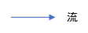 | 链接各个符号。                                   |
|  | 流程的名字，如“用户登录”、“查询订单”等流程活动。 |
|  | 条件分支，成功或失败等。                         |
|  | 流程图的开始和结束，必须成对出现。               |
|  | 数据输入和输出，一般会链接文档或数据库。         |
|  | 表示流程中会产生或读取纸质文档。                 |
|  | 表示流程中涉及的外部数据库。                     |
|  | 表示链接到同一页的另外一块流程图。               |
|  | 表示链接到另一页的另外一块流程图。               |

> 流程图属于静态模型，用于数据建模。

#### 实例

下面是一个用户发票的例子：

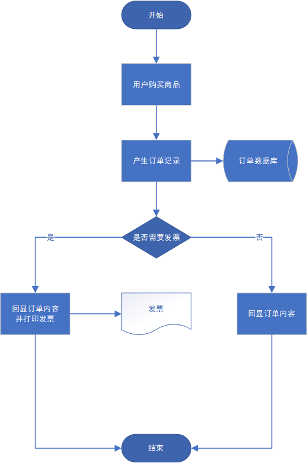

### <span id="3-3">3.3 数据字典</span>

#### 介绍

**数据字典（Data dictionary）**是一种用户可以访问的记录数据库和应用程序元数据的目录。数据字典主要记录关于数据的定义，而不关心数据间的相互关系。一般数据字典必须包括以下项：

+ 字段名
+ 数据类型：数据类型内容根据字典使用场景决定，如果是比较抽象的数据字典，类型只需包含一些元数据类型；如果数据字典就是面向特定系统的，则数据类型应该是系统中的类型；
+ 长度
+ 默认值
+ 可空
+ 备注

对于面向实现流的数据字典，还应该包含以下字段：

+ 是否为主键
+ 是否唯一
+ 实现的数据类型
+ 其他和实现环境相关的信息

> 数据字典属于静态模型，用于数据建模。

#### 实例

下面是一个销售订单的数据字典，数据类型使用抽象类型，但注释中包含一些技术细节：

| 字段名           | 类型    | 长度 | 可空 | 默认值 | 注释                                         |
| ---------------- | ------- | ---- | ---- | ------ | -------------------------------------------- |
| trade_id         | String  | 25   |      |        | 自动生成，日期（8）+ `uuid_short()`（17）    |
| trade_status     | String  |      |      |        | `"已完成" `\|\| `"已取消"` \|\| `"等待处理"` |
| trade_start_time | String  |      |      |        | 交易发起时间，`timestamp`                    |
| trade_paid_time  | String  |      | 是   |        | 交易完成时间，`timestamp`                    |
| trade_price      | Float   |      | 是   |        | 交易价格                                     |
| trade_payment    | String  |      |      |        | 付款方式                                     |
| trade_signed     | Boolean |      |      |        | 产品是否已经签收                             |

下面是一个用于 MySQL 数据库的销售订单数据字典：

### <span id="3-4">3.4 实体关系图</span>

#### 介绍

**实体-联系图(Entity Relationship Diagram，E-R)**，提供了表示实体类型、属性和联系的方法，是用来描述现实世界的概念模型。E-R 图被大量使用在关系型数据库的概念设计阶段中，注重数据间的相互联系。

E-R 图包含以下符号：

| 符号                                                         | 含义                                                         |
| ------------------------------------------------------------ | ------------------------------------------------------------ |
|  | 表示现实中的事物，如“人”、“商品”。                           |
|  | 属性必须连接到实体上。                                       |
|  | 关系描述不同实体间的联系，如“人购买商品”，“购买”就是关系。   |
|  | 连接各个符号，对于实体和实体，可以表示一对一（1 : 1）、一对多（1 : N）和多对多关系（M : N）。 |

> E-R 图属于静态模型，用于数据建模。

#### 实例

下面是一个用户与产品、产品订单的 E-R 图例子：

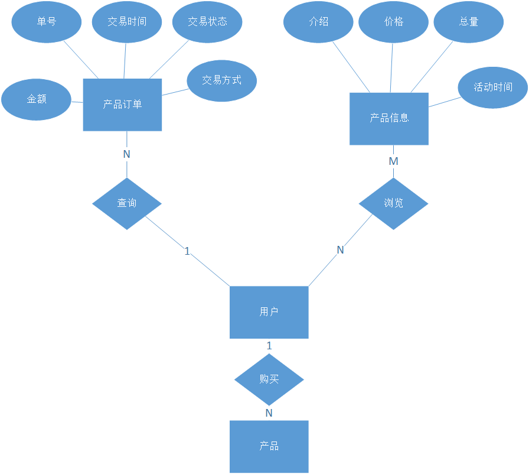

### <span id="3-5">3.5 数据流图</span>

#### 介绍

**数据流图（Data Flow Diagram，DFD）**从数据传递和加工角度，以图形方式来表达系统的逻辑功能、数据在系统内部的逻辑流向和逻辑变换过程，是结构化系统分析方法的主要表达工具及用于表示软件模型的一种图示方法。

> 数据流通常使用分层方式绘制，即先进行总体建模，再进行局部细化。顶层数据流图被称为“0 层数据流图”，在顶层中通常不会描述数据存储过程。
>
> 每条数据流都应该遵循输入输出平衡原则，即输入和输出必须是成对的，否则数据流没有意义。

数据流图包含以下符号：

| 符号                                                         | 含义                                                         |
| ------------------------------------------------------------ | ------------------------------------------------------------ |
|  | 即数据流，数据流应该使用名词描述，表示某项数据。             |
|  | 也称加工过程，表示系统的一个数据处理动作。                   |
|  | 外部交互方一般是数据起点和终点，如“人”、“数据库”。           |
| 或 | 数据存储必须连接到数据流程上，表示从存储中读取或向存储中存入数据。 |

如果单个流程和多条流相关，必须遵循以下原则：

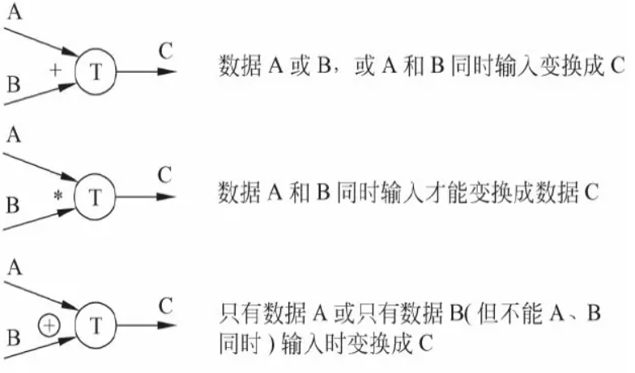

> 数据流图属于静态模型，用于功能建模。
>
> 数据流图更多适用于低级内存管理场景，告知程序员何时申请和释放内存。

#### 实例

下面是一个餐厅管理系统的 1 层数据流图：

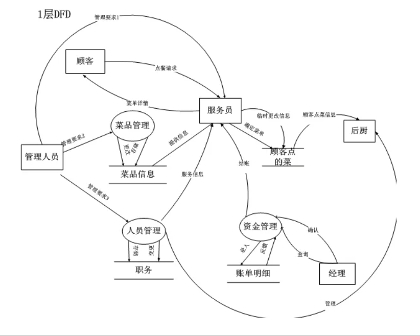

### <span id="3-6">3.6 用例规格说明</span>

#### 介绍

**用例规格说明（Use Case Requirement Specification）**是对用例内容的详细说明，一般会采用表格或列表的形式描述。根据实践经验总结，用例规格说明的内容通常应该包括以下内容：

| 项                 | 含义                                                   |
| ------------------ | ------------------------------------------------------ |
| 用例               | 用例的名字                                             |
| 主要参与者         | 用例的主要参与者，即使用者                             |
| 目标               | 描述用例对应的功能                                     |
| 前提条件           | 激活该用例必须满足的条件                               |
| 后置条件（触发器） | 用例结束后会发生的事情，也可以表述为激活某一个用例     |
| 主事件流（场景）   | 正常情况下会发生的事件流                               |
| 次事件流（异常）   | 用例中可能发生的异常以及其处理事件流                   |
| 优先级             | 描述功能优先级，可以表述为是否必须实现、在什么阶段实现 |
| 何时可用           | 功能再什么时候可用，可以表述为在某个版本中实现         |
| 使用频率           | 用例单位时间被激活的频率                               |
| 使用方式           | 主要参与者使用用例中功能的方式，如接口、软件           |
| 次要参与者         | 用例中的其他参与者                                     |
| 次要参与者使用方式 | 次要参与参与用例功能协作的方式                         |
| 未解决的问题       | 如果用例尚未完成，将问题记录以备查阅                   |

> 用例规格说明属于静态模型，用于需求建模，是对用例的具体描述或补充。

#### 实例

下面是一个市民登录 Web 站点以报告路面坑洼和严重程度的用例规格说明：

| 用例               | 登录 Web 站点                                                |
| ------------------ | ------------------------------------------------------------ |
| 参与者             | 市民                                                         |
| 目的               | 在报告前进行身份验证，防止恶意报告行为影响正常功能           |
| 前置条件           | 市民拥有能够访问 Web 的设备                                  |
| 后置条件           | 市民获得提交报告的权限                                       |
| 主事件流           | 1. 市民：打开客户端输入网址<br>2. 客户端：显示登录页面<br>3. 市民：输入账号密码<br>4. 客户端：发出请求<br>5. 服务器：响应验证<br>6. 客户端：允许用户进入 |
| 次事件流           | 1. 服务器错误：服务器无法处理页面请求<br>2. 客户端错误：客户端没有解析页面的能力，提示用户<br>3. 市民密码输入错误：必须重新输入直到正确 |
| 优先级             | 必须实现                                                     |
| 何时可用           | 首个版本                                                     |
| 使用频率           | 预计为较低的月频                                             |
| 使用方式           | 通过客户端浏览器                                             |
| 次要参与者         | 客户端，服务器                                               |
| 次要参与者使用方式 | 客户端和服务器：HTTP                                         |

### <span id="3-7">3.7 甘特图</span>

#### 介绍

**甘特图（Gantt chart）**也称横道图或条状图（Bar chart），由亨利·劳伦斯·甘特（Henry Laurence Gantt）提出。甘特图通过条状图来显示项目、进度和其他时间相关的系统进展的内在关系随着时间进展的情况。

甘特图一般必须包括以下信息：

+ 任务
+ 时间
+ 任务预期安排
+ 当前任务进度

复杂的甘特图还可以添加其他辅助信息，如：

+ 任务简介
+ 参与人员
+ 统计信息
+ 注释
+ ......

#### 实例

下方是一个最简单的甘特图实例：

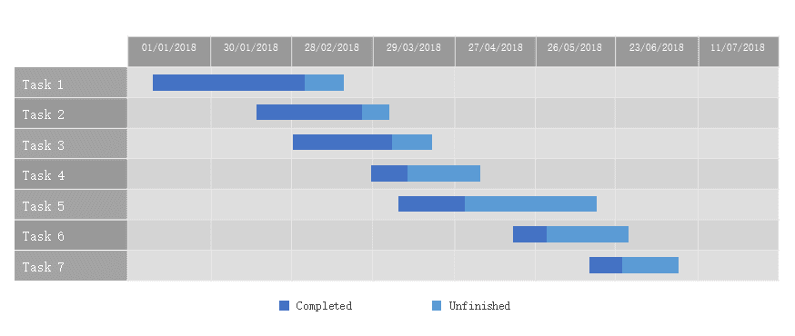

### 3.8 架构图

#### 介绍

架构图一般分为功能性架构图和技术性架构图。架构图的表示并没有通用的标准，能够完成表述体系结构的任务即可。架构图一般分为两类：

+ 技术架构模型：面向专业技术人员
+ 功能结构模型：面向用户和管理人员

#### 实例

下面是一个基于 Java Spring 的技术性微服务架构图：

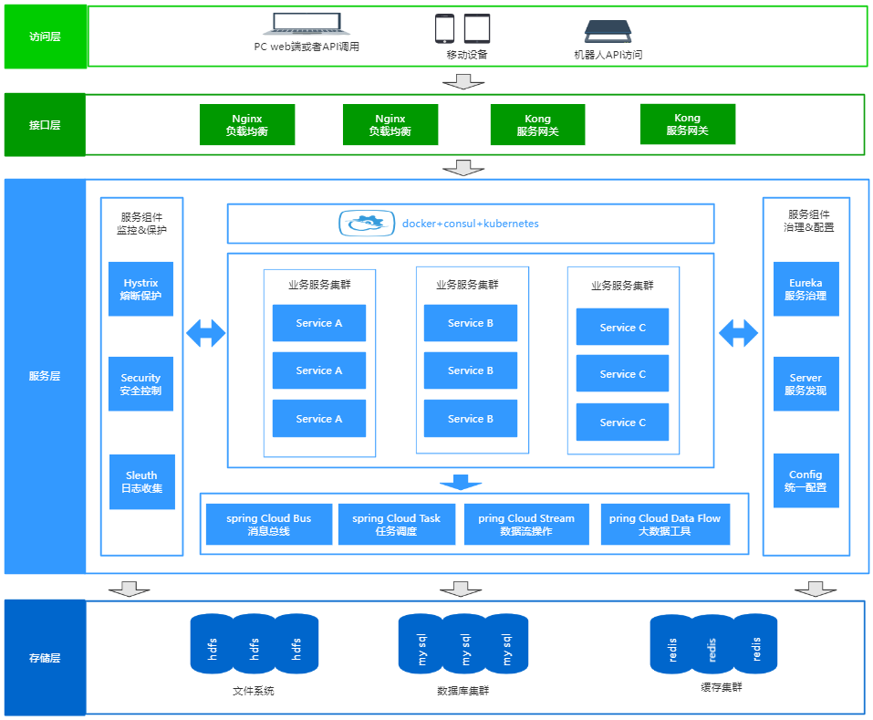

下面是一个典型的现代分布式 Web 应用架构图：

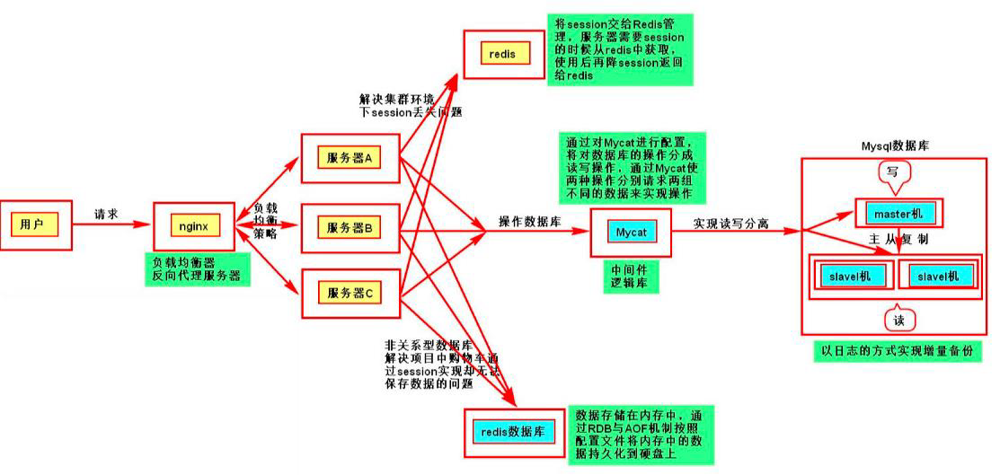

下面是一个基于 Docker 容器技术的微服务架构图：

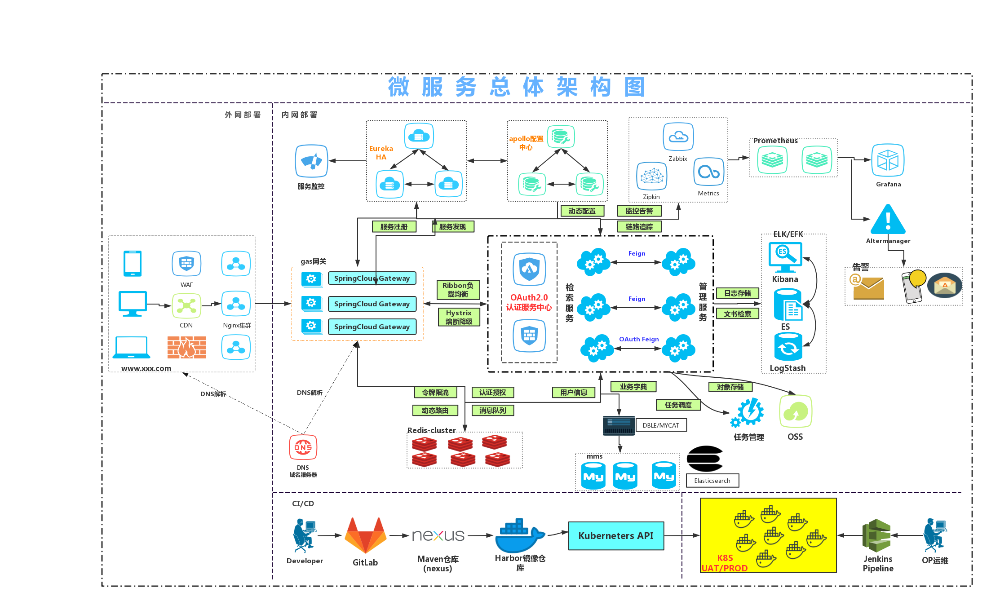

### <span id="3-9">3.9 架构环境图</span>

#### 介绍

**架构环境图（Architectural Context Diagram，ACD）**对软件以及外部实体的交互方式进行建模，包含以下一些常用元素：

+ 目标系统：被建模的系统，使用一个大矩形表示，包含一些接口；
+ 接口：目标系统上的接口，使用小型矩形表示，依附在目标系统的边框上；
+ 上级系统：调用目标系统服务的更高层的系统（消费者模块），一般是位于目标系统上方的小矩形，连接接口；
+ 同级系统：与目标系统对等并相互作用的系统（协作模块），一般是位于目标系统左右的小矩形，连接接口；
+ 下级系统：被目标系统调用的系统（依赖模块），一般是位于目标系统下方的小矩形，连接接口；
+ 参与者：目标系统的用户，如人或设备，与接口连接。

#### 实例

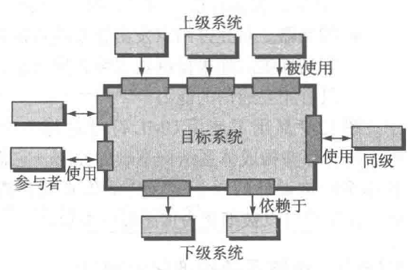

### <span id="3-10">3.10 CRC 模型</span>

#### 介绍

**类-职责-协作者（Class-Responsibility-Collaborator，CRC）**模型用于识别和组织与系统需求相关的类，以及它们之间的协作关系。最简单的 CRC 模型需要包含三部分：

+ 类名
+ 职责：和类相关的属性和操作
+ 协作者：提供完成特定职责所需信息或服务的外部类

扩展的 CRC 还可以包括更多部分，如类的描述、类的类型、类的特性、类的消息列表等。

#### 实例

下面是一个描述信用卡业务动作类与协作者关系的 CRC 卡片：

<table>
    <tr>
        <td colspan="2"><strong>类的名称：</strong>Credit Sale</td>
    </tr>
    <tr>
        <td colspan="2"><strong>类的类型：</strong>Transaction Event</td>
    </tr>
    <tr>
        <td colspan="2"><strong>类的描述：</strong>信用卡的业务</td>
    </tr>
    <tr>
        <td><strong>职责</strong></td>
        <td><strong>协作者</strong></td>
    </tr>
    <tr>
        <td>读信用卡</td>
        <td>信用卡</td>
    </tr>
    <tr>
        <td>取得授权</td>
        <td>信用权利</td>
    </tr>
    <tr>
        <td>显示购物金额</td>
        <td>产品订单</td>
    </tr>
    <tr>
        <td></td>
        <td>销售总账</td>
    </tr>
    <tr>
        <td></td>
        <td>审计文件</td>
    </tr>
    <tr>
        <td>生成账单</td>
        <td>账单</td>
    </tr>
</table>


## 第四部分 统一建模语言

> 第四部分参考 *The Unified Modeling Language User Guide*（《UML 用户指南》），Grady Booch，James Rumbaugh，Ivar Jacobson 著，邵维忠 等译。
>
> [UML 官方网站](http://uml.org)
>
> 据 [Wikipedia](https://en.wikipedia.org/wiki/Unified_Modeling_Language)：**统一建模语言**（英语：Unified Modeling Language，缩写 **UML**）是非专利的第三代建模和规约语言。UML 是一种开放的方法，用于说明、可视化、构建和编写一个正在开发的、面向对象的、软件密集系统的制品的开放方法。UML 展现了一系列最佳工程实践，这些最佳实践在对大规模，复杂系统进行建模方面，特别是在软件架构层次已经被验证有效。
>
> 这个语言由葛来迪·布区（Grady Booch），伊瓦尔·雅各布森（Ivar Jacobson）与詹姆士·兰宝（James Rumbaugh）于 1994 年至 1995 年间，在 Rational Software 公司中开发，于 1996年 又进一步发展。UML 集成了 Booch ，对象建模技术和面向对象程序设计的概念，将这些方法融合为单一的，通用的，并且可以广泛使用的建模语言。UML 打算成为可以对并发和分布式系统的标准建模语言。
>
> 1997 年，UML 被对象管理组织（ISO）接纳为标准，并在此之后受该组织管理。2005 年，UML 被国际标准化组织接纳为一种标准，自此，该标准被定期修订以涵盖 UML 的最新版本。然而，在软件工程中，大多数从业者不使用 UML ，而是产生非正式的手绘图；不过，这些图例中仍往往包括 UML 的元素。

UML 利用图形化机制描述系统的分析和设计模型，定义了四类视图：

1. 用例图：描述系统参与者与功能；
2. 静态图：描述系统的静态结构，包括类图、对象图、包图等；
3. 行为图：描述系统的动态行为，包括交互图、活动图、状态图等；
4. 实现图：描述系统的实际实现，包括构件图和部署图等。

共 13 种图形：

1. 类图：一种结构图，展示类、接口、协作以及它们的关系；
2. 对象图：一种结构图，展示一组对象以及它们的关系；
3. 构件图：一种结构图，展示构建的外部接口和内部组成；
4. 组合结构图：一种结构图，展示结构化类的外部接口和内部组成；
5. 用例图：一种行为图，展示一组用例、参与者以及它们的关系；
6. 顺序图：一种行为图，展示一组交互，强调消息的时间顺序；
7. 通信图：一种行为图，展示一组交互，强调收发消息的对象的组织结构；
8. 状态图：一种行为图，展示一个状态机，强调对象由事件定义的行为；
9. 活动图：一种行为图，展示一个计算过程，强调从活动到活动的流；
10. 部署图：一种结构图，展示一组节点、制品以及包含的类和构件之间的关系；
11. 包图：一种结构图，展示把模型组织成包；
12. 定时图：一种行为图，展示在特定时间具有消息的交互；
13. 交互概念图：一种行为图，结合了活动图和顺序图的内容。

UML 是抽象的、独立于特定程序语言、为适用于任何软件开发过程而设计的，当 UML 提供的符号仍然无法满足表达需求时，还可使用**<span id="stereotype">构造型（stereotype）</span>**`<<steretype>>`进行额外描述，只需在双尖括号内填充描述语句即可。第四部分主要介绍一些软件工程中常用 UML 技术，符号图片主要来自 [Microsoft Visio](https://www.microsoft.com/en-us/microsoft-365/visio/flowchart-software) 。UML 将建模分为静态和动态建模。

### 4.1 <span id="4-1">用例图</span>

#### 介绍

**用例（use case）**也称用况，是对一组动作序列的描述，也可以理解为每个用例表述一种使用场景。**UML 用例图**是对用例进行建模的一种技术，包括一些概念以及相对应的符号表示。

> UML 用例图属于动态模型，用于对基本行为（功能）进行建模。

#### 规范

UML 标准规定了一组概念术语和其符号：

| 术语   | 符号                                                         | 含义                                                         |
| :----- | ------------------------------------------------------------ | :----------------------------------------------------------- |
| 参与者 |  | 用例的参与者，只用于表示人。                                 |
| 参与者 |  | 用方框表示非人参与者。                                       |
| 用例   |  | 椭圆形表示用例。                                             |
| 子系统 |  | 使用方框包围多个用例表示一个子系统。                         |
| 关联   |  | 无箭头实线，连接参与者和用例，表示参与者将参与用例。         |
| 依赖   | 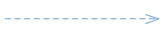 | 箭头虚线，表示某个用例依赖于前一个用例的发生，箭头指向被依赖的用例。 |
| 泛化   | 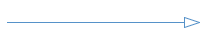 | 空心箭头，表示一个用例/参与者与另一个用例/参与者为继承关系，箭头指向基类，如“管理员”泛化自用户，“管理员注册”泛化自“用户注册”。 |
| 扩展   |  | 虚线箭头附加构造型`<<extend>>`，表示一个用例可能在另一个用例后发生，箭头指向前一个用例，如“打印订单”是“产生订单”的扩展。 |
| 包含   |  | 虚线箭头附加构造型`<<include>>`，表示一个用例是另一个用例的一部分，箭头指向父用例，如“验证”包含“登录”和“注册”。 |
| 实现   |  | 虚线空心箭头，表示一个或多个（通常是多个）用例实现了另一个更加抽象的用例，箭头指向接口用例，如“餐厅”被“服务”、“厨房”、“收银“等用例实现。该符号使用较少，因为一般不会在用例图中描述实现。 |

#### 实例

下面是一个简单图书馆系统的用例图，包含基本的用户认证、查阅书籍、借阅、图书管理员功能：

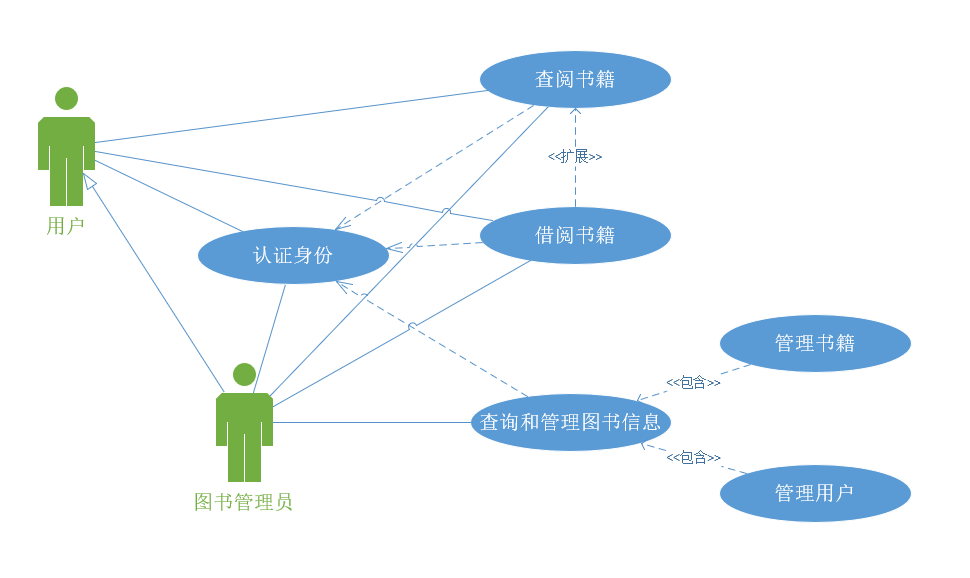

### 4.2 <span id="4-2">类图</span>

#### 介绍

**UML 类图（class diagram）**是显示一组类、接口、协作以及它们之间的关系的图形符号。类图不仅能用于描述概念模型，还可用于描述具体设计。

> UML 类图属于静态模型，用于对基本结构（数据）建模。

#### 规范

UML 类图标准的内容比其他图表更加复杂，首先是最基本的类结构部分：

| 术语     | 符号                                                         | 含义                                                         |
| -------- | ------------------------------------------------------------ | ------------------------------------------------------------ |
| 类       | 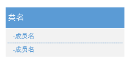 | 表示类，第一行为类的名字，第二行为类的属性，第三行为类的方法。 |
| 特殊的类 | 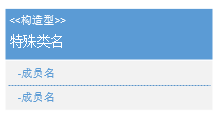 | 在软件类设计中，普通的类无法满足表述需求，往往还包括特殊结构如枚举、接口、mixin 等，要表示这些特殊的类，需要在其名称上方使用构造型进行描述，如`<<interface>>`表示一个接口。 |
| 模板类   | 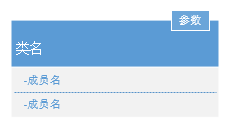 | 对于模板/泛型类，模板参数位于类符号的右上角，如果模板类在继承或实现时有模板特化情况，还需使用`<<bind>>`构造型描述参数限定条件。 |
| 包       |  | 包用于把一组模型组织成一定的层次结构，如文件夹、程序集、类库。 |

类的成员规定：

| 术语        | 符号                                                         |
| ----------- | ------------------------------------------------------------ |
| 公有成员    | `+`开头                                                      |
| 私有成员    | `-`开头                                                      |
| 保护成员    | `#`开头                                                      |
| 包内成员    | `~`开头                                                      |
| 抽象类/成员 | 斜体标注名称                                                 |
| 静态类/成员 | 下划线标注名称                                               |
| 属性        | `属性:类型=初始值{取值范围表达式}`，如如`name : string = "A" { 可能的值： "A", "B", "C" }`。 |
| 方法        | `<方法名>([参数1类型, 参数2类型, ...])[:返回类型]`           |

类的关系：

| 术语     | 符号                                                         | 含义                                                         |
| -------- | ------------------------------------------------------------ | ------------------------------------------------------------ |
| 继承     | 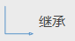 | 空心箭头，箭头指向基类。                                     |
| 实现     |  | 空心虚线箭头，箭头指向被实现的接口或抽象类。                 |
| 双向关联 |  | 实线，连接两个互相知道彼此的类。                             |
| 单向关联 |  | 实线非闭合箭头，两个类的联系是单向的，一个类知道另一个类，另一个类却不知道这个类，箭头指向被知道的类。 |
| 聚合     |  | 空心菱形箭头，也称公共聚集，箭头指向“容器”类。               |
| 组合     |  | 实心菱形箭头，也称组合聚集或符合，箭头指向“容器”类。         |
| 依赖     |  | 虚线非闭合箭头，表示一个类依赖于另一个类的存在，箭头指向依赖者。 |

> 对于概念模型，表述结构和关系就足够了，而设计模型一般还要表示更加具体的内容，如模板和成员访问性。

#### 实例

一个学生类的例子：

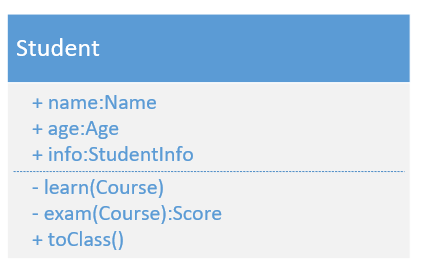

一个可迭代接口的例子：

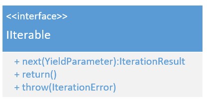

一个 HTTP 状态枚举的例子：

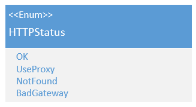

一个泛型数组和字符串继承的例子：

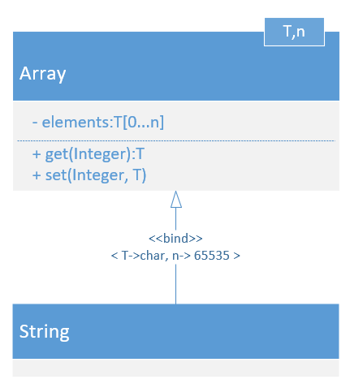

一个游戏场景内各类关系的例子：

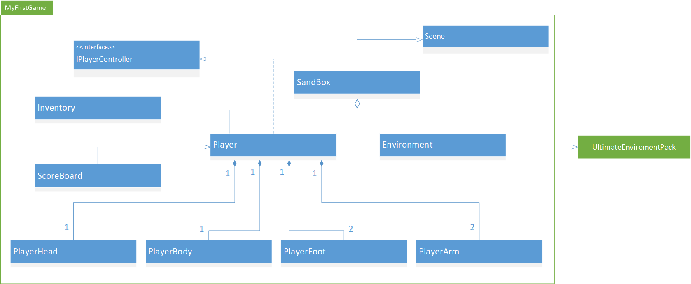

### <span id="4-3">4.3 对象图</span>

#### 介绍

**UML 对象图（object diagram）**是表示某一时间点上一组对象内部以及它们之间关系的符号图，当需要对系统特殊情况进行描述时，应该使用对象图而不是类图。

> UML 对象图属于静态模型，用于对基本结构（数据）建模。

#### 规范

对象图是对类图的补充，其标准内容比较简单：

| 术语     | 符号                | 含义                                               |
| -------- | ------------------- | -------------------------------------------------- |
| 对象     | `对象名:类名`       | 将类图中的类名细化为对象名即可表示一个特定的对象。 |
| 泛指对象 | `:类名`             | 表示所有该类的对象实例。                           |
| 状态     | `对象名:类名[状态]` | 状态名称包裹在对象名后的方括号内。                 |
| 属性值   | `属性:类型=值`      | 表示属性具体的值。                                 |

#### 实例

下面是一个人类对象的例子：

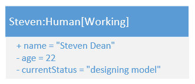

### 4.4 <span id="4-4">交互图</span>

#### 介绍

**UML 交互图（interactive diagram）**显示一个交互过程，包括一组对象和它们间的关系，以及对象间传递的消息。交互图主要包括**顺序图**和**通信图**，顺序图强调交互和时间的关系，通信图则没有反应时间信息。

> UML 交互图属于动态模型，用于对基本行为进行建模。

#### 规范

UML 标准规定了一组概念术语和其符号：

| 术语         | 符号                                                         | 含义                                                         |
| ------------ | ------------------------------------------------------------ | ------------------------------------------------------------ |
| 对象和生命线 | 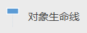 | 矩形方框表示对象，垂直虚线表示生命线，生命线代表对象的执行时间范围。对象也可添加类说明。 |
| 执行规约     |  | 也称激活，执行规约将置于对象生命线上，表示在一定时间段上对象将进行一种交互。 |
| 参与者       |  | 当参与交互的对象是人时，可以附加人型符号。                   |
| 同步消息     |  | 也称同步事件，同步消息箭头从一条对象生命线上的执行规约指向另一个对象生命线上的执行规约，消息箭头必须是平行的，附加文字说明消息的名称和参数`消息([参数1, 参数2, ...])`。消息一般为动词，参数为名词。 |
| 返回消息     |  | 返回消息从执行规约底部返回到另一个执行规约，可以带返回参数`([参数1, 参数2, ...])`。 |
| 异步消息     | 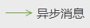 | 非封闭箭头，表示消息的返回是异步的，附加文字说明消息名称和参数。 |
| 对象撤销     |  | 也称破坏对象，在生命线终点标记一个叉号表示对象生命周期结束。 |
| 片段         |  | 片段用于包裹一段交互过程，并说明片段中的结构化控制流程，总共有四种控制流程，其名称位于片段左上角标签中。片段也可以包裹一组交互并命名。 |

四种控制流程：

+ 可选执行：标签`opt`，表示片段内的交互过程是可选的，内部过程的执行需要满足一个布尔条件，该条件书写在标签下方，相当于流程控制语句`if`；
+ 条件执行：标签`alt`，表示片段内的过程根据条件分支执行，会有一个满足条件参数的执行区域和一个分支`else`区域，相当于流程控制语句`if else`；
+ 并行执行：标签`par`，并行片段会用虚线来分割几个并行的部分，经常用于表示进程和线程的并发；
+ 循环执行：标签`loop(m, n)`，表示循环 m 至 n 次，一般表示为 1 至 n 次，每次循环需要满足特定条件，不满足条件或循环次数达到最高时跳出，相当于流程控制语句`while`。

#### 实例

下面是一个客户端通过消息队列向数据库输入数据的例子，消息队列同步接收客户端消息，数据库空闲时传输消息至数据库，在所有消息处理完毕后异步提示客户端处理完成：

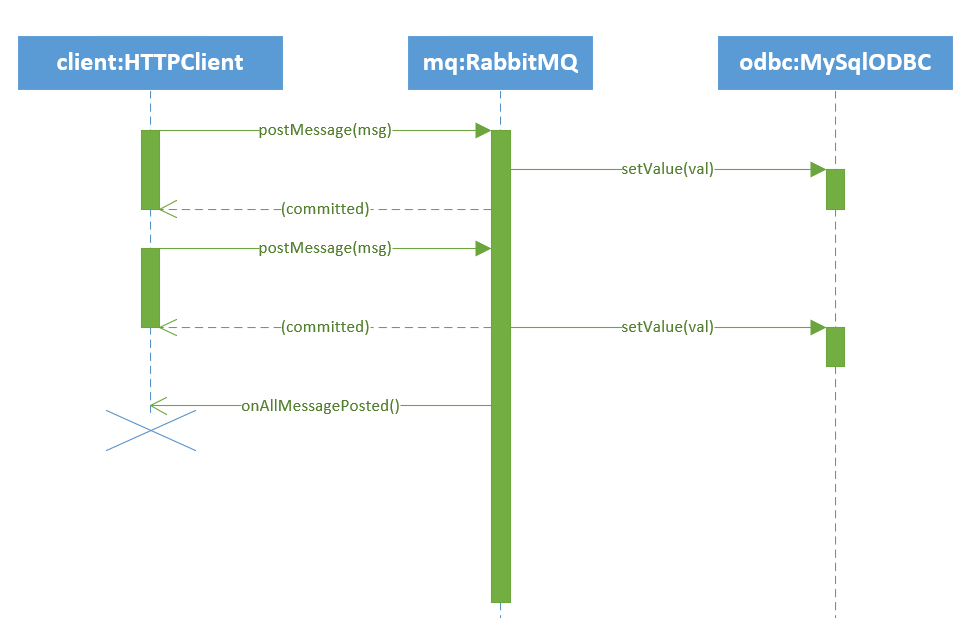

下面是一个订单录入的例子：

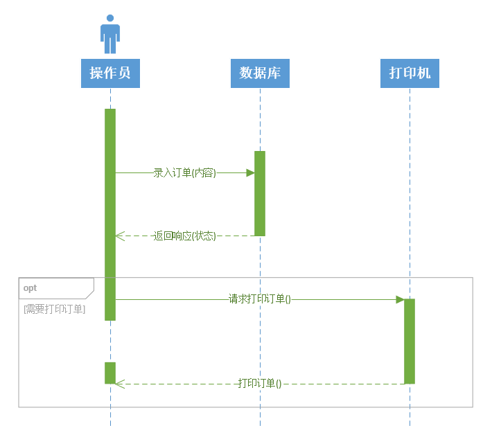

下面是一个判断权限的例子：

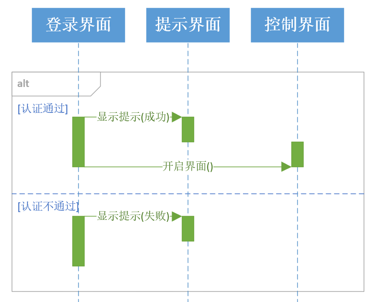

下面是一个语言编译服务并行处理多个代码片段的例子：

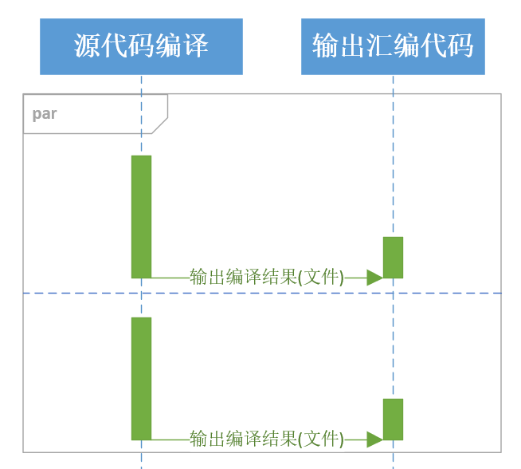

下面是一个计算机从键盘鼠标等设备读取用户输入，并在屏幕上返回输出的例子：

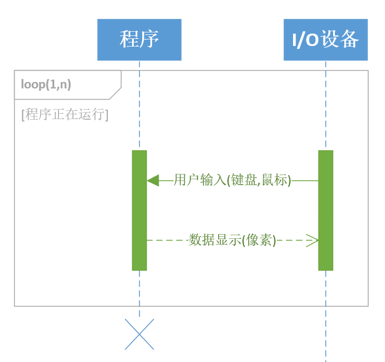

### 4.5 <span id="4-5">活动图</span>

#### 介绍

**UML 活动图（activity diagram）**显示从活动到活动的流。**活动（activity）**表示独立执行的动作，这些动作将改变系统自身的状态。互动图类似常用建模语言中的<a href="#3-2">流程图</a>。

> UML 用例图属于动态模型，用于对基本行为进行建模。

#### 规范

UML 标准规定了一组概念术语和其符号：

| 术语 | 符号                                                         | 含义                                                       |
| :--- | ------------------------------------------------------------ | :--------------------------------------------------------- |
| 活动 |  | 圆角方形，表示一个动作。                                   |
| 流   |  | 表示活动的进行方向。                                       |
| 判断 |  | 菱形，表示判断分支，如是或否。                             |
| 合并 |  | 菱形，和判断一致，用于合并多个因判断而分支流至同一个活动。 |
| 开始 |  | 活动图的开始。                                             |
| 结束 |  | 活动图的结束。                                             |
| 分岔 |  | 长方框，表示接下来多个活动将并行，必须和汇合成对出现。     |
| 汇合 |  | 长方框，表示多个并行活动汇合，必须和分岔成对出现。         |
| 泳道 |  | 泳道用于表示一组并行任务。                                 |

#### 实例

下面是一个市民报告路面坑洼和严重程度活动的活动图：

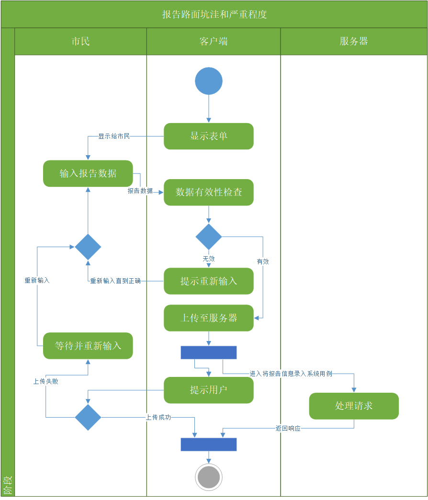

### 4.6 <span id="4-6">状态图</span>

#### 介绍

**UML 状态图（state diagram）**是描述状态机的一种工具。**有限状态机（FSM）**是一种描述动态系统的方法，一个 FSM 由五个部分组成：

+ 状态集 J
+ 输入集 K
+ 转换函数 T
+ 初始状态 S
+ 最终状态集 F

每个**当前状态（current state）**都在特点特定**事件（event）**发生后，发生一个**转移（transition）**，经过包含一组**动作（action，原子操作）**的**活动（activity，组合操作）**处理，转换至**下一个状态**，或转换为**最终状态**不再变化。

##### 状态

**状态（state）**是对象生命周期中的一个条件或状况，在生命周期中对象将在满足一些条件后执行一些动作，或等待事件到来。状态包含以下几个部分：

+ 名称：状态可以匿名
+ 进入/退出效应（entry/exit effect）：进入退出状态时执行的一组动作；
+ 内部转移（internal transition）：不包括状态改变，但会执行动作或活动的转移；
+ 子状态（substate）：状态的嵌套结构，包含非正交（顺序活动）或正交（并发活动）子状态；
+ 延迟事件（deferred event）：在该状态下不处理，推迟到该对象另一个状态下处理的一组事件。

 ##### 转移

**转移（transition）**表示对象在特定事件发生后，在满足特定条件的情况下，在前一个状态中执行一些动作（退出效应），并进入下一个状态的过程。对象发生状态改变称转移被**激活**。转移包含五个部分：

+ 源状态（source state）：处于源状态的对象在接收到触发事件并满足守卫条件时将激活一个转移；
+ 事件触发器（event trigger）：即事件，当对象满足条件时会因事件而激活转移；
+ 守卫条件（guard condition）：一个布尔表达式，当转移监听的事件发生时检测表达式，为真时激活转移；
+ 效应（effect）：一个可执行的行为，比如动作，作用于该对象或其他对象；
+ 目标状态（target state）：转移完成后的状态。

##### 事件触发器

复杂的事件触发器可以包括以下部分：

+ 信号：向其他对象发送一个信号，`send 对象.信号名`；
+ 事件：对象接收的事件，事件可以有参数，参数将用在其他事件触发器部分中，`事件名(参数)`。
+ 调用：调用其他对象的方法，`对象名.方法名(参数)`；
+ 时间推移：在指定时间后激活转移，`after(时间)`；
+ 状态改变：即非内部转移；
+ 守卫条件：激活转移的前提，是对事件传入参数的判断，`[布尔表达式]`；

事件触发器的表示格式：`事件名(事件参数)[守卫条件]/效应1/效应2/...`，其中效应可以为信号、调用、状态改变以及其他自定义动作，事件本身的时间推移放置在事件名前方，效应的时间推移放置在效应前方。

##### 效应

**效应（effect）**是对象在激活转移时执行的行为，转移只发生在上一个转移结束后。一个转移只允许在上一个转移的所有效应结束后才可激活，有以下几种效应：

+ entry：进入效应，对象进入状态时的活动，`entry/动作1(参数);动作2(参数);...`；
+ exit：退出效应，对象离开状态时的活动，`exit/动作(参数);动作2(参数);...`；
+ do：其他效应，动作或活动，`do/动作(参数);动作2(参数);...`；
+ defer： do 中的特殊动作或活动，需要有一个事件队列管理延迟事件，`do/defer 延迟动作(参数)`；
+ include：包含的状态转换，用于嵌入其他状态图，`include/状态转换过程名`，链接到一幅外部状态图。

> UML 状态图属于动态模型，用于对高级行为进行建模。

##### 子状态

如果一个状态内部还有比较复杂的**子状态（substate）**，就需要进行嵌套表示，子状态将包含自己的初态和末态。子状态分为两种：

+ 非正交子状态：同步顺序执行的一组状态，就是一组内部状态图；
+ 正交子状态：异步并发的多组状态，就是多组内部状态图。

#### 规范

UML 标准规定了一组概念术语和其符号：

| 术语           | 符号                                                         | 含义                                           |
| -------------- | ------------------------------------------------------------ | ---------------------------------------------- |
| 转移           |  | 箭头指向下一个状态。                           |
| 事件触发器     |  | 事件触发器写在转移上方，斜杠分隔各个部分。     |
| 简单状态       |  | 仅表示状态的名字，而不包含动作和活动。         |
| 状态           |  | 包括状态名、动作和活动。                       |
| 初始状态       |  | 初始状态一般是匿名的。                         |
| 最终状态       |  | 最终状态一般是匿名的。                         |
| 复合状态       |  | 含有子状态的状态，正交状态使用平行虚线隔开。   |
| 折叠的复合状态 |  | 复合状态，但是内部细节不可见。                 |
| 分支           |  | 一个状态在不同条件下有不同转移，使用分支表示。 |

#### 实例

下面是一个简单的 HTTP 接口服务状态机：

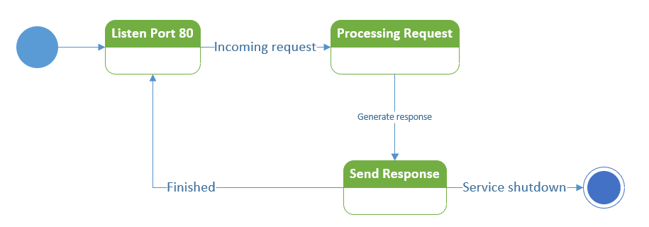

下面是一个雷达系统状态机：

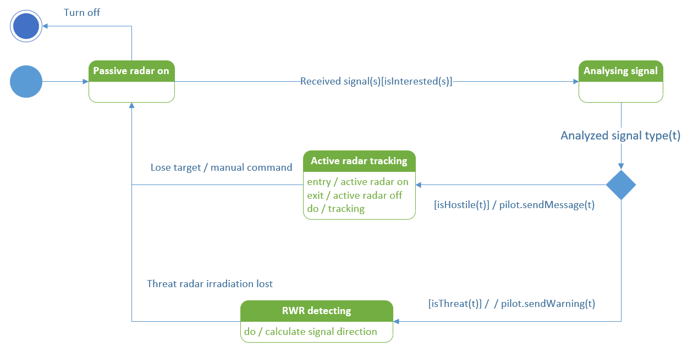

下面是一个包含子状态的 ATM 状态机：

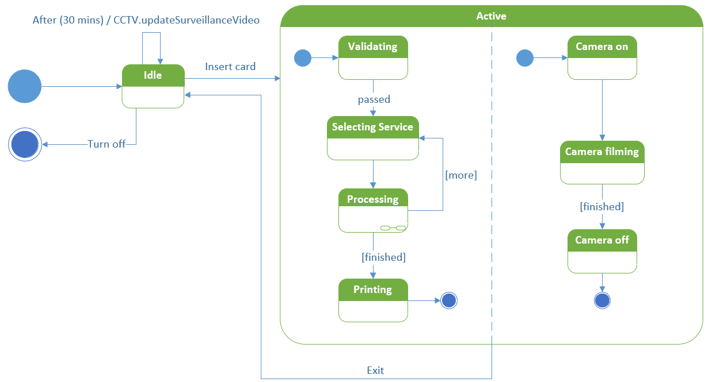

### 4.7 <span id="4-7">构件图</span>

#### 介绍

**UML 构件图（artifact diagram）**也称 UML 制品图，展示一组构件以及构件之间的关系。构件一般可分为四种类型，这些类型使用构造型注释：

+ 可执行程序（executable）
+ 库（library）
+ 文件（file）
+ 文档（document）

其他类型也可使用构造型描述。

#### 规范

UML 标准规定了一组概念术语和其符号：

| 术语       | 符号                                                         | 含义                                                         |
| ---------- | ------------------------------------------------------------ | ------------------------------------------------------------ |
| 构件       |  | 构件符号包含`<<artcifact>>`构造型注释和构件名称，右上角带有一个插头符号的特殊标记。实际使用中构件不一定要使用该符号，可以使用数据库符号、文件符号、类符号等代替构件符号。 |
| 提供的接口 | 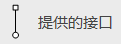 | 由构件向外部提供的接口，与其他构件需要的接口连接。           |
| 所需的接口 | 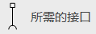 | 构件依赖于外部的接口，与其他构件提供的接口连接。             |
| 关联       |  | 表示两个构件互相知道彼此。                                   |
| 单向关联   | 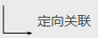 | 一个构件知道另一个构件，另一个构件不知道该构件，箭头指向被知道的构件。 |
| 依赖       | 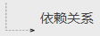 | 表示一个构件的运作依赖于另一个构件。                         |
| 聚合       |  | 一个构件内部包含一组可以单独运作的构件，菱形箭头指向父构件。 |
| 组合       |  | 一个构件内部包含一组必须在被组合的情况下运作的构件，菱形箭头指向父构件。 |
| 包         |  | 包可以表示多种事物，如框架、模式、库等，包名位于左上角的标签中，使用构造型表示其特殊类型，内部包含一组构件和关系。 |

#### 实例

下面是一个使用 HTTP 通信库和 HTTP 客户端的例子：

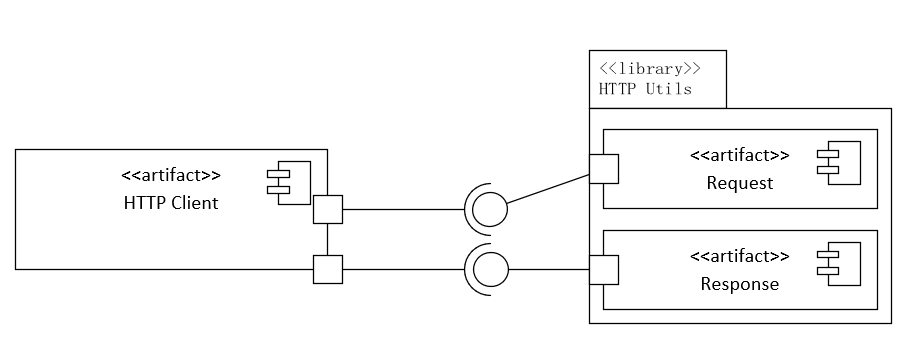

### 4.8 <span id="4-8">部署图</span>

#### 介绍

**UML 部署图（deployment diagram）**是一组展示运行时进行处理的结点和结点上运行的构件的符号。

#### 规范

UML 标准规定了一组概念术语和其符号，这里只包含结点相关符号，构件符号查看上一章节：

| 术语 | 符号                                                         | 含义                                                         |
| ---- | ------------------------------------------------------------ | ------------------------------------------------------------ |
| 结点 |  | 部署时构件所属的机器或虚拟机器。                             |
| 清单 | 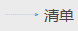 | 虚线箭头附加构造型`<<manifest>>`，用于列举构件中的重要部分的详细说明。 |
| 部署 | 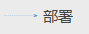 | 虚线箭头附加构造型`<<deploy>>`，用于表示源类型部署为目标类型，如镜像部署为虚拟机实例。 |

#### 实例

下面是一个 Docker 容器化部署 DevOps 方案的例子：

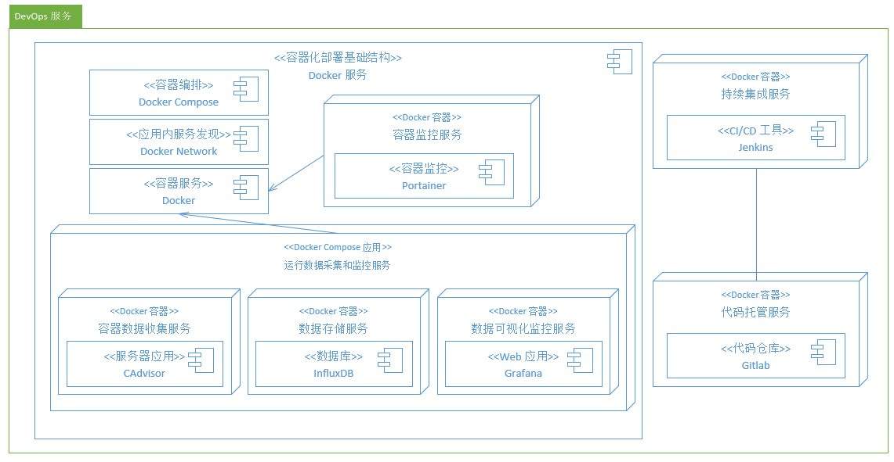

## 第五部分 软件质量保证

实现高质量软件的四大管理和实践活动：

1. 软件工程方法：参考软件过程工作流部分；
2. 项目管理技术：参考软件项目管理部分；
3. 质量控制活动：控制活动确保所有软件过程产品符合其质量目标；
4. 软件质量保证。

其中，**软件质量保证（Software Quality Assurance，SQA）**是适用于整个软件过程的普适性活动，包括：

+ SQA 过程
+ 质量保证和质量控制任务
+ 软件工程方法和工具
+ 软件工作产品和变更控制
+ 软件开发规范保证
+ 测量和报告机制

软件的所有利益相关者：软件工程师、项目管理者、客户、销售人员和 **SQA 小组**都对软件质量负有责任。SQA 小组作为软件组织内部的客户代表，确保软件满足一系列质量因素、工作流按照预期计划进行、SQA 恰当地发挥作用。

### 5.1 软件质量概念

#### 软件质量

**软件质量**可以理解为：**软件过程的质量 + 软件产品的质量 + 软件创造的实际价值**。

1. 软件过程质量：高质量的软件过程包括好的过程管理、最佳软件工程实践、变更管理和控制等一系列软件工程活动；
2. 软件产品质量：软件产品包含可运行的软件本身、工作文档、用户说明文档等内容。高质量的软件产品不仅能够满足客户明确提出的所有需求，还应满足软件应用的隐含需求（可靠性、安全性等），以及一些能让客户感到惊喜的附加功能；
3. 软件创造的实际价值：对于软件开发组织而言，软件创造的价值来自于客户支付的报酬和软件过程优化所降低的成本；对于客户而言，软件创造的实际价值来自于软件创造的实际营收，以及软件带来的生产力提高的回报。

质量在不同的观点角度中还有其他更加灵活的定义。David Garvin 认为可以从五个观点角度描述质量：

1. 先验论观点：质量是被人立刻识别到的属性，这些属性是主观而非量化的；
2. 用户观点：如果产品能够满足所有需求，就是有质量的；
3. 制造商观点：如果产品符合规格说明，就是有质量的；
4. 产品观点：质量评价来自于产品的固有属性，如功能和特性；
5. 基于价值的观点：从客户支付的报酬数量衡量质量。

以上五个观点应该综合使用，即软件的高质量应该是容易被感知的，满足用户需求的，符合生产规格的，来自于产品本身属性而非主观评价的，能够创造实际经济价值的。

Robert Glass 提出了一种更加直观的质量公式：
$$
用户满意度=合格的产品+好的质量+按预算和进度安排交付
$$

#### 软件质量评价

除了从软件过程、软件产品和软件价值三个方面评价软件质量，还可使用国际标准推荐内容和一些公认的观点。

##### ISO 9126 质量因素

**ISO 9126 **制定的是意图标识计算机软件的质量属性，包含三个质量层次：

1. 质量特性
2. 质量子特性
3. 度量指标

六个关键属性：

1. 功能性：软件满足已确定需求的程度；
2. 可靠性：软件可用的时间长度；
3. 易用性：软件容易使用的程度；
4. 效率：软件优化使用系统资源的程度；
5. 可维护性：软件易于修复的程度；
6. 可移植性：软件从一个环境移植到另一个环境中的容易程度。

其中各六个质量特性与二十七个质量子特性的关系如下：

<table log-set-param="table_view" data-sort="sortDisabled"><tbody><tr><td valign="top" align="left" width="99"><div class="para" label-module="para">质量特性</div></td><td valign="top" align="left" width="99"><div class="para" label-module="para">功能性</div></td><td valign="top" align="left" width="99"><div class="para" label-module="para">可靠性</div></td><td valign="top" align="left" width="99"><div class="para" label-module="para">易用性</div></td><td valign="top" align="left" width="99"><div class="para" label-module="para">效率</div></td><td valign="top" align="left" width="99"><div class="para" label-module="para">维护性</div></td><td valign="top" align="left" width="99"><div class="para" label-module="para">可移植性</div></td></tr><tr><td rowspan="5" align="left"><div class="para" label-module="para">质量子特性</div></td><td valign="top" align="left" width="99"><div class="para" label-module="para">适合性</div></td><td valign="top" align="left" width="99"><div class="para" label-module="para">成熟性</div></td><td valign="top" align="left" width="99"><div class="para" label-module="para">易理解性</div></td><td valign="top" align="left" width="99"><div class="para" label-module="para">时间特性</div></td><td valign="top" align="left" width="99"><div class="para" label-module="para">易分析性</div></td><td valign="top" align="left" width="99"><div class="para" label-module="para">适应性</div></td></tr><tr><td valign="top" align="left" width="99"><div class="para" label-module="para">准确性</div></td><td valign="top" align="left" width="99"><div class="para" label-module="para">容错性</div></td><td valign="top" align="left" width="99"><div class="para" label-module="para">易学性</div></td><td valign="top" align="left" width="99"><div class="para" label-module="para">资源利用性</div></td><td valign="top" align="left" width="99"><div class="para" label-module="para">易改变性</div></td><td valign="top" align="left" width="99"><div class="para" label-module="para">易安装性</div></td></tr><tr><td valign="top" align="left" width="99"><div class="para" label-module="para">互操作性</div></td><td valign="top" align="left" width="99"><div class="para" label-module="para">易恢复性</div></td><td valign="top" align="left" width="99"><div class="para" label-module="para">易操作性</div></td><td valign="top" align="left" width="99"><br></td><td valign="top" align="left" width="99"><div class="para" label-module="para">稳定性</div></td><td valign="top" align="left" width="99"><div class="para" label-module="para">共存性</div></td></tr><tr><td valign="top" align="left" width="99"><div class="para" label-module="para">保密安全性</div></td><td valign="top" align="left" width="99"><br></td><td valign="top" align="left" width="99"><div class="para" label-module="para">吸引性</div></td><td valign="top" align="left" width="99"><br></td><td valign="top" align="left" width="99"><div class="para" label-module="para">易测试性</div></td><td valign="top" align="left" width="99"><div class="para" label-module="para">易替换性</div></td></tr><tr><td valign="top" align="left" width="99"><div class="para" label-module="para">功能性的依从性</div></td><td valign="top" align="left" width="99"><div class="para" label-module="para">可靠性的依从性</div></td><td valign="top" align="left" width="99"><div class="para" label-module="para">易用性的依从性</div></td><td valign="top" align="left" width="99"><div class="para" label-module="para">效率依从性</div></td><td valign="top" align="left" width="99"><div class="para" label-module="para">维护性的依从性</div></td><td valign="top" align="left" width="99"><div class="para" label-module="para">可移植性的依从性</div></td></tr></tbody></table>

##### Garvin 的质量维度

David Garvin 提出的多维质量观点适用于所有抽象的质量评定场景。对于软件，其 8 个维度有以下解释：

1. 性能：软件是否交付了所有内容、功能和特性？
2. 特性：软件是否包含能让客户感到惊喜的非明确需求特性？
3. 可靠性：软件是否无误地提供了所有功能，并在需要使用时可以正常运行？
4. 符合性：软件是否遵守软件领域标准，以及特定应用领域标准（如交互界面设计准则）？
5. 耐久性：是否能对软件进行变更和维护，而不产生大量副作用？随着时间推移，变更带来的副作用是否会增加？
6. 适用性：软件在可接受的时间范围内能否完成变更，修正错误，排除副作用？
7. 审美：软件是否符合主观上的美观（优雅）？
8. 感知：人的主观感受将影响对客观事物的评价，对于软件，其过去版本的糟糕表现可能会影响用户对之后已修正版本的评价。

Garvin 的质量维度属于“软”评价，其中的主观评价点需和量化的软件基准数据一起使用。

##### McCall 的质量因素

由 McCall，Richards，Walters 提出的质量因素侧重三个方面，并包含一些因素：

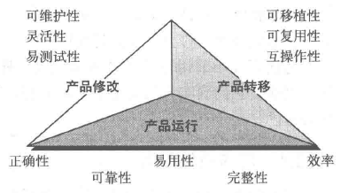

+ 运行（操作特性）
  + 正确性：软件按用户需求和规格说明完成功能的程度；
  + 可靠性：软件以期望的精度完成预期功能的程度；
  + 效率：软件完成所属功能所需的计算资源和代码数量；
  + 完整性：对未授权人件访问软件和数据的可控程度；
  + 易用性：对软件使用进行学习、操作、准备输入和解释输出所需的成本；
+ 修改（承受变更的能力）
  + 可维护性：发现和修正软件错误所需的成本；
  + 灵活性：修改软件所需的成本；
  + 易测试性：测试软件所需的成本；
+ 转移（对新环境的适应能力）
  + 可移植性：将软件迁移到新运行环境的成本；
  + 可复用性：软件和软件的一部分可以在其他软件中使用的容易程度；
  + 互操作性：将软件与其他软件或系统连接集成的成本。

#### 软件质量成本

软件不可能是完美的，但可以是“足够好”的：在提供用户期望的高质量功能和特性的同时包含一些无伤大雅的小问题。过于纠结一些微小的错误产生的成本可能远大于其带来的收益，而尽早提供“足够好”的软件可能会帮助软件企业垄断市场、减少工作流复杂度、产生更高的实际价值。

Boehm 和 Basili 的一项研究表明，修正软件错误的成本会在实现工作流后激增：

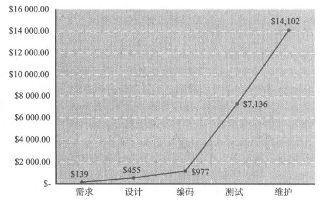

##### 成本类型

+ 质量成本：在追求高质量、保证高质量过程中的成本，以及低质量软件引起的费用；
+ 预防成本：计划和协调质量保证活动、改进质量保证过程、测试、相关培训的成本；
+ 评估成本：对软件工程工作产品评估、数据收集和度量估算、测试和调试的成本；
+ 失效成本：修正软件错误、排除变更副作用、评估失效模型收集数据的成本。

### 5.2 软件质量保证技术

#### 质量保证的要素

软件质量保证过程一般涵盖以下内容：

1. 标准：质量保证标准可以由软件组织自行定制，也可使用 IEEE 和 ISO 推荐的质量标准；
2. 评审和审核：技术评审由软件工程师执行，意在发现软件错误；软件审核由 SQA 人员执行，意在确保软件工程遵守质量原则；
3. 测试：软件测试是质量保证工程的一部分，意在发现软件错误；
4. 错误和缺陷收集与分析；
5. 变更管理：变更对软件具有破坏性，变更管理意在避免变更带来的混乱；
6. 培训：要改善软件质量、执行质量保证计划，必须对所有软件利益相关者进行培训；
7. 供应商管理：根据软件使用的分发方式，对软件发行商和渠道进行管理；
8. 安全和安全防护：互联网软件质量保证必不可少的组成部分；
9. 风险管理。

#### 质量保证的任务

软件质量保证过程一般包含以下任务：

1. 编写质量保证计划：该计划确定以下内容：
   + 评估内容
   + 审核和评审内容
   + 项目标准
   + 错误报告和跟踪流程
   + 软件质量保证的工作产品
2. 参与编写软件过程描述：SQA 会参与和审核过程描述的以下内容：
   + 内部软件标准
   + 外部软件标准（如 ISO 9001）
   + 过程描述是否符合软件组织方针
   + 过程描述是否和其他文档一致
3. 评审软件工程活动；
4. 审核软件工程工作产品；
5. 确保根据文档指示处理软件过程中的偏差；
6. 记录并向高层管理人员报告偏差。

#### 质量保证的目标和度量点

为了实现上述质量保证任务，必须达成以下质量保证目标：

+ 需求质量：需求模型必须正确、完整、一致；
+ 设计质量：设计模型的每一元素必须符合需求模型，并能高效指导实现工作流；
+ 代码质量：软件源代码和文档必须符合软件组织内部或外部公认标准，并且易于维护；
+ 质量控制有效性：质量保证活动本身必须在使用有限资源的情况下保证软件的高质量。

下面是这些目标包含的属性，以及可以参考的度量点：

| 目标           | 属性                                                         | 度量                                                         |
| -------------- | ------------------------------------------------------------ | ------------------------------------------------------------ |
| 需求质量       | 内容歧义<br/>完备性<br/>可理解性<br/>易变性<br/>可追溯性<br/>模型清晰度 | 模糊的修饰词数量（如：许多、较少、对人友好）<br/>TODO，TBA（to be announced） 和 TBD（to be determined）的数量<br/>节和小节的数量<br/>每项需求历史上变更的次数<br/>变更消耗的时间<br/>无法追溯的需求和代码数量<br/>UML 和其他模型数量<br/>模型中描述文字的数量（字数、页数）<br/>UML 和其他模型中的错误数量 |
| 设计质量       | 架构完整性<br/>构件完备性<br/>接口复杂度<br/>模式复用程度    | 是否有架构模型<br/>能够追溯到架构模型的构件数量<br/>过程设计的复杂度<br/>模型使用者从模型中挑选出单个功能所需的平均次数（评估易读性）<br/>模型整体布局的合理性（元素排列等）<br/>使用的模式数量 |
| 代码质量       | 复杂度<br/>可维护性<br/>可理解性<br/>可重用性<br/>文档       | 环复杂度<br/>注释的数量或百分比占比<br/>是否有命名约定和命名约定的完整度<br/>可重用构件的百分比<br/>可读性指数 |
| 质量控制有效性 | 资源分配<br/>完成率<br/>评审效率<br/>测试效率                | 每项质量控制活动消耗的时间<br/>实际完成时间和预计完成时间的偏差度<br/>发现的错误和关键错误数量<br/>修正错误需要的工作量<br/>错误来源 |

#### 质量保证统计方法

质量统计方法的出现是质量评价量化需求的必然，用于确定当前存在的软件错误情况，为修正计划提供指导。统计质量保证的过程包含以下步骤：

1. 收集软件错误和错误信息，并分类；
2. 追溯错误的**根本原因**；
3. 使用 Pareto 原则（80% 的错误可以追溯到所有可能原因中的 20%），参考根本原因指导，分离错误的**基本原因**；
4. 根据基本原因修正错误。

下面是一些**常见的错误根本原因**：

+ 不完整或错误的规格说明（IES）
+ 在与客户交流中产生的误解（MCC）
+ 故意违背规格说明（IDS）
+ 违反程序设计标准和原则（VPS）
+ 数据的表示有误（EDR）
+ 构件接口不一致（ICI）
+ 设计存在逻辑上的错误（EDL）
+ 不完整或错误的测试用例（IET）
+ 不完整或错误的文档（IID）
+ 将设计转化为代码时产生的错误（PLT）
+ 不清晰或不一致的交互界面（HCI）
+ 其他原因（MIS）

对根本原因的统计可以整理为表格，并划分严重、中等和微小错误。下面是一个例子：

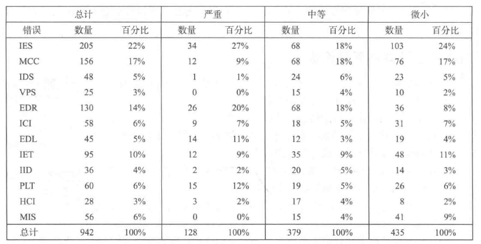

以矛盾论为指导，优先解决属于主要矛盾的根本问题。主要矛盾可以定义为超过 50% 或其他自定义比例的错误，如上表中的 IES，MCC 和 IDS 超过了 53%，属于当前主要矛盾；也可定义为严重错误中的主要错误，如上表中的 IES，EDR，PLT 和 EDL 。在错误修正时和修正后，需要时刻注意次要矛盾向主要矛盾的转化。

类似的方法还有**六西格玛方法学**。

#### 软件可靠性测量

**软件可靠性**在统计学中的标准定义为：在特定环境和特定时间内，计算机程序正常运行的概率。**故障**（failure [IEEE 610.12]）是软件的不正确的行为，与硬件的磨损不同，软件故障都可以追溯到设计和实现的问题中。

**平均故障间隔时间**（Mean-Time-Between-Failure，**MTBF**）是一种简单的软件可靠性测量方法：
$$
MTBF=MTTF+MTTR
$$
其中 **MTTF**（Mean-Time-To-Failure）表示软件的**平均故障时间**，**MTTR**（Mean-Time-To-Repair）表示软件的**平均修复时间**。使用 MTBF 的好处之一是，用户关心的不是软件的实际缺陷数量，而是缺陷表现出的故障出现的时间间隔。优先修复一个 1000 小时出现一次的错误相比修复一个 10000 小时出现一次的错误会带来更好的用户体验。

**故障率**（Failures-In-Time，**FIT**）是另一个可选的指标，规定为单个部件（在软件中体现为构件）每 10 亿次执行中发生的故障数量，如 1 FIT 表示构件没 10 亿次运行发生一次错误。

**软件可用性**（Software Usability）定义为在某个给定的时间节点上，程序能够按照需求正确执行的概率：
$$
软件可用性=\frac{MTTF}{MTTF+MTTR}\times100\%
$$
确保软件安全是另一项质量保证活动。首先评估软件错误可能带来的灾难性后果，然后补充软件规格说明中与安全相关的需求部分，产生一张包括不希望发生的事件以及对应解决方案的清单。

#### 质量保证计划

SQA 保证计划为质量保证提供指导路线，IEEE 公布的 SQA 计划标准建议 SQA 计划中应该包括以下内容：

1. 计划的目的和范围；
2. SQA 覆盖的所有工作产品（如模型、文档、源代码）描述；
3. 软件过程中使用的标准和习惯（convention）；
4. SQA 活动和任务，以及它们在过程流中的位置；
5. 支持 SQA 活动和任务的工具和方法；
6. 软件配置管理；
7. 收集、保护和维护 SQA 相关记录的方法；
8. 与 SQA 相关的组织角色和责任。
